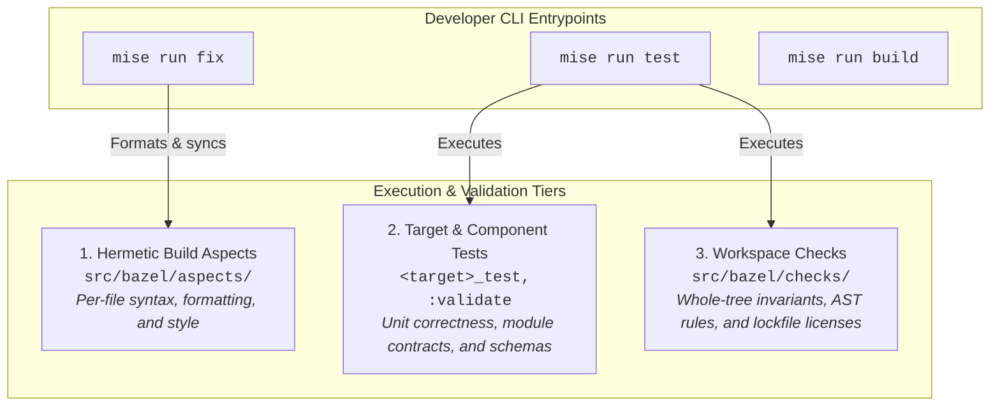
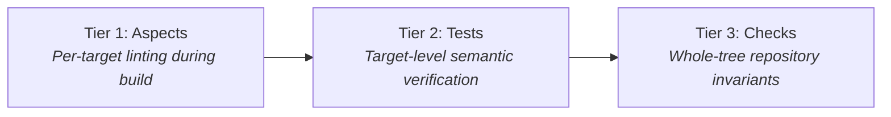

<!-- Explains the architecture, target lifecycle, BUILD.bazel file structure, rule taxonomy, and automated maintenance in the monorepo. -->

# Bazel Architecture & Philosophy

[Bazel](https://github.com/bazelbuild/bazel) is the primary engine for building container workloads, compiling source targets, indexing infrastructure modules, and enforcing static analysis in the monorepo. Cloud substrate provisioning is owned by [OpenTofu](https://github.com/opentofu/opentofu) and in-cluster runtime reconciliation is owned by [Argo CD](https://github.com/argoproj/argo-cd); Bazel validates and packages the artifacts consumed by both.

**Assumes familiarity with:** [Developer Guide](../../infra/docs/developer.md) and [Operator Guide](../../infra/docs/operator.md).



---

## Core Mental Model

Bazel models software as a directed acyclic graph (DAG) of hermetic targets across four foundational concepts:

1. **Workspace**: The repository root, marked by `MODULE.bazel` and `.bazelrc`. It establishes the root boundary and dependency graph for all internal and external packages.
2. **Package**: Any directory containing a `BUILD.bazel` file. A package owns all files in its directory and subdirectories, up to the next nested `BUILD.bazel` file.
3. **Label**: An unambiguous canonical address for a target. For example, `//src/examples/svelte_web:app` identifies the target named `app` in the package `src/examples/svelte_web`.
4. **Hermeticity**: Actions execute in isolated sandboxes with sanitized environments (`--incompatible_strict_action_env`). Actions cannot read unlisted files, access external network resources, or invoke arbitrary host binaries from `$PATH`. Tools execute through hermetic binary aliases declared in [`src/bazel/tools/`](../tools) backed by `@multitool`.

---

## Anatomy of a BUILD.bazel File

A `BUILD.bazel` file is a declarative Starlark script describing the buildable units, test suites, and data assets within a single package.

Every `BUILD.bazel` file follows a four-part top-to-bottom order:

1. **Package Docstring**: States the role and responsibility of the package.
2. **Load Statements**: Alphabetically sorted `load(...)` declarations.
3. **Package Configuration**: Package-level directives (`package(...)`, `exports_files(...)`, `package_sources()`).
4. **Target & Test Pairs**: Target definitions (`py_library`, `py_binary`, `tf_module`) followed immediately by companion tests (`py_test`, `sh_test`). Co-locating tests beside their targets ensures locality; never group tests at the bottom of the file.

### Canonical Structure Example

```python
"""User profile service and data validation."""

load("@rules_python//python:defs.bzl", "py_binary", "py_library", "py_test")
load("//src/bazel/rules/build_graph_coverage:defs.bzl", "package_sources")

package(default_visibility = ["//visibility:public"])

package_sources()

# Library target
py_library(
    name = "service",
    srcs = ["service.py"],
    deps = [
        "//src/common/logging",
    ],
)

# Companion unit test
py_test(
    name = "service_test",
    srcs = ["service_test.py"],
    deps = [":service"],
)

# Binary target
py_binary(
    name = "server",
    srcs = ["server.py"],
    deps = [":service"],
)

# Companion integration test
py_test(
    name = "server_test",
    srcs = ["server_test.py"],
    deps = [":server"],
)
```

---

## Common Target Types

Packages declare targets using five primary target types:

### 1. Python Workloads and Libraries (`rules_python`)

Declare libraries, binaries, and companion tests using [rules_python](https://github.com/bazelbuild/rules_python):

```python
load("@rules_python//python:defs.bzl", "py_binary", "py_library", "py_test")

py_library(
    name = "pipeline",
    srcs = ["pipeline.py"],
    deps = ["@python_deps//ray"],
)

py_test(
    name = "pipeline_test",
    srcs = ["pipeline_test.py"],
    deps = [":pipeline"],
)

py_binary(
    name = "submit",
    srcs = ["submit.py"],
    main = "submit.py",
    deps = [":pipeline"],
)
```

The monorepo provisions two hermetic pip hubs from `pyproject.toml` via `MODULE.bazel`:

- `@python_deps`: First-party workload dependencies pinned in `requirements_lock.txt` (such as [Ray](https://github.com/ray-project/ray)).
- `@dev_python_deps`: Tooling, linters, and validator dependencies pinned in `requirements_dev_lock.txt`.

### 2. Web Applications and Services (`aspect_rules_js`)

Link [pnpm](https://github.com/pnpm/pnpm) packages, bundle frontend assets with [Vite](https://github.com/vitejs/vite), and launch development servers using [aspect_rules_js](https://github.com/aspect-build/rules_js):

```python
load("@aspect_rules_js//js:defs.bzl", "js_run_devserver")
load("@npm//:defs.bzl", "npm_link_all_packages")
load("@npm//src/examples/svelte_web:vite/package_json.bzl", vite = "bin")

npm_link_all_packages(name = "node_modules")

_APP_SRCS = [
    "app.html",
    "package.json",
    "svelte.config.js",
    "tsconfig.json",
    "vite.config.ts",
    ":node_modules",
] + glob(["routes/**"])

# Production build bundle
vite.vite(
    name = "app",
    srcs = _APP_SRCS,
    args = ["build"],
    chdir = package_name(),
    out_dirs = ["build"],
)

# Interactive local development server
vite.vite_binary(name = "vite_dev")

js_run_devserver(
    name = "dev",
    args = ["dev"],
    chdir = package_name(),
    data = _APP_SRCS,
    tool = ":vite_dev",
)
```

### 3. Container Images, Publication, and Execution (`src/bazel/rules/oci`)

Package workload binaries into multi-architecture OCI container images using [rules_oci](https://github.com/bazel-contrib/rules_oci), declare guarded publication pipelines, and enable interactive cluster submission:

```python
load(
    "//src/bazel/rules/oci:defs.bzl",
    "oci_multiarch_image",
    "oci_workload_publish",
    "oci_workload_run",
)

# Multi-architecture container image
oci_multiarch_image(
    name = "image",
    base = "ray_torch_base",
    entrypoint = ["/entrypoint.sh"],
    files = ":app_files",
    workdir = "/workspace",
)

# Guarded publication target (CI release streams)
oci_workload_publish(
    name = "publish",
    image = ":image",
)

# On-demand execution target (interactive cluster submission)
oci_workload_run(
    name = "run",
    image = ":image",
    manifest = ":manifest",
    namespace = "team-examples-workloads",
)
```

This macro family generates standard operational entry points:

- **Local container loading (`bazel run :image_load`)**: Selects and loads only the local host architecture (`linux_arm64` on Apple Silicon, `linux_amd64` on x86) into the local [Docker](https://github.com/docker/cli) daemon. The foreign architecture is pruned during graph analysis and never built.
- **Guarded publication (`bazel run :publish -- --tag=<stream_tag>`)**: Verifies digest provenance and pushes multi-architecture images to the target registry without hardcoding ambient secrets or registry credentials in the monorepo.
- **Cluster submission (`bazel run :run`)**: Automates on-demand execution by building images, publishing them via digest handoff, templating image digests into `:manifest`, and submitting the workload to the cluster using hermetic [`kubectl`](https://github.com/kubernetes/kubectl).

### 4. OpenTofu Components (`rules_tf`)

Declare cloud infrastructure modules with explicit provider bindings using [rules_tf](https://github.com/opentofu/rules_tf):

```python
load("@rules_tf//tf:def.bzl", "tf_module")

tf_module(
    name = "aws",
    providers = ["aws"],
    deps = [
        "//src/infra/terraform/components/cluster/_interface",
    ],
)
```

### 5. [Kubernetes](https://github.com/kubernetes/kubernetes) Manifests (`src/bazel/rules/kubernetes_manifests`)

Render [Kustomize](https://github.com/kubernetes-sigs/kustomize) bundles and automatically enforce [`kubeconform`](https://github.com/yannh/kubeconform) and [`kube-linter`](https://github.com/stackrox/kube-linter) schema validations:

```python
load("//src/bazel/rules/kubernetes_manifests:defs.bzl", "workload_manifests")

workload_manifests(
    name = "manifest",
    srcs = [
        "deployment/database.yaml",
        "deployment/kustomization.yaml",
        "deployment/project.yaml",
        "deployment/workload.k8s.yaml",
    ],
)
```

---

## Extending the Build Graph: Rules vs. Macros

Target declarations rely on two Starlark extension mechanisms: primitive **rules** (`py_library`, `tf_module`) and composite **macros** (`oci_multiarch_image`, `workload_manifests`). Reusable build logic is authored in `.bzl` extension files under [`src/bazel/rules/`](../rules).

| Capability | Macro (`def my_macro(...)`) | Rule (`rule(...)`) |
| :--- | :--- | :--- |
| **Execution Phase** | **Loading phase**: Evaluated when `BUILD.bazel` files are parsed. | **Analysis phase**: Evaluated when the action graph is resolved. |
| **Action Creation** | Cannot create build actions (`ctx.actions` is unavailable). | Declares build actions via `ctx.actions.run` or `ctx.actions.write`. |
| **Providers** | Cannot inspect or return providers. | Consumes dependency providers and returns new ones (`DefaultInfo`, etc.). |
| **Purpose** | Syntactic sugar: groups multiple targets and reduces boilerplate. | Engine extension: registers new node types in Bazel's build graph. |

### When to Author a Macro

Author a macro to group multiple related targets under one declaration and eliminate boilerplate in `BUILD.bazel` files.

For example, `workload_manifests` expands into `kustomization`, rendered `kustomized_resources`, and companion validation targets under a single label.

### When to Author a Rule

Author a rule to register new build actions that convert inputs into outputs (such as compiling assets, generating code, or reporting validation findings to the `_validation` output group).

---

## Execution Tiers

Validation is layered into three execution tiers:



### Tier 1: Hermetic Build Aspects (`src/bazel/aspects/`)

Lint aspects traverse the build graph during `bazel build`. Aspect findings attach to the `_validation` output group, failing the build on syntax, lint, or type check violations (formatting is verified exclusively by `//:fix -- --check`). Aspects are organized by **language and data format**, not by tool binary:

- `cross_lang/`: Repository-wide invariants ([`gitleaks`](https://github.com/gitleaks/gitleaks)).
- `gha/`: GitHub Actions workflow validation ([`actionlint`](https://github.com/rhysd/actionlint), [`zizmor`](https://github.com/woodruffw/zizmor)).
- `markdown/`: Markdown linting ([`rumdl`](https://github.com/rvben/rumdl), [`mmdlint`](https://github.com/DavidAnson/markdownlint)).
- `python/`: Python linting and type checking ([`ruff`](https://github.com/astral-sh/ruff), [`ty`](https://github.com/astral-sh/ty)).
- `shell/`: POSIX shell analysis ([`shellcheck`](https://github.com/koalaman/shellcheck)).
- `tofu/`: OpenTofu module linting ([`tflint`](https://github.com/terraform-linters/tflint)).
- `toml/`: TOML syntax validation ([`taplo`](https://github.com/tamasfe/taplo)).
- `web/`: Frontend assets covering TypeScript, JavaScript, HTML, and CSS ([`oxlint`](https://github.com/oxc-project/oxc)).
- `yaml/`: YAML linting and Chainsaw schema validation ([`yamllint`](https://github.com/adrienverge/yamllint), [`chainsaw`](https://github.com/kyverno/chainsaw)).

### Tier 2: Semantic Component Tests

Target-level tests (`py_test`, `sh_test`, `go_test`, `tf_module` validation) verify the functional behavior of libraries, binaries, [Helm](https://github.com/helm/helm) charts, and [OpenTofu](https://github.com/opentofu/opentofu) modules via `mise run test`.

### Tier 3: Repository Workspace Checks (`src/bazel/checks/`)

Workspace static analyzers examine whole-tree invariants, multi-target relationships, or external scanner reports that require `BUILD_WORKSPACE_DIRECTORY`. They execute concurrently as native Bazel test targets (`sh_test`, `py_test`) aggregated under `//src/bazel/checks:all_checks` and evaluated automatically via `mise run test` or direct Bazel invocations (`bazel test //src/bazel/checks/...`):

- **Tree integrity & hygiene**: Verifies git graph completeness (`unclaimed_files`), synchronization contracts (`ifttt`), commit convention compliance (`commit_message`), and dotenv syntax and style with [dotenv-linter](https://github.com/dotenv-linter/dotenv-linter) (`dotenv`).
- **Infrastructure & GitOps invariants**: Verifies non-overlapping subnet allocations and host port ranges (`cluster_network`), Argo CD Application component coverage and valid `$values/...` file paths (`argocd_links`), and [Kubernetes](https://github.com/kubernetes/kubernetes)-safe resource naming (`source_names`).
- **Security & license governance**: Scans dependencies and container configurations for vulnerabilities via [Trivy](https://github.com/aquasecurity/trivy) (`trivy_source`), verifies Debian base image license compliance (`license_images`), validates third-party lockfiles against SPDX allowlists (`license_source`), and fences dev dependencies out of production images (`dev_tool_isolation`).
- **Cross-language static rules**: Evaluates custom AST and syntax rules across all repository sources using [`opengrep`](https://github.com/opengrep/opengrep) via `src/bazel/checks/opengrep/rules.yaml`, and prevents agent guidance drift (`rulesync`).

### Execution Tier Invariants

1. **Resolution vs Execution Separation**:
   CLI helpers (such as `src/bazel/tools/diff/cli.py`) are pure target resolvers. They inspect git diffs or graph queries and write clean labels to `stdout` without executing Bazel or child runners.
2. **Native Execution**:
   Execution is always direct and top-level (`bazel build` or `bazel test`). No Bazel rule, run target, or runner script is permitted to invoke the Bazel client in a subshell, preventing fractured telemetry, broken action caching, and duplicate BuildBuddy invocations.

---

## Directory Taxonomy

All build infrastructure, aspect configurations, custom rules, and hermetic tool wrappers live under `src/bazel/`:

```text
src/bazel/
├── aspects/       # Language- and format-first lint aspects attached to _validation
├── checks/        # Workspace-wide static analyzers and invariant checks
├── docs/          # Architecture, philosophy, and build system documentation
├── gazelle/       # In-tree Gazelle language extensions (OpenTofu, GitOps, Python)
├── module_deps/   # Modular dependency extensions for MODULE.bazel
├── patches/       # Upstream patches applied to external bzlmod dependencies
├── rules/         # First-party repository rules and macros (oci, k8s, lint_aspect)
└── tools/         # Stable binary aliases resolving hermetic multitool binaries
```

---

## Automated Target Maintenance

The monorepo separates authored source code from generated build configuration. Developers maintain implementation code; automated generators maintain `BUILD.bazel` files. Running `mise run fix` executes the generator pipeline and reformats all authored assets.

### Target Generation Architecture

Target generation is managed natively and deterministically by [Gazelle](https://github.com/bazelbuild/bazel-gazelle) (`//:gazelle`):

- **Go**: Discovers `.go` sources, resolves package imports, and generates `go_library`, `go_binary`, and `go_test` targets via [rules_go](https://github.com/bazelbuild/rules_go) (`@gazelle//language/go`).
- **Python**: Discovers `.py` sources, parses AST imports, resolves dependencies against `@python_deps`, and generates `py_library`, `py_binary`, and `py_test` targets via `@rules_python_gazelle_plugin//python`.
- **OpenTofu**: In-tree Gazelle extension (`//src/bazel/gazelle/opentofu`) discovers `.tf` files, parses module dependencies and provider requirements, and generates `tf_module` targets.
- **GitOps**: In-tree Gazelle extension (`//src/bazel/gazelle/gitops`) inspects Argo CD platform components, parses `kustomization.yaml` and `Chart.yaml`, links vendor Helm dependencies from `MODULE.bazel`, and emits declarative `kustomization`, `helm_chart`, `helm_lint_test`, and `manifest_checks` targets.

### Managed File Types & Pathspecs

The repository's build files and manifests are synchronized across these declared file types:

<!-- keep-sorted start -->
- **Build & Module Definitions**: `BUILD.bazel`, `MODULE.bazel`, `*.bzl`.
- **Go Source & Modules**: `*.go`, `go.mod`, `go.sum` (managed by Gazelle).
- **Infrastructure & GitOps**: `*.tf`, `*.tfvars`, `Chart.yaml`, `kustomization.yaml` (managed by Gazelle).
- **Python Source & Locks**: `*.py`, `pyproject.toml`, `requirements_lock.txt`, `requirements_dev_lock.txt` (managed by Gazelle).
- **Web & Styles**: `*.ts`, `*.tsx`, `*.js`, `*.jsx`, `*.mjs`, `*.css`, `package.json`, `tsconfig.json`.
<!-- keep-sorted end -->

### Drift Detection

Pre-commit hooks and CI gates ensure generated targets never drift from source reality:

- **`gazelle_drift` hook**: Runs `bazel run //:gazelle -- --mode=diff` before each commit to verify Go, Python, OpenTofu, and GitOps targets match declared sources.
- **Format gate**: `//:fix -- --check` runs Gazelle whenever a file it reads changed, and fails when Gazelle rewrites a `BUILD` file.

Manual edits to generated targets are rejected by CI; always run `mise run fix`.

---

## Concurrency & Resource Management

Bazel defaults in `.bazelrc` allocate up to 20% of host CPU cores (`--local_resources=cpu=HOST_CPUS*.2,memory=HOST_RAM*.5`, `--loading_phase_threads=auto`), preserving headroom for the local development fleet.

Override concurrency flags when operating under memory or CPU pressure:

<!-- keep-sorted start -->
- **Action concurrency (`--jobs=<N>`)**: Caps concurrent execution actions (compilations, aspect validations, tests).
- **Compute budget (`--local_resources=cpu=<N>,memory=<MB>`)**: Caps total cores and memory across worker processes.
- **Loading threads (`--loading_phase_threads=<N>`)**: Caps threads during workspace loading and analysis.
- **Test concurrency (`--local_test_jobs=<N>`)**: Caps concurrent test runners without throttling compilation or validation.
<!-- keep-sorted end -->

```bash
# Throttle concurrent test execution to 2 parallel runners
bazel test --local_test_jobs=2 //...

# Restrict the execution phase to 4 concurrent actions and 8GB RAM
bazel build --jobs=4 --local_resources=cpu=4,memory=8192 //...
```

---

## Next Reading

- [Developer Guide](../../infra/docs/developer.md): Connect to the private tailnet, launch remote workspaces, run builds, and submit compute workloads.
- [Operator Guide](../../infra/docs/operator.md): Follow cloud foundation provisioning, cluster topologies, GitOps sync waves, and reliability contracts.
