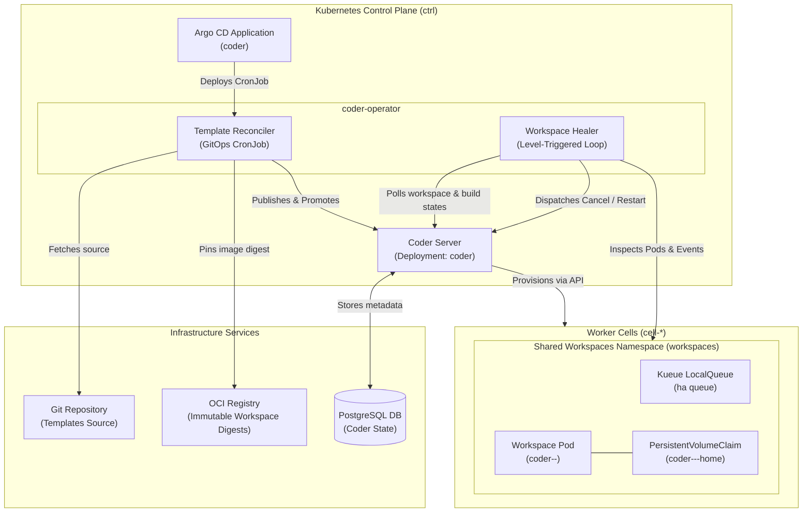
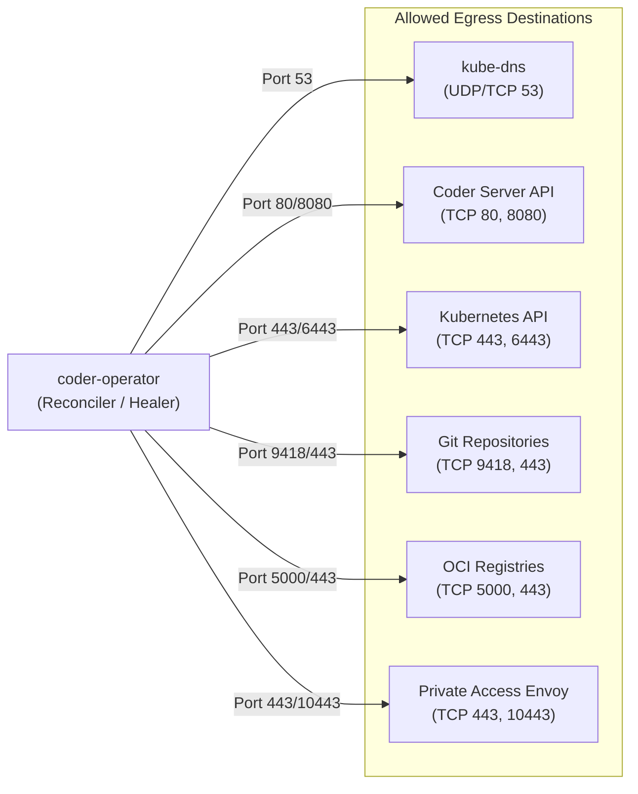
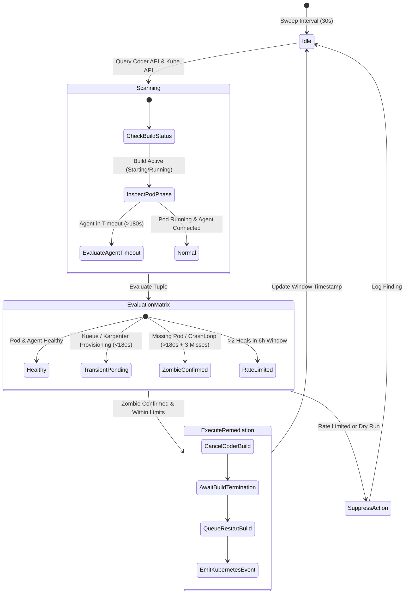
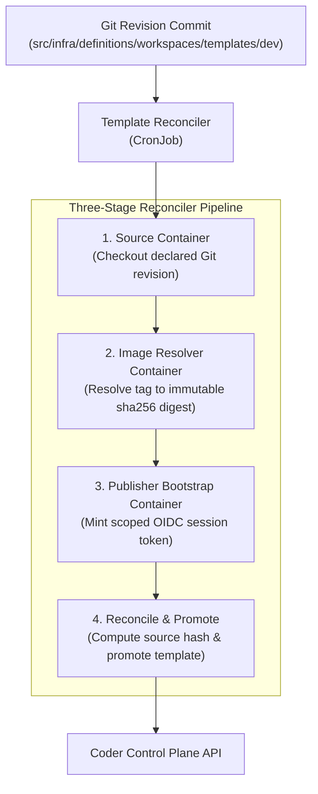
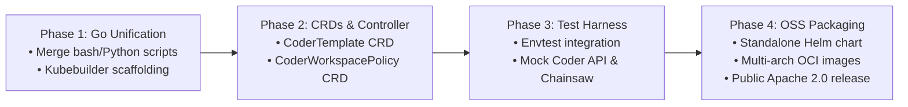

<!-- Technical documentation for coder-operator: GitOps template reconciler and level-triggered workspace healer architecture, healing lifecycle, configuration, and open-source extraction roadmap. -->

# Coder Operator (`coder-operator`)

The `coder-operator` is a Kubernetes-native operational controller and lifecycle manager for [Coder](https://github.com/coder/coder) deployments. It unifies declarative GitOps template publication with level-triggered automated healing for developer workspaces across distributed worker cells.



---

## 1. Tutorial: Getting Started with `coder-operator`

This hands-on tutorial guides you through deploying the `coder-operator`, verifying declarative template synchronization, running the Workspace Healer in dry-run mode, and observing safe remediation of a simulated zombie workspace.

### Prerequisites

- Access to a Kubernetes cluster running Coder (e.g., local development cell or control plane).
- `kubectl` configured with cluster administrator privileges or namespace administrative permissions in the `coder` and `workspaces` namespaces.
- `coder` CLI installed and authenticated with administrative privileges.
- [Argo CD](https://github.com/argoproj/argo-cd) managing the `coder` component.

### Step 1: Deploy and Verify the Template Reconciler

The Template Reconciler runs as a CronJob every 2 minutes. On each run it checks out the workspace template definition, resolves container image tags to immutable digests, computes a content hash, and promotes the new version in Coder.

Trigger the template reconciler job manually to verify template synchronization:

```bash
kubectl create job --from=cronjob/coder-template-reconciler coder-template-reconciler-manual -n coder
```

Watch the job logs as it executes the three-stage pipeline (source preparation, image digest resolution, and OIDC token minting):

```bash
kubectl logs -n coder -l app.kubernetes.io/component=template-publication -c reconcile -f
```

Expected log output:

```text
Published template 'dev' version '3c8f8b89e1b2...' (gitops:3c8f8b89e1b2)
Promoting version '3c8f8b89e1b2...' to active for template 'dev'
Successfully updated template 'dev' description and active version.
```

Verify that Coder reflects the promoted version:

```bash
coder templates versions list dev --column name,status,active --output table
```

### Step 2: Run the Workspace Healer in Dry-Run Mode

By default, the Workspace Healer executes in dry-run mode (`DRY_RUN=true`). In this mode, the reconciler inspects both the Coder API and the Kubernetes API in the `workspaces` namespace, evaluates build states and pod health, but emits diagnostic findings without executing mutating operations (no pod deletions or build cancellations).

Inspect the healer logs:

```bash
kubectl logs -n coder -l app.kubernetes.io/component=workspace-healer -f
```

Expected dry-run diagnostic log:

```text
{"level":"info","ts":"2026-09-27T21:40:00Z","logger":"workspace-healer","msg":"Starting workspace reconciliation loop","dry_run":true,"poll_interval":"30s"}
{"level":"info","ts":"2026-09-27T21:40:02Z","logger":"workspace-healer","msg":"Evaluated workspaces","scanned":14,"healthy":14,"unhealthy":0,"healed":0}
```

### Step 3: Simulate a Zombie Workspace and Observe Healing Diagnostics

Simulate a stalled workspace where a workspace build is marked `running` by Coder, but the underlying Kubernetes pod has failed or was evicted without Coder observing the transition:

1. Create a test workspace:

   ```bash
   coder create --template dev test-healing-workspace --yes
   ```

2. Once the workspace build starts, simulate a network boundary fault or delete the backing pod while severing Coder agent communication:

   ```bash
   kubectl delete pod -n workspaces -l coder.coder.com/workspace-name=test-healing-workspace --force --grace-period=0
   ```

3. Observe the healer log:

   ```bash
   kubectl logs -n coder -l app.kubernetes.io/component=workspace-healer | grep test-healing-workspace
   ```

Output in dry-run mode:

```text
{"level":"warn","ts":"2026-09-27T21:41:15Z","logger":"workspace-healer","workspace":"test-healing-workspace","build_id":"b305e552-0f5a-4cb7-9ce4-e0cf55cb24d2","coder_status":"running","agent_status":"timeout","pod_phase":"NotFound","consecutive_misses":1,"threshold":3,"action":"would_cancel_and_heal","reason":"Pod missing while agent timed out; consecutive miss count under threshold (1/3)"}
```

After 3 consecutive evaluation cycles (matching the consecutive-miss threshold), the healer confirms the failure condition and logs that remediation would execute:

```text
{"level":"warn","ts":"2026-09-27T21:42:45Z","logger":"workspace-healer","workspace":"test-healing-workspace","build_id":"b305e552-0f5a-4cb7-9ce4-e0cf55cb24d2","consecutive_misses":3,"threshold":3,"action":"DRY_RUN_REMEDY","msg":"[DRY RUN] Would issue Coder API cancel for build b305e552 and queue restart build"}
```

---

## 2. How-To Guides

### How to Run the Workspace Healer in Dry-Run Mode

To verify detection logic without altering cluster or Coder state, configure the Workspace Healer deployment or cronjob with `DRY_RUN: "true"`:

```yaml
apiVersion: apps/v1
kind: Deployment
metadata:
  name: coder-workspace-healer
  namespace: coder
spec:
  template:
    spec:
      containers:
        - name: healer
          env:
            - name: DRY_RUN
              value: "true"
            - name: LOG_LEVEL
              value: "debug"
```

Apply the configuration and follow the log stream. In dry-run mode, the healer will:

- Query all active workspaces via `GET /api/v2/workspaces`.
- Query all active builds via `GET /api/v2/workspace-builds`.
- Cross-reference corresponding Kubernetes Pods in the shared `workspaces` namespace.
- Increment internal observation counters for consecutive misses.
- Log exact remedial actions (`would_cancel`, `would_restart`, `would_delete_stuck_pod`) with diagnostic metadata.

### How to Tune Consecutive-Miss Thresholds and Timeout Alignment

The Workspace Healer aligns its evaluation cycle with the 180s connection timeout defined in Coder templates ([`coder_agent.connection_timeout = 180`](../../../definitions/workspaces/templates/dev/agent.tf#L6)). Tuning these settings allows operators to accommodate environments with slower node provisioning or image pull speeds.

To adjust the detection sensitivity:

1. Open the healer ConfigMap or Deployment environment configuration.
2. Adjust `HEALER_POLL_INTERVAL_SECONDS` and `HEALER_CONSECUTIVE_MISS_THRESHOLD`:

```yaml
env:
  # Interval between sweep loops (default: 30s)
  - name: HEALER_POLL_INTERVAL_SECONDS
    value: "45"
  # Number of successive unhealthy readings required before triggering healing (default: 3)
  - name: HEALER_CONSECUTIVE_MISS_THRESHOLD
    value: "4"
  # Maximum tolerated agent handshake latency matching coder_agent.connection_timeout
  - name: HEALER_AGENT_CONNECTION_TIMEOUT_SECONDS
    value: "180"
```

> [!TIP]
> The total confirmation window before active remediation is:
> $$\text{Confirmation Window} = \text{HEALER\_CONSECUTIVE\_MISS\_THRESHOLD} \times \text{HEALER\_POLL\_INTERVAL\_SECONDS}$$
> With default values ($3 \times 30\text{s} = 90\text{s}$), after the 180s Coder agent timeout has expired, the operator observes the failure over an additional 90 seconds to prevent transient API blips from triggering premature restarts.

### How to Diagnose and Recover Stuck Workspaces Manually

If a workspace enters a hung state and the operator is running in dry-run mode or healing is exhausted:

1. Identify the stuck workspace build:

   ```bash
   coder list --all
   coder builds list <workspace-name>
   ```

2. Check the backing Kubernetes pod status in the `workspaces` namespace:

   ```bash
   kubectl get pods -n workspaces -l coder.coder.com/workspace-name=<workspace-name> -o wide
   ```

3. Inspect pod events and container termination reasons:

   ```bash
   kubectl describe pod -n workspaces -l coder.coder.com/workspace-name=<workspace-name>
   ```

4. If the build is hung in in-flight status (`starting` or `stopping`) while the pod is terminated or CrashLooping:
   - Cancel the build via Coder CLI:

     ```bash
     coder builds cancel <build-id>
     ```

   - Restart the workspace cleanly:

     ```bash
     coder start <workspace-name>
     ```

5. Reset the healer rolling-window limit for the workspace if it reached the maximum rate limit:

   ```bash
   kubectl annotate pod -n workspaces -l coder.coder.com/workspace-name=<workspace-name> coder.openplex.io/healer-reset-window="$(date +%s)"
   ```

### How to Authorize and Rotate Template Publication Credentials

The Template Reconciler requires credentials to authenticate with Coder API and publish templates. In automated production environments, credentials are minted dynamically via short-lived OIDC exchange or fetched from Kubernetes secrets:

1. Ensure the secret `coder-template-publication` in namespace `coder` contains the required authentication keys:

   ```bash
   kubectl get secret coder-template-publication -n coder -o jsonpath='{.data}'
   ```

2. When rotating Git credentials, update the `git-token` and `git-username` keys in `coder-template-publication`:

   ```bash
   kubectl create secret generic coder-template-publication \
     --namespace coder \
     --from-literal=git-username="git-service-user" \
     --from-literal=git-token="ghp_NEW_TOKEN_STRING" \
     --dry-run=client -o yaml | kubectl apply -f -
   ```

3. When using automated OIDC bootstrapping ([`bootstrap_template_publisher.py`](kustomize/scripts/bootstrap_template_publisher.py)), verify that the `coder-oidc` secret contains valid bootstrap credentials (`CODER_BOOTSTRAP_OIDC_PASSWORD`). The script logs in to Coder's OIDC issuer, mints a scoped token with permissions `coder:templates.author`, `coder:templates.build`, `organization:read`, and `user:read`, stores the token in `/state/coder-session-token`, and logs out the interactive session immediately.

### How to Provision and Rotate Cloud Automation Tokens

On cloud clusters, Dex uses external OAuth without a local password database. Coder automation components (`workspace-healer` and `coder-template-reconciler`) authenticate using a pre-minted session token synchronized via ExternalSecrets from AWS Secrets Manager.

#### RBAC Role Justification for User `automation`

Coder v2.37 AGPL (open-source) supports built-in roles only (`member`, `template-admin`, `user-admin`, `auditor`, `owner`); custom RBAC roles require Coder Enterprise.

- **Template Reconciler:** Requires `template-admin` privileges to create, publish, and promote workspace templates.
- **Workspace Healer:** Calls `GET /api/v2/workspaces` and `POST /api/v2/workspaces/{id}/builds` across all developers' workspaces. In Coder's built-in RBAC model, `template-admin` has no permissions on non-owned workspaces. Only the `owner` role possesses authorization to inspect and update workspaces owned by other users.
- **Conclusion:** User `automation` must be assigned the `owner` role.

#### Initial Provisioning Steps

1. Authenticate with Coder CLI as an administrator:

   ```bash
   coder login https://coder.<publicDomain>
   ```

2. Create the machine account `automation` with login disabled:

   ```bash
   coder users create automation --email automation@<publicDomain> --login-type none
   ```

3. Assign the `owner` role:

   ```bash
   coder roles user update automation --role owner
   ```

4. Mint a permanent automation token (~100 years / 876600 hours):

   ```bash
   coder tokens create --user automation --lifetime 8760h --name automation-token
   ```

5. Store the token in AWS Secrets Manager under property `token`:

   ```bash
   aws secretsmanager create-secret \
     --name "ctrl-aws-usw2-coder-automation-token" \
     --description "Coder automation token for workspace healer and template reconciler" \
     --secret-string '{"token":"<CODER_TOKEN>"}' \
     --region us-west-2
   ```

#### Token Rotation Procedure

To rotate the token annually:

1. Mint a new 1-year token:

   ```bash
   coder tokens create --user automation --lifetime 8760h --name automation-token-$(date +%Y)
   ```

2. Update the secret value in AWS Secrets Manager:

   ```bash
   aws secretsmanager put-secret-value \
     --secret-id "ctrl-aws-usw2-coder-automation-token" \
     --secret-string '{"token":"<NEW_CODER_TOKEN>"}' \
     --region us-west-2
   ```

3. Trigger ExternalSecret reconciliation:

   ```bash
   kubectl -n coder annotate es coder-automation-token force-sync="$(date +%s)" --overwrite
   ```

4. Verify the workspace healer restarts or reconciles without errors.
5. Revoke the retired token:

   ```bash
   coder tokens delete <OLD_TOKEN_NAME> --user automation
   ```

---

## 3. Technical Reference

### Workspace Healing Detection Matrix

The Workspace Healer continuously evaluates the tuple $(\text{Coder Workspace State}, \text{Coder Build State}, \text{Coder Agent State}, \text{Kubernetes Pod Phase})$. The following matrix defines the diagnostic evaluation and resulting reconciliation action for each combination:

| Coder Workspace State | Coder Build State | Coder Agent State | Kubernetes Pod Phase / Condition | Duration in State | Evaluation & Diagnosis | Reconciliation Action (Active Mode) | Guardrails & Rate Limits |
|---|---|---|---|---|---|---|---|
| `starting` | `running` | `connecting` | `Pending` (Kueue: `Admitted: False`) | $< 600\text{s}$ | **Normal Queuing**: Workload admitted to Kueue local queue, waiting on capacity. | None (Wait for Kueue admission). | Bounded by overall provision timeout. |
| `starting` | `running` | `connecting` | `Pending` (Karpenter: `NodeProvisioning`) | $< 300\text{s}$ | **Capacity Scaling**: Dynamic cloud node provisioning in progress. | None (Wait for node readiness). | Karpenter provisioning deadline. |
| `starting` | `running` | `connecting` | `Pending` (Scheduling Failed / Unschedulable) | $> 300\text{s}$ | **Scheduling Stall**: Incompatible node selectors, taint mismatches, or exhausted PVC binding. | Record warning event; check PVC mount status. Do not cancel if PVC is attaching. | Consecutive-miss $\ge 3$. |
| `starting` | `running` | `connecting` | `Running` (Containers: `CrashLoopBackOff`) | $> 120\text{s}$ | **Container Failure**: Agent or sidecar failing immediately upon startup (e.g. entrypoint crash). | Cancel build with failure message; mark workspace stopped. | Rolling window limit (max 2/6h). |
| `starting` | `running` | `connecting` | `Running` (Containers: `ImagePullBackOff`) | $> 180\text{s}$ | **Image Registry Failure**: Missing workspace image tag or bad pull secret. | Cancel build immediately; alert operator. | Consecutive-miss $\ge 2$. |
| `starting` | `running` | `timeout` | `Running` (Containers: `Ready: True`) | $> 180\text{s}$ | **Zombie Agent**: Pod is running and network is alive, but agent handshake timed out ($>180\text{s}$). | Cancel current build; schedule restart build. | Max 2 heals / 6h; concurrency limit. |
| `starting` | `running` | `timeout` | `Failed` / `Unknown` / `NotFound` | $> 60\text{s}$ | **Dead Pod Zombie**: Compute Pod was evicted, OOM-killed, or node failed, leaving build orphaned. | Force-cancel Coder build; dispatch restart. | Max 2 heals / 6h. |
| `running` | `succeeded` | `disconnected` | `Running` | $> 180\text{s}$ | **Agent Heartbeat Loss**: Established workspace lost communication with Coder control plane. | Check node and network health; if unrecoverable, restart workspace pod. | Consecutive-miss $\ge 3$. |
| `running` | `succeeded` | `disconnected` | `Failed` / `NotFound` | $> 60\text{s}$ | **Compute Disappearance**: Workspace Pod terminated unexpectedly after successful startup. | Recreate workspace build or trigger auto-start if configured. | Max 2 heals / 6h. |
| `stopping` | `running` | `disconnected` | `Terminating` (Stuck Finalizer / CSI unmount) | $> 180\text{s}$ | **Storage Unmount Stall**: Storage detachment or PVC unmount hung on storage backend. | Force cleanup of stuck finalizers if volume unmounted safely; cancel build. | Manual intervention warning if disk lock active. |
| `canceling` | `running` | Any | Any | $> 120\text{s}$ | **Hung Cancellation**: Coder build cancel request acknowledged but not completed. | Terminate backing Kubernetes job/pod directly; force-set terminal state. | Concurrency limit. |
| Any | Any | Any | Any | Any | **Rate-Limited Workspace**: Workspace exceeded 2 healing attempts in 6 hours. | Emit `HealingExhausted` event; lock further automated restarts; notify user. | Bypassed only via administrative reset annotation. |

### Configuration Parameters & Environment Variables

| Variable | Type | Default | Description |
|---|---|---|---|
| `CODER_URL` | String | `http://coder.coder.svc.cluster.local` | Internal URL for Coder API service within the control plane cluster. |
| `CODER_SESSION_TOKEN_FILE` | String | `/state/coder-session-token` | Filesystem path containing the scoped Coder session/publisher authentication token. |
| `DRY_RUN` | Boolean | `true` | When `true`, scans workspaces and logs planned healing operations without altering state. |
| `HEALER_POLL_INTERVAL_SECONDS` | Integer | `30` | Duration in seconds between successive reconciliation evaluation cycles. |
| `HEALER_CONSECUTIVE_MISS_THRESHOLD` | Integer | `3` | Number of consecutive failed checks required before triggering active healing. |
| `HEALER_AGENT_CONNECTION_TIMEOUT_SECONDS` | Integer | `180` | Maximum tolerated agent connection handshake duration, aligned with `coder_agent.connection_timeout`. |
| `HEALER_MAX_HEALS_PER_WINDOW` | Integer | `2` | Maximum allowed automated heal operations per individual workspace within the rolling window (`DEFAULT_MAX_HEALS_PER_WINDOW`). |
| `HEALER_WINDOW_DURATION_HOURS` | Integer | `6` | Duration of the rolling rate-limiting window in hours (`DEFAULT_ROLLING_WINDOW_SECONDS = 21600`). |
| `HEALER_MAX_CONCURRENT_HEALS` | Integer | `5` | Maximum number of concurrent mutating heal operations permitted per fleet sweep run (`DEFAULT_MAX_FLEET_HEALS_PER_RUN`). |
| `HEALER_STATE_CONFIGMAP_NAME` | String | `workspace-healer-state` | Name of the ConfigMap in namespace `coder` storing serialized workspace health state and heal timestamps (`state.json`). |
| `TARGET_NAMESPACES` | String | `""` | Comma-separated list of workspace namespaces to watch (empty defaults to the shared `workspaces` namespace). |
| `LOG_LEVEL` | String | `info` | Logging verbosity: `debug`, `info`, `warn`, `error`. |
| `METRICS_PORT` | Integer | `8080` | Port exposing Prometheus operational metrics (`/metrics`) and health checks (`/healthz`). |

### RBAC Permissions Matrix

The `coder-operator` enforces least-privilege role boundaries split between the control-plane namespace (`coder`) and the shared workspace execution namespace (`workspaces`).

#### 1. Control-Plane Namespace (`coder`) Permissions

```yaml
apiVersion: rbac.authorization.k8s.io/v1
kind: Role
metadata:
  name: coder-operator-control-plane
  namespace: coder
rules:
  # Secret access for reading template publication tokens and OIDC bootstrap credentials
  - apiGroups: [""]
    resources: ["secrets"]
    verbs: ["get", "list", "watch"]
  # ConfigMap access for storing reconciler state and leader election locks
  - apiGroups: [""]
    resources: ["configmaps"]
    verbs: ["get", "list", "watch", "create", "update", "patch"]
  # Coordination for high-availability leader election
  - apiGroups: ["coordination.k8s.io"]
    resources: ["leases"]
    verbs: ["get", "list", "watch", "create", "update", "patch"]
  # Emitting operator audit events
  - apiGroups: [""]
    resources: ["events"]
    verbs: ["create", "patch"]
```

#### 2. Shared Workspaces Namespace (`workspaces`) Permissions

Every worker cell hosts all developer workspaces in one shared namespace, `workspaces`, labeled `app.kubernetes.io/part-of: coder-workspaces`. The cell-level `coder_workspaces` component creates the namespace, the `coder-workspace` ServiceAccount that workspace pods run as (`automountServiceAccountToken: false`), and the `coder-provisioner` Role and RoleBinding granting the cell's Coder provisioner subject the lifecycle access it needs to create workspace resources.

Workspaces are owned by individual users, not teams. Until user-OIDC authorization lands, workspaces have no team-scoped access: they cannot submit jobs into team lanes, read team dev secrets, or mount team S3 buckets.

```yaml
apiVersion: rbac.authorization.k8s.io/v1
kind: Role
metadata:
  name: coder-provisioner
  namespace: workspaces
rules:
  # Managing workspace configuration, home volumes, and services
  - apiGroups: [""]
    resources: ["configmaps", "persistentvolumeclaims", "services"]
    verbs: ["create", "delete", "get", "list", "patch", "update", "watch"]
  # Reading scheduling and startup events
  - apiGroups: [""]
    resources: ["events"]
    verbs: ["list"]
  # Observing workspace Pod lifecycles
  - apiGroups: [""]
    resources: ["pods"]
    verbs: ["get", "list", "watch"]
  # Managing per-workspace secrets
  - apiGroups: [""]
    resources: ["secrets"]
    verbs: ["create", "delete", "get", "patch", "update"]
  # Managing the workspace Deployment
  - apiGroups: ["apps"]
    resources: ["deployments"]
    verbs: ["create", "delete", "get", "list", "patch", "update", "watch"]
  # Observing Kueue admission of workspace Pods
  - apiGroups: ["kueue.x-k8s.io"]
    resources: ["workloads"]
    verbs: ["get", "list", "watch"]
```

### Network Boundaries & NetworkPolicy Reference

The `coder-operator` enforces strict zero-ingress policies and whitelisted egress egress boundaries. It operates purely as an egress-oriented client.



The underlying Kubernetes `NetworkPolicy` for the template reconciler and operator pod ensures zero egress to unintended subnets:

```yaml
apiVersion: networking.k8s.io/v1
kind: NetworkPolicy
metadata:
  name: coder-operator-egress
  namespace: coder
spec:
  podSelector:
    matchLabels:
      app.kubernetes.io/part-of: coder
  policyTypes:
    - Egress
  egress:
    # 1. Cluster DNS resolution
    - to:
        - namespaceSelector:
            matchLabels:
              kubernetes.io/metadata.name: kube-system
          podSelector:
            matchLabels:
              k8s-app: kube-dns
      ports:
        - {protocol: UDP, port: 53}
        - {protocol: TCP, port: 53}
    # 2. Coder Control Plane API
    - to:
        - podSelector:
            matchLabels:
              app.kubernetes.io/instance: coder
              app.kubernetes.io/name: coder
      ports:
        - {protocol: TCP, port: 80}
        - {protocol: TCP, port: 8080}
    # 3. Kubernetes API Server
    - to:
        - ipBlock: {cidr: 10.0.0.0/8}
        - ipBlock: {cidr: 172.16.0.0/12}
        - ipBlock: {cidr: 192.168.0.0/16}
      ports:
        - {protocol: TCP, port: 443}
        - {protocol: TCP, port: 6443}
    # 4. Private Access Envoy Gateway
    - to:
        - namespaceSelector:
            matchLabels:
              kubernetes.io/metadata.name: envoy-gateway-system
          podSelector:
            matchLabels:
              app.kubernetes.io/component: proxy
              app.kubernetes.io/name: envoy
      ports:
        - {protocol: TCP, port: 443}
        - {protocol: TCP, port: 10443}
    # 5. Git Daemons & Monorepo Mirrors
    - to:
        - ipBlock: {cidr: 172.19.0.0/16}
      ports:
        - {protocol: TCP, port: 9418}
    # 6. Origin & Workload OCI Registries
    - to:
        - ipBlock: {cidr: 172.19.255.22/32}
      ports:
        - {protocol: TCP, port: 5000}
    # 7. External HTTPS for upstream base images & webhooks (excluding RFC 1918)
    - to:
        - ipBlock:
            cidr: 0.0.0.0/0
            except:
              - 10.0.0.0/8
              - 172.16.0.0/12
              - 192.168.0.0/16
              - 100.64.0.0/10
              - 169.254.0.0/16
      ports:
        - {protocol: TCP, port: 443}
```

### Observability & Prometheus Metrics

The `coder-operator` exposes metrics on `:8080/metrics`:

| Metric Name | Type | Labels | Description |
|---|---|---|---|
| `coder_operator_template_sync_duration_seconds` | Histogram | `template, status` | Latency distribution of template GitOps reconciliation cycles. |
| `coder_operator_template_sync_total` | Counter | `template, status` | Cumulative count of template publication attempts. |
| `coder_operator_healer_scanned_workspaces_total` | Counter | `namespace` | Number of workspace instances scanned during healer reconciliation sweeps. |
| `coder_operator_healer_zombies_detected_total` | Counter | `workspace, reason` | Count of detected zombie or hung workspace builds. |
| `coder_operator_healer_actions_total` | Counter | `workspace, action, mode` | Remedial actions executed (e.g., `cancel_build`, `restart_workspace`, `dry_run`). |
| `coder_operator_healer_rate_limit_exceeded_total` | Counter | `workspace` | Number of times healing was suppressed due to the 2-heals/6h rolling window. |
| `coder_operator_healer_consecutive_misses` | Gauge | `workspace, build_id` | Current consecutive-miss counter for an in-flight unconfirmed failure. |

---

## 4. Explanation

### Dual-Engine Architecture: Reconciler and Healer

The `coder-operator` combines two distinct reconciliation loops designed to manage the full lifecycle of ephemeral developer environments:

1. **The Template Reconciler** ensures that the state of Coder workspace templates in the control plane exactly matches declarative Git definitions. It bridges the monorepo source tree (`src/infra/definitions/workspaces/templates/dev`) with Coder's internal template versioning registry.
2. **The Workspace Healer** provides continuous operational runtime recovery. In large distributed fleets, asynchronous events (such as Kubernetes node spot terminations, network partition blips, CSI volume lock timeouts, and Karpenter node consolidation) inevitably cause edge-case inconsistencies between Coder's internal database state and real cluster compute status. The healer bridges this gap using level-triggered observability.



### Level-Triggered Reconciliation vs. Edge-Triggered Events

Many Kubernetes controllers rely heavily on edge-triggered event streams (e.g., watching Pod deletion events via Informers). While performant, edge-triggered models suffer from critical blind spots in disaster scenarios:

- If the operator restarts or crashes during a pod eviction event, the deletion event is missed.
- If network partition disrupts webhook delivery between Coder server and the Kubernetes API server, Coder never transitions a `starting` build to `failed`.
- If an agent process segfaults or panics after establishing an initial socket connection, no Kubernetes Pod state change occurs, but Coder's heartbeat stops.

The `coder-operator` Workspace Healer adopts **level-triggered reconciliation**:

- On every sweep cycle (default: every 30 seconds), the healer computes the entire system state from scratch.
- It queries Coder's `/api/v2/workspaces` and `/api/v2/workspace-builds` endpoints.
- It correlates each active build with the live state of Kubernetes Pods, PersistentVolumeClaims, and Kueue queue admission objects in the shared `workspaces` namespace.
- It makes decisions based on the *current level* of truth, ensuring that regardless of past network partitions or missed events, state eventually converges to desired health.

### The 180s Connection Timeout & Consecutive-Miss Heuristics

A central challenge in automated workspace recovery is avoiding false positives during legitimate startup latency. In high-density clusters, scheduling a workspace pod involves several asynchronous phases:

1. **Admission Phase**: Kueue evaluates the `ha` LocalQueue in the `workspaces` namespace. If quota is constrained, the pod remains `Pending`.
2. **Provisioning Phase**: Karpenter provisions an EC2 or GCP compute instance, which requires 45 to 90 seconds.
3. **Storage Attachment Phase**: Cloud block storage (EBS gp3 or Persistent Disk) attaches to the instance and is formatted/mounted by the CSI driver.
4. **Image Pull & Container Startup**: Base container images, Tailscale sidecars, and backup proxies are initialized.
5. **Agent Handshake**: The Coder agent boots inside the main container, performs token exchange, and connects via mTLS/gRPC to Coder server.

Coder defines this boundary via [`coder_agent.connection_timeout = 180`](../../../definitions/workspaces/templates/dev/agent.tf#L6). Under normal conditions, if the agent does not establish connectivity within 180 seconds, Coder flags the agent status as `timeout`.

However, Coder's server does not immediately cancel or abort the build upon agent timeout; it leaves the build in `starting` status until an external actor intervenes or an overall provisioner deadline passes.

To prevent premature disruption, the healer combines:

- **Agent Timeout Alignment**: The healer will not consider an in-flight build for remediation until its duration exceeds the 180s agent timeout.
- **Consecutive-Miss Threshold**: Once the 180s threshold is breached, the healer does not kill the workspace on the first scan. Instead, it increments a `consecutive_misses` gauge. Only after $N = 3$ consecutive evaluation intervals (an additional 90 seconds of confirmed dead state) is the build classified as a confirmed zombie. This guarantees that temporary network blips during agent handshake do not cause unnecessary workspace restarts.

### Rate Limiting Theory & Thundering Herd Prevention

Automated remediation loops can amplify outages if left unrestricted. Two specific failure modes must be guarded against:

1. **Reboot Loops on Poisoned Workspaces**:
   - If a developer commits a syntax error to their dotfiles (e.g., an infinite loop or `exit 1` in `~/.bashrc`), or if their persistent home volume contains corrupted binaries, the workspace will crash immediately upon startup.
   - An unconstrained healer would repeatedly kill and restart the workspace indefinitely, consuming CPU cycles, generating excessive Coder build logs, and churning storage attachments.
   - **Protection: 2 Heals per 6-Hour Sliding Window**. The operator records timestamps for each healing event per workspace in the `workspace-healer-state` ConfigMap (`state.json`). If a workspace reaches 2 healing cycles within a 6-hour rolling window (`DEFAULT_ROLLING_WINDOW_SECONDS = 21600`), automated remediation ceases. The workspace is tagged with condition `HealingExhausted`, and an alert event is posted to the pod and Coder notification system for human review.

2. **Thundering Herds during Cluster Incidents**:
   - If a worker node crashes or an entire Availability Zone experiences networking issues, dozens of developer workspaces may disconnect simultaneously.
   - If the healer attempted to cancel and restart all affected workspaces at the same instant, the sudden influx of simultaneous builds would overwhelm the Coder API server, exhaust Kueue quotas, and overwhelm storage attachment controllers.
   - **Protection: Max Fleet Concurrency Limit per Run**. The healer limits active remediation to `MAX_FLEET_HEALS_PER_RUN = 5` concurrent mutating operations per fleet sweep cycle (`evaluate_healing_rate_limits`). Healing operations are prioritized based on workspace age, spreading the recovery load evenly across successive evaluation intervals.

### Declarative Template GitOps Pipeline

The Template Reconciler enforces strict immutability and provenance tracking:



1. **Digest-Pinned Image Resolution**:
   - Rather than publishing templates referencing mutable tags (e.g., `:v1` or `:latest`), the reconciler uses `crane` to inspect the remote OCI registry and resolve the target tag to its immutable cryptographic digest (`sha256:8961fc86...`).
   - This ensures that all workspaces spawned from this template version execute bit-for-bit identical container binaries, regardless of subsequent image pushes.
2. **Content Hashing & Idempotency**:
   - The reconciler computes a composite SHA-256 hash across all template files (`*.tf`, scripts) and the resolved target configuration inputs.
   - The version is tagged as `gitops:<hash:0:12>`.
   - If Coder already contains a version with this name in `succeeded` status, the publication step is skipped and the reconciler directly ensures that version is active.
   - If a previous publication attempt failed or crashed, a retry suffix (`<hash:0:48>-retry-<attempt>`) is generated, preventing naming collisions while ensuring forward progress.
3. **Decoupled User Impact**:
   - Promoting a new template version in Coder is completely non-disruptive to active developer environments.
   - Running workspaces continue operating uninterrupted. Developers receive an in-app banner notifying them that an updated template is available, which will be applied during their next scheduled or manual workspace restart.
4. **Publication Trigger Mechanism (Periodic CronJob + Content Hashing)**:
   - **Why Coder app diffs cannot trigger publication**: The Argo CD Application for Coder tracks `src/infra/argocd/components/coder/kustomize`. Updates to developer workspace templates (`src/infra/definitions/workspaces/templates/dev`) or shared modules (`src/infra/definitions/workspaces/modules`) occur outside the Coder component path, producing no git diff in the Argo CD application.
   - **Level-triggered reconciliation via CronJob**: Rather than requiring synthetic commits or coupling Coder app diffs to workspace template source paths, template reconciliation runs via a Kubernetes `CronJob` (`coder-template-reconciler`) scheduled every 2 minutes (`*/2 * * * *`).
   - **Zero-overhead idempotency**: The reconciler hashes all materialized template files (including transitive modules) and target inputs into `source_hash`. If Coder already contains a succeeded version matching `source_hash`, publication is skipped and the version is confirmed promoted. When any file in `templates/dev` or `modules` changes, `source_hash` changes, automatically triggering a new build and promotion.

### Brokerless Snapshot Root Key Injection

Developer workspace snapshots use brokerless client-side encryption. The Coder server provisions workspace templates using identity hooks that require access to the cluster's snapshot root key:

- **Source of Truth**: The root key originates in cloud Secrets Manager (e.g. `${ctrl cluster}-workspace-snapshot-root` via `aws-secrets-manager` on cloud) or `local-secret-records` on Floci.
- **Projection**: The ExternalSecret `workspace-snapshot-root` in namespace `coder` reads property `root_key` and creates Kubernetes Secret `workspace-snapshot-root`.
- **Mount & Environment**: The Coder server pod mounts this secret read-only at `/etc/coder/workspace-snapshot-root/root_key` with volume name `workspace-snapshot-root` and injects `WORKSPACE_SNAPSHOT_ROOT_KEY_FILE=/etc/coder/workspace-snapshot-root/root_key`.
- **Password Derivation**: During workspace builds, template identity hook `hooks/snapshot-repository-password.sh` reads this root key file to compute a deterministic HMAC-SHA256 repository password scoped to the workspace owner, eliminating intermediate credential broker services.

---

## 5. Roadmap: Standalone Open-Source Extraction

Currently, the `coder-operator` components (the GitOps Template Reconciler and the Workspace Healer) are implemented as coordinated scripts, jobs, and Kubernetes manifests within this monorepo under `src/infra/argocd/components/coder`.

To benefit the broader community and enable standalone adoption across independent Coder deployments, the project is scheduled for extraction into a dedicated open-source repository (`github.com/<org>/coder-operator`).

### Architectural Evolution Plan



#### Phase 1: Unification into a Compiled Go Binary

- **Current State**: Shell scripts (`template-reconciler.sh`), Python helpers (`bootstrap_template_publisher.py`, `coder_api.py`), and Kubernetes Job definitions.
- **Target**: A single compiled Go binary (`coder-operator`) implementing two sub-commands:
  - `coder-operator reconciler`: Headless GitOps synchronization worker.
  - `coder-operator healer`: Continuous level-triggered controller daemon.
- **Benefits**: Zero runtime interpreter dependencies (no Python or Bash in base container image), distroless execution, and reduced memory footprint ($<30\text{MiB}$).

#### Phase 2: Custom Resource Definitions (CRDs)

Transition from imperative environment configurations to declarative Kubernetes Custom Resources:

1. `CoderTemplate` CRD:

   ```yaml
   apiVersion: coder.example.com/v1alpha1
   kind: CoderTemplate
   metadata:
     name: dev-workspace
     namespace: coder
   spec:
     templateName: dev
     source:
       git:
         url: https://github.com/org/workspace-templates.git
         path: dev
         revision: main
     autoPromote: true
     variableOverrides:
       storageClass: general-expandable
   status:
     activeVersion: gitops:3c8f8b89e1b2
     conditions:
       - type: Ready
         status: "True"
   ```

2. `CoderWorkspacePolicy` / `CoderWorkspaceHealer` CRD:

   ```yaml
   apiVersion: coder.example.com/v1alpha1
   kind: CoderWorkspacePolicy
   metadata:
     name: default-healing-policy
     namespace: coder
   spec:
     targetNamespaces:
       selector:
         matchLabels:
           app.kubernetes.io/part-of: coder-workspaces
     detection:
       agentConnectionTimeout: 180s
       consecutiveMissThreshold: 3
       pollInterval: 30s
     rateLimits:
       maxHealsPerWindow: 2
       windowDuration: 6h
       maxConcurrentHeals: 3
     dryRun: false
   ```

#### Phase 3: Testing Harness & Simulation Framework

- Build an in-process mock Coder API server supporting full CRUD on `/api/v2/workspaces`, `/api/v2/workspace-builds`, and `/api/v2/templates`.
- Implement [Kubernetes `envtest`](https://book.kubebuilder.io/reference/envtest.html) integration tests verifying level-triggered healing under simulated API latency, node failures, and rate limit exhaustion.
- Package e2e acceptance tests using [Chainsaw](https://kyverno.github.io/chainsaw/) to validate real pod lifecycle interactions on Kind and k3s clusters.

#### Phase 4: Standalone Packaging & Release

- Establish a standalone GitHub repository (`<org>/coder-operator`) under the Apache-2.0 license.
- Automated multi-architecture (`linux/amd64`, `linux/arm64`) container builds published to GitHub Container Registry (`ghcr.io/<org>/coder-operator`).
- Community Helm chart publishing via GitHub Pages / Artifact Hub.
- Formal documentation site built with Material for MkDocs or Starlight.
