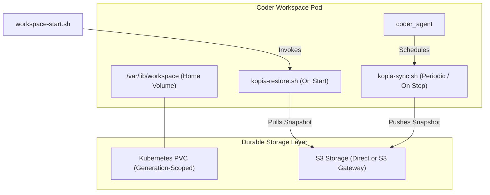

# Coder Snapshots Module

The `coder_snapshots` [OpenTofu](https://github.com/opentofu/opentofu) module provisions durable, generation-scoped home volume storage for [Coder](https://github.com/coder/coder) workspaces, integrated with [Kopia](https://github.com/kopia/kopia) backup and restore lifecycle hooks.

## Architecture & Design



### Durable Home Volume Architecture

Workspaces maintain a stable PersistentVolumeClaim (`coder-${workspace_id}-home`) across their entire lifecycle:

- **Stable Volume Attachment**: Routine workspace stop/start cycles and snapshot restores always attach to `coder-${workspace_id}-home`, preventing Kubernetes PVC finalizer deadlocks (`kubernetes.io/pvc-protection`) when tearing down pods.
- **In-Place Atomic Restore**: Snapshot restores pull snapshot archives into staging and perform an atomic cutover within `/var/lib/workspace` while preserving directory inodes, ensuring zero storage detachment latency or orphaned volumes.
- **Restore Generation Tracking**: Restoring a snapshot calculates a deterministic generation identifier (`substr(sha256(restore_selector), 0, 8)`), tracked in `terraform_data.restore_generation` and keyed by `terraform_data.applied_restore_selector` to ensure restores execute idempotently.

### Workspace Lineage

Each workspace derives an immutable 40-character lineage token:

`Lineage = sha256("workspace-lineage" ‖ owner_id ‖ workspace_id)[0:40]`

This lineage token establishes cryptographic provenance across forks and restarts:

- Restores cross-check the snapshot manifest's lineage against the active or parent lineage claim before applying changes to the filesystem.

### Multi-Cloud S3 Compatibility

Kopia repositories communicate with S3-compatible object storage engines:

- **Direct Cloud Object Storage**: AWS S3, Google Cloud Storage (via S3 XML API), or Azure Blob Storage (via S3 gateway).
- **In-Cluster Gateway Routing**: For multi-cell topologies and private networking, `s3_endpoint` routes traffic through the in-cluster S3 gateway (such as `http://s3-gateway.s3-system.svc:8080`).
- **TLS Configuration**: When an HTTP endpoint is supplied, the sync and restore scripts automatically configure `--disable-tls` for the Kopia repository connection.

### Client-Side Bandwidth Throttling

Workspaces on high-throughput networks can saturate node or gateway bandwidth during large snapshots or initial restores. The `max_bandwidth_mbps` parameter enforces client-side upload and download rate limiting via Kopia's native `--max-upload-speed` and `--max-download-speed` flags (converting Megabits per second to bytes per second). Setting `max_bandwidth_mbps = 0` leaves bandwidth unthrottled.

### Lifecycle Scripts

The module registers three `coder_script` resources on the target `coder_agent`:

1. `hourly_snapshot`: Runs periodically according to `snapshot_interval` (defaulting to every 30 minutes: `0 */30 * * * *`).
2. `shutdown_snapshot`: Executes synchronously on workspace stop (`run_on_stop = true`) with an 1800-second timeout to persist uncommitted state before the home volume is detached.
3. `restore`: Executes synchronously on workspace startup (`run_on_start = true`) to stage and cut over filesystem contents if a snapshot selector is present.

---

## Inputs

| Name | Type | Default | Description |
| :--- | :--- | :--- | :--- |
| `agent_id` | `string` | n/a | Coder agent ID to attach snapshot and restore scripts to. |
| `app_labels` | `map(string)` | `{}` | Labels applied to Kubernetes resources. |
| `disk_iops` | `number` | `null` | Provisioned IOPS for an EBS-backed home PVC, or null to keep the storage class default. |
| `disk_throughput_mbps` | `number` | `null` | Provisioned throughput in MB/s for an EBS-backed home PVC, or null to keep the storage class default. |
| `home_disk_gib` | `number` | n/a | Home disk size in GiB for the PersistentVolumeClaim. |
| `kopia_repository_bucket` | `string` | `""` | S3 bucket name for the Kopia repository and manifests. |
| `max_bandwidth_mbps` | `number` | `0` | Client-side bandwidth limit in Mbps for Kopia (0 = unlimited). |
| `owner_id` | `string` | n/a | Coder owner ID. |
| `owner_username` | `string` | n/a | Coder owner username. |
| `restore_selector` | `string` | `""` | Selected snapshot ID to restore (or empty). |
| `s3_endpoint` | `string` | `""` | Optional custom S3 endpoint URL (e.g. `http://s3-gateway.s3-system.svc:8080`). |
| `snapshot_interval` | `string` | `"0 */30 * * * *"` | Cron expression for periodic workspace backup snapshots. |
| `storage_class_name` | `string` | `null` | Storage class name for the home PersistentVolumeClaim. |
| `workspace_id` | `string` | n/a | Unique identifier of the Coder workspace. |
| `workspace_name` | `string` | n/a | Human-readable name of the Coder workspace. |
| `workspace_namespace` | `string` | n/a | Kubernetes namespace hosting the workspace resources. |

---

## Outputs

| Name | Type | Description |
| :--- | :--- | :--- |
| `active_restore_generation` | `string` | Active restore generation identifier (`0` for fresh, 8-character hash for restores). |
| `environment_variables` | `map(string)` | Map of environment variables to inject into the workspace container. |
| `home_volume_claim_annotations` | `map(string)` | Annotations applied to the Kubernetes PersistentVolumeClaim created for the home volume. |
| `home_volume_claim_name` | `string` | Name of the Kubernetes PersistentVolumeClaim created for the home volume. |
| `restore_requested` | `bool` | Whether a snapshot restore has been requested. |
| `restore_selector` | `string` | Snapshot selector ID stripped of source cell prefix. |
| `workspace_lineage` | `string` | Derived 40-character lineage token representing the durable workspace claim. |

---

## Usage Example

```hcl
module "snapshots" {
  source = "./modules/coder_snapshots"

  agent_id                    = coder_agent.main.id
  app_labels                  = local.app_labels
  home_disk_gib               = 50
  kopia_repository_bucket     = "coder-snapshots"
  max_bandwidth_mbps          = 100
  owner_id                    = data.coder_workspace.me.owner_id
  owner_username              = data.coder_workspace.me.owner
  restore_selector            = data.coder_parameter.restore_selector.value
  s3_endpoint                 = "http://s3-gateway.s3-system.svc:8080"
  snapshot_interval           = "0 */30 * * * *"
  storage_class_name          = "standard"
  workspace_id                = data.coder_workspace.me.id
  workspace_name              = data.coder_workspace.me.name
  workspace_namespace         = "workspaces"
}

# Mount the generation-scoped PersistentVolumeClaim in the workspace Pod / Deployment:
resource "kubernetes_deployment_v1" "workspace" {
  # ...
  spec {
    template {
      spec {
        container {
          name = "workspace"

          # Inject snapshot environment variables into the main container
          dynamic "env" {
            for_each = module.snapshots.environment_variables
            content {
              name  = env.key
              value = env.value
            }
          }

          volume_mount {
            name       = "home"
            mount_path = "/home/coder"
          }
        }

        volume {
          name = "home"
          persistent_volume_claim {
            claim_name = module.snapshots.home_volume_claim_name
          }
        }
      }
    }
  }
}
```
