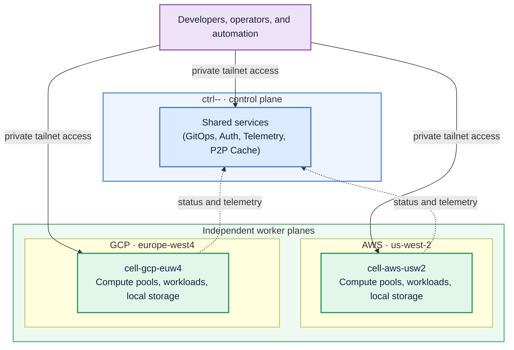
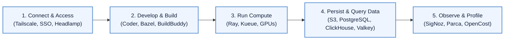
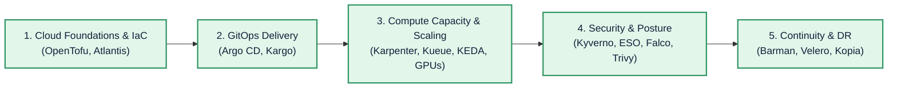

<!-- Introduces the multi-cloud infrastructure architecture, fleet topology, control and worker plane boundaries, and system invariants. -->

# Architecture

This repository provisions and orchestrates a self-hosted engineering platform built on vendor-neutral CNCF graduated and incubating technologies across multi-cloud infrastructure that the organization owns. It provides a unified development, execution, and operational plane across independent [Kubernetes](https://github.com/kubernetes/kubernetes) clusters and cloud providers.

## One control plane, many worker planes

The infrastructure separates shared management services from compute and execution
planes:

- **Control plane (`ctrl-<cloud>-<region>`)**: Hosts shared services such as continuous
  delivery, identity brokering, artifact caching, and global telemetry.
- **Worker planes (`cell-<cloud>-<region>`)**: Independent Kubernetes clusters that host
  team workspaces, compute pools, datastores, and batch workloads close to their data.

The infrastructure natively supports multiple cloud providers, including
[Amazon Web Services (AWS)](https://aws.amazon.com/) and
[Google Cloud Platform (GCP)](https://cloud.google.com/). Providers can be mixed
and matched freely across regions (for example, operating a control plane in AWS
while running worker cells in both AWS and GCP). Users and automation connect
directly to any cluster via a private, authenticated
[Tailscale](https://github.com/tailscale/tailscale) tailnet without routing
traffic through the control plane.

## Core Platform Workflows

The platform serves two primary perspectives: developers shipping code and running
workloads, and operators maintaining and scaling the fleet.

### The Developer Journey

Developers use the platform to build, execute, and inspect applications without
managing underlying cloud resources or Kubernetes plumbing.

1. **Zero-Trust Access & Discovery**: Connect securely from anywhere without VPN overhead
   or public IP exposure, authenticating with corporate single sign-on directly into a
   centralized service catalog and multi-cluster dashboard powered by
   [Tailscale](https://github.com/tailscale/tailscale), [Dex](https://github.com/dexidp/dex),
   [Homer](https://github.com/bastienwirtz/homer), and [Headlamp](https://github.com/headlamp-k8s/headlamp).
2. **Instant Workspaces & Hermetic Builds**: Start development immediately in reproducible,
   containerized cloud environments via browser, [VS Code](https://github.com/microsoft/vscode),
   or SSH. Build code and container images hermetically with fast incremental remote caching
   and distributed execution enabled by [Coder](https://github.com/coder/coder),
   [Bazel](https://github.com/bazelbuild/bazel), and [BuildBuddy](https://github.com/buildbuddy-io/buildbuddy).
3. **Elastic Batch & Distributed Compute**: Launch ad-hoc batch processing or distributed
   machine learning training without managing node pools or idle GPUs. Workloads request
   accelerator classes and queue priorities, automatically gang-scheduling onto on-demand
   GPU and CPU nodes through [Ray](https://github.com/ray-project/ray), PyTorch, and
   [Kueue](https://github.com/kubernetes-sigs/kueue).
4. **Unified Data Access & In-Cluster Databases**: Read and write high-throughput datasets
   over virtual S3 coordinates, run fast analytical queries across large datasets, and access
   transactional databases and in-memory caches colocated with compute using virtual S3 object
   storage, [ClickHouse](https://github.com/ClickHouse/ClickHouse),
   [PostgreSQL](https://github.com/postgres/postgres), and [Valkey](https://github.com/valkey-io/valkey).
5. **Full-Stack Telemetry & Cost Transparency**: Trace requests across services, profile CPU
   and memory bottlenecks down to individual lines of code, and monitor real-time cloud
   spend attributed to specific teams and projects via [SigNoz](https://github.com/signoz/signoz),
   [Parca](https://github.com/parca-dev/parca), and [OpenCost](https://github.com/opencost/opencost).

### The Operator Journey

Platform operators declare infrastructure, enforce fleet-wide governance, and maintain
continuous reliability.

1. **Multi-Cloud Infrastructure as Code**: Declare VPC networks, subnets, IAM roles, and
   managed Kubernetes clusters across AWS and GCP using modular stacks, with automated
   pull-request planning, state locking, and peer-reviewed applies driven by
   [OpenTofu](https://github.com/opentofu/opentofu) and [Atlantis](https://github.com/runatlantis/atlantis).
2. **Declarative Fleet Delivery & Promotion**: Maintain consistent platform state across all
   clusters and environments through ordered sync waves and zero-overlay manifests, promoting
   container images through automated validation gates without manual git commits via
   [Argo CD](https://github.com/argoproj/argo-cd), [Kargo](https://github.com/akuity/kargo),
   and operator-managed datastores ([CloudNativePG](https://github.com/cloudnative-pg/cloudnative-pg),
   [Valkey Operator](https://github.com/valkey-io/valkey-operator)).
3. **Dynamic Capacity & Fast Image Distribution**: Eliminate static, over-provisioned worker
   pools by scaling right-sized spot and GPU compute just-in-time, tuning container resource
   requests automatically, and pulling multi-gigabyte container layers peer-to-peer in seconds
   with [Karpenter](https://github.com/kubernetes-sigs/karpenter), the
   [NVIDIA GPU Operator](https://github.com/NVIDIA/gpu-operator), [KEDA](https://github.com/kedacore/keda),
   the [Vertical Pod Autoscaler (VPA)](https://github.com/kubernetes/autoscaler), and
   [Dragonfly](https://github.com/dragonflyoss/dragonfly).
4. **Defense-in-Depth Security & Governance**: Enforce strict admission policies fleet-wide,
   project cloud secrets dynamically into pods without storing credentials in Git, isolate
   traffic with portable network policies, and detect runtime threats directly in the kernel
   using [Kyverno](https://github.com/kyverno/kyverno),
   [External Secrets Operator](https://github.com/external-secrets/external-secrets), portable
   Kubernetes `NetworkPolicy`, [Trivy](https://github.com/aquasecurity/trivy),
   [Kubescape](https://github.com/kubescape/kubescape), and [Falco](https://github.com/falcosecurity/falco).
5. **Continuous State Preservation & Disaster Recovery**: Protect platform state against
   regional or cluster failures with continuous database streaming, point-in-time developer
   workspace snapshots, scheduled cluster backups, and automated recovery drills orchestrated
   by [Barman](https://github.com/EnterpriseDB/barman), [Kopia](https://github.com/kopia/kopia),
   and [Velero](https://github.com/vmware-tanzu/velero).

---

## Explore by Role

Follow the dedicated documentation lineage tailored to your workflow:

- **[Developer Guide](developer.md)**: Connect to the tailnet, launch remote workspaces, run hermetic builds, submit compute jobs, and inspect telemetry.
- **[Operator Guide](operator.md)**: Explore cluster topology, failure domains, multi-cloud OpenTofu foundations, GitOps sync waves, and reliability contracts.
