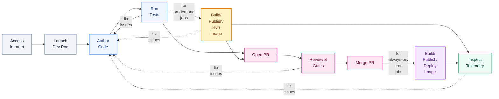

<!-- Guides software engineers and researchers through the developer workflow. -->

# Developer Guide

This guide is for engineers, data scientists, and researchers building applications, libraries, data pipelines, and machine learning models. Everything you need to write code, run builds, submit compute jobs, and inspect telemetry is available through self-service interfaces.

---

## The Workflow at a Glance



---

## 1. Access Intranet

All dashboards and development environments reside on a private, encrypted mesh network.

### Install and Connect Tailscale

<a href="assets/flows/tailscale-login.png"></a>

Install the official client using Homebrew (command below) or [direct download](https://tailscale.com/download):

```bash
brew install --cask tailscale
```

Authenticate using your organization single sign-on credentials through the Tailscale desktop app (click the Tailscale menu bar icon and select **Log in...**) or via the CLI:

```bash
tailscale up
```

<br clear="right"/>

### Access Service Catalog

<a href="assets/flows/home.png"></a>

Once connected, open your browser to the central service catalog at `https://home.c.corp.<domain>`, providing a unified landing page linking directly to all development workspaces, telemetry, and compute tools.

<br clear="right"/>

---

## 2. Launch Dev Pod

Instead of configuring and maintaining local tools on your machine, you develop inside reproducible cloud workspaces equipped with preconfigured compilers, runtimes, and cluster access.

### Create a Workspace

<a href="assets/flows/create-devpod.gif"></a>

1. Open **[Coder](https://github.com/coder/coder)** from the service catalog.
2. Select the **dev** template, provide a name for your workspace, and choose your target region or worker cell.
3. Configure your compute parameters (CPU, memory, optional accelerators, and disk size).
4. Click **Create Workspace**, or restore an existing environment using a snapshot selector.

<br clear="right"/>

> [!TIP]
> **Placement & Sizing Guidance**:
>
> - **Region / Cell**: Select a cell geographically closest to you to minimize editor latency, or pick one equipped with your team's GPU/TPU accelerator pools.
> - **Burstable Headroom & Crash Safety**: Allocations support burstable headroom above base requests. Transient spikes in memory-intensive jobs spill into host swap, absorbing temporary bursts and giving runtimes time to run garbage collection before the system exhausts all memory and triggers an OOM kill.

### Pre-Installed Developer Tools

Every workspace comes with integrated tools and web applications pre-installed and authenticated:

| **Dev Pod Dashboard** | [Paseo](https://github.com/coder/coder) (UI AI Workspace) | **[Herdr](https://herdr.dev) (TUI AI Workspace)** |
| :--- | :--- | :--- |
| <a href="assets/flows/devpod.png"></a><br/>Central workspace overview displaying active resource utilization, build logs, and pre-installed app launcher cards. | <a href="assets/flows/paseo.gif"></a><br/>Browser UI workspace and local orchestrator for AI agents, accessible via browser or companion mobile app over Tailscale. | <a href="assets/flows/herdr.gif"></a><br/>Terminal-native TUI workspace runtime to manage AI agent tasks directly from the shell. |
| [VS Code](https://github.com/microsoft/vscode) (Browser & Desktop) | **[Zasper](https://github.com/zasper-io/zasper) (Notebooks)** | **[Zellij](https://github.com/zellij-org/zellij) (Terminal Multiplexer)** |
| <a href="assets/flows/vscode.gif"></a><br/>Full code-server in your browser or via Desktop VS Code. | <a href="assets/flows/zesper.gif"></a><br/>Interactive notebook and exploratory data analysis environment preconfigured with Python 3. | <a href="assets/flows/zellij.gif"></a><br/>Persistent terminal multiplexer preserving sessions across browser refreshes and machine restarts. |
| **[File Browser](https://github.com/filebrowser/filebrowser)** | **Direct SSH Connectivity** | **[Workspace Snapshots](#workspace-snapshots)** |
| <a href="assets/flows/filebrowser.gif"></a><br/>Browse, inspect, upload, and download workspace files directly through a web interface. | <a href="assets/flows/ssh.gif"></a><br/>Connect local IDEs ([Cursor](https://www.cursor.com), JetBrains) or CLI terminals via Tailscale SSH. | <a href="assets/flows/snapshots.gif"></a><br/>Browse and restore verified point-in-time snapshots and manage workspace lineages. |

### Dev Filesystem Layout

<a href="assets/flows/fs.gif"></a>

Workspaces structure all disks and storage under the unified `/fs/` hierarchy:

- **Monorepo (`/fs/depot`)**: The monorepo is mounted directly at `/fs/depot`, ready for immediate editing, building, and testing without manual cloning or repository setup.
- **Local Data Storage (`/fs/local`)**: Fast persistent local volume storage for datasets, working directories, intermediate build outputs, and caches.
- **Ephemeral Scratch (`/tmp`)**: High-speed node-local temporary scratch storage for transient runtime files and short-lived operations.
- **Object Storage (`/fs/s3`)**: Compatibility mount granting direct filesystem access to object buckets:
  - **Cell-Local Buckets (`/fs/s3/<cell>/...`)**: High-throughput, zero-egress storage colocated within the same region and cloud provider as your workspace worker cell. Use `/fs/s3/<cell>/scratch` for short-lived intermediate build/training artifacts and `/fs/s3/<cell>/home` for durable cell-scoped team datasets.
  - **Global Buckets (`/fs/s3/global/...`)**: Replicated multi-region storage accessible uniformly across all worker cells and regions. Use `/fs/s3/global/home` for cross-region shared configurations, foundational checkpoints, and team assets that must be available everywhere.
- **User Home (`~`)**: Your persistent home directory (`/home/coder`), shell configurations, and personal environment state persist across stops, restarts, and pod replacements.

<br clear="right"/>

### Workspace Snapshots

<a href="assets/flows/snapshots.gif"></a>

The persistent disk attached to your pod (storing your home directory `~` and `/fs/local`) is automatically snapshotted in the background every 30 minutes and right before workspace shutdown. Snapshots use content-defined deduplication and compression via [Kopia](https://github.com/kopia/kopia) to stream only modified blocks into object storage (`s3://`) with minimal bandwidth and storage overhead.

You can use snapshots to roll back after accidental changes, recover deleted work, or create a second dev pod from an earlier snapshot whenever you want two identical setups running in parallel:

1. **Open the Snapshot Catalog**: Click the **"Restore Snapshot..."** action in your Coder workspace app bar, or navigate to `https://coder-snapshots.<ctrl>.<public_domain>`.
2. **Inspect Lineage & History**:
   - **Lineage Graph**: The interactive graph visually maps parent-child relationships and active workspace branches (such as `unicorn | 2026-09-22T23:00:30Z (Active)`). Clicking a node filters the history to that exact lineage.
   - **Timeline**: View all verified snapshots, including UTC capture timestamp, relative age, file count, and deduplication efficiency (for example, 280 GiB logical data deduplicated to 2.7 GiB physical storage on S3).
3. **Select Point in Time**: Find the desired snapshot and click **"Use Snapshot"**.
4. **Copy the Backup Selector**: A modal displays the unique backup selector hash (such as `5c7b2b73ab622c7f0382f6e21cf209c2`) and automatically copies it to your clipboard.
5. **Apply Restoration in Coder**:
   - **Launch an Identical Second Dev Pod**: Click **"Or create a brand-new workspace with this backup"** in the modal to launch a brand-new workspace initialized with that exact snapshot state.
   - **Roll Back Existing Workspace**: Return to your Coder workspace parameters, paste the selector ID into the **"Restore from backup"** field, and restart the workspace.
6. **Anti-Split-Brain Guard**: Restored workspaces branch cleanly into their own lineage. The snapshot engine prevents multiple active workspaces from writing to the same lineage simultaneously, guaranteeing data integrity.

<br clear="right"/>

---

## 3. Author Code

<a href="assets/flows/code.gif"></a>

You develop applications, services, data pipelines, and machine learning models under `src/`. Code is organized into team directories and self-contained project folders (such as `src/<team>/<project>/`). Any project folder containing a `deployment/project.yaml` is automatically recognized by build and release tools for building, testing, and deployment.

### Project Structure

Every project pairs application code with build and deployment metadata:

```text
src/<team>/<project>/
├── main.py                 # Application source code
├── BUILD.bazel             # Build rules and container image definition
└── deployment/
    ├── <project>.k8s.yaml  # Kubernetes workload manifest (Deployment, RayJob, CronJob)
    ├── kustomization.yaml  # Manifest bundle entry point referencing k8s resources
    └── project.yaml        # Delivery model declaration (submitted vs promoted)
```

<!-- TODO(simonepri): Provide workload templating or scaffolding for deployment manifests so projects do not have to duplicate Kubernetes boilerplate. -->

Projects can be authored in any programming language supported by Bazel, including Python, Go, TypeScript, Rust, and C++. Hermetic toolchains pin runtimes and compiler versions repository-wide, eliminating host environment discrepancies.

<br clear="right"/>

### Storage & Databases

Workloads have native access to storage systems and datastores, supporting both cell-local high-throughput I/O and global cross-cluster access:

- **Object Storage (`s3://`)**: Datasets, model checkpoints, and shared artifacts reside in unified, S3-compatible object storage addressed via virtual bucket coordinates:
  - `s3://global/home/<team>/...`: Durable, team-scoped datasets and production checkpoints, accessible across clusters (cross-cluster access is rate-limited to control WAN egress costs).
  - `s3://aws-usw2/scratch/...`: Cell-local, high-throughput temporary scratch storage for intermediate runs.
  - **Fast Inventory Searches (`s3i`)**: Buckets produce daily Parquet-based storage inventories. Developer workspaces and workload pods query petabyte-scale metadata locally using the `s3i` CLI tool (such as `s3i find "*.safetensors"`, `s3i ls`, `s3i du`, or custom SQL via [DuckDB](https://github.com/duckdb/duckdb)) with zero network list overhead. Because inventories generate periodically, `s3i` queries reflect state delayed by up to 24 hours. Direct recursive S3 bucket scans (`s3:ListObjectsV2`) incur financial cost and are rate-limited to a fixed quota per day per pod.
- **[PostgreSQL](https://github.com/postgres/postgres)**: Relational database for transactional application state and structured relational queries. Applications connect using standard connection strings (see reference configuration in [`src/examples/svelte_web`](../../examples/svelte_web)).
- **[ClickHouse](https://github.com/ClickHouse/ClickHouse)**: Columnar analytics database engineered for petabyte-scale SQL queries over event streams, time-series data, and telemetry.
- **[Valkey](https://github.com/valkey-io/valkey)**: In-memory, Redis-compatible key-value store for low-latency caching, rate limiting, and shared PyTorch compile caches.

### Resource Sizing & Automatic Vertical Pod Autoscaling (VPA)

For workloads and user applications running on the cluster (such as microservices and background deployments), **Initial VPA** is enabled by default through cluster policies.

- **Initial Request Rightsizing**: VPA analyzes historical CPU and memory utilization and automatically computes optimal initial resource requests whenever a pod launches. This eliminates manual sizing guesswork, avoids over-allocating team quota, and optimizes cluster scheduling.
- **Burstable Capacity & Swap Crash Safety**: Workload pods maintain burstable headroom above their initial requests. They can burst into unreserved node CPU cores and spill into host swap disk during sudden traffic spikes, large data transformations, or model loading. Spilling into swap disk trades temporary disk latency for process crash safety, preventing the Linux kernel OOM killer from abruptly terminating your service.

### Reference Implementations

To get started quickly, explore tested reference projects across common workload patterns under [`src/examples`](../../examples):

| Workload Type | Reference Implementation | Delivery Model | Key Capability |
| :--- | :--- | :--- | :--- |
| **Distributed AI Training** | [`src/examples/ray_train`](../../examples/ray_train) | Submitted (On-Demand) | Multi-node PyTorch training on autoscaled GPU nodes |
| **Distributed Data Processing** | [`src/examples/ray_data`](../../examples/ray_data) | Submitted (On-Demand) | Parallel dataset transformation with Ray Data |
| **Real-Time Model Serving** | [`src/examples/ray_serve`](../../examples/ray_serve) | Promoted (GitOps) | Autoscaled model inference endpoints |
| **Scheduled Batch Jobs** | [`src/examples/batch_cron`](../../examples/batch_cron) | Promoted (GitOps) | Recurring cron execution with retry policies |
| **Full-Stack Web Application** | [`src/examples/svelte_web`](../../examples/svelte_web) | Promoted (GitOps) | SvelteKit service with PostgreSQL and autoscaling |

### Agent Guidance & RuleSync (`agents/`)

The repository coordinates AI coding assistants and developers through distributed RuleSync definitions:

- **Global & Domain Rules**: Global architecture, coding, testing, security, documentation, and writing standards live in root [`agents/*.rules.rulesync.md`](../../../agents). Domain-specific rules live colocated directly beside the code they govern in nested `agents/` directories (such as [`src/infra/agents/infra.rules.rulesync.md`](../agents/infra.rules.rulesync.md), [`src/infra/argocd/agents/argocd.rules.rulesync.md`](../argocd/agents/argocd.rules.rulesync.md), and [`src/examples/agents/examples.rules.rulesync.md`](../../examples/agents/examples.rules.rulesync.md)).
- **Standardized Four-Part Taxonomy**: Every rule file structures guidance into `Context`, `Principles`, `Decisions`, and `Best Practices`, with bold contract names and clear, enforceable constraints.
- **Auto-Scoped & Lazy-Loaded by Models**: Rules are never dumped into one monolithic prompt. Models and coding assistants (such as Claude Code, Antigravity, or Codex) auto-scope rules based on parent directory boundaries and frontmatter `globs:` (such as `globs: ["**/*.py"]` or `globs: ["**/*.md"]`). When a model reads, writes, or edits a file, only the rules matching that active file path load into the model's context window. This prevents token bloat, eliminates noise, and avoids conflicting instructions across domains.
- **Rule Synchronization**: Running `mise run //:agent-generate` parses all RuleSync sources and compiles native agent rule files into `.agents/rules/`, `.claude/rules/`, and supported IDE extensions.

---

## 4. Run Tests

After authoring application code, connecting data sources, or adapting a reference example, you validate and test your changes locally before running them on the cluster. The repository uses [Bazel](https://github.com/bazelbuild/bazel) for hermetic, multi-language builds, wrapped with [mise](https://mise.jdx.dev/) for simple command execution.

### Everyday Commands

Run linters, formatters, and tests directly from your workspace terminal. Through Bazel change detection, each command analyzes your changes and executes checks, tests, and builds only on affected targets:

```bash
# Format code and regenerate build files automatically
mise run fix

# Run repository checks and linters on affected targets
mise run check

# Run automated tests on affected targets
mise run test

# Run all checks, tests, and builds on affected targets
mise run ci
```

### Shared Remote Caching & Execution with BuildBuddy

Bazel builds leverage remote execution and distributed caching via [BuildBuddy](https://github.com/buildbuddy-io/buildbuddy).

- **Distributed Remote Cache**: Actions, compiled object files, and test outputs are cached globally across the fleet. When a colleague or CI has already built a target or run a test on identical inputs, your build downloads the cached artifact in milliseconds rather than recompiling from source.
- **Remote Execution (RBE)**: Bazel offloads parallel compilation, linting, and test runs to remote worker pools, drastically speeding up large builds while freeing local workspace CPU and memory.
- **Terminal Invocation Links & Analytics**: Every `mise run` or `bazel` invocation emits a clickable BuildBuddy link in your terminal. Open the link to inspect granular build timing waterfalls, target dependency graphs, complete stdout/stderr test logs, cache hit rates, and per-action resource consumption.

### Infrastructure Conformance & Integration Testing (Chainsaw & Floci)

When authoring or verifying cluster infrastructure, Kyverno admission policies, Argo CD components, or workload scheduling behaviors, validate your changes locally against the Floci cloud-and-cluster emulator:

- **Local Fleet Bring-Up**: Launch the local multi-cluster environment with `mise run //src/infra:up` (or `mise run up` inside `src/infra`). Floci spins up a lightweight emulation environment providing local Kubernetes clusters, emulated S3 storage, and local container registries.
- **Run Chainsaw Conformance Suites**: Execute the behavioral integration suites locally against the Floci fleet:

  ```bash
  # Run all behavioral conformance test suites
  mise run //src/infra:chainsaw

  # Run a specific suite (e.g. scheduling, networking, storage)
  bazel run //src/infra/definitions/conformance:chainsaw -- --test=scheduling
  ```

- **Continuous In-Cluster Verification**: In live clusters, a lightweight subset of Chainsaw smoke checks runs continuously every 15 minutes through Kuberhealthy (probing DNS, API server responsiveness, metrics API availability, identity flows, secrets rotation, and storage resolution) to detect runtime degradation before developer workloads are affected. The SigNoz Synthetic Monitoring status table groups each check's logs under an action name derived from its Kuberhealthy label.

---

## 5. Build, Publish & Run Workloads

Once tests and linters pass, you move from local validation to running workloads on the cluster. Depending on the delivery model declared in `deployment/project.yaml`, you can submit compute jobs on demand from your terminal or promote long-running services across deployment stages through GitOps.

### Fleet Topology: Control Plane & Worker Cells

The infrastructure separates central control plane management from regional execution:

- **Control Plane (`ctrl`)**: The central cluster hosting shared management tools, the service catalog, identity, and workspace coordination. Workloads never run on the control plane.
- **Worker Cells (`cell`)**: Regionally distributed execution clusters (such as `cell-aws-usw2` or `cell-gcp-euw4`) where workload pods, batch compute jobs, and hardware accelerators physically run. Workloads execute inside your target worker cell, where Kubernetes manifests encode cell-local resources and scheduling queues.

### On-Demand Jobs (`delivery: submitted`)

Run interactive compute jobs directly from your workspace terminal:

```bash
# Run multi-node Ray training on demand
bazel run //src/examples/ray_train:run

# Run distributed Ray Data processing on demand
bazel run //src/examples/ray_data:run
```

When submitted:

1. Bazel builds the container image hermetically and publishes it to the regional registry.
2. The job manifest applies to your team's namespace in the target worker cell.
3. [Kueue](https://github.com/kubernetes-sigs/kueue) validates your team's compute quota and admits the workload (or queues it if capacity is currently busy).
4. [Karpenter](https://github.com/kubernetes-sigs/karpenter) and cluster autoscalers provision exact spot or on-demand instances just-in-time: standard CPU nodes, GPU accelerators, or TPU slices, automatically terminating nodes once the run completes.

### Compute Quotas & Fair-Share Queueing

Compute capacity in each cell is allocated per team and declared as code in `src/infra/definitions/teams/<team>.yaml`. Workloads declare their target availability class via manifest labels (such as `availability-class: wa` and `kueue.x-k8s.io/queue-name: wa`):

- **`ha` (Highly Available)**: Guaranteed nominal capacity for mission-critical services, datastores, and interactive workspaces. Never preempted.
- **`ma` (Mostly Available)**: Dedicated on-demand compute for high-priority training runs and business-critical pipelines immune to spot preemption.
- **`wa` (Weakly Available)**: Elastic capacity for distributed AI training (such as Ray Train), data processing pipelines (Ray Data), and ad-hoc batch runs. Workloads run on spot or on-demand instances and dynamically borrow idle capacity from other tiers across the cluster cohort.
- **`be` (Best-effort)**: Background tasks and scale-to-zero workloads with lowest scheduling priority.

Workloads also declare a latency class (`latency-class: ls` for interactive/latency-sensitive or `latency-class: lt` for batch/latency-tolerant), which policy engines compose into the pod's scheduling priority ladder (`ha-ls` down to `be-lt`).

#### Preemption & Automatic Requeueing Logic

When submitting compute jobs under fair-share borrowing:

1. **Automatic Admission**: If your team has quota available in the requested class, Kueue admits the run immediately, and cluster autoscalers provision instances just-in-time.
2. **Graceful Preemption**: When higher-priority (`ha`) workloads demand cluster capacity, borrowed `wa` or `be` jobs are gracefully preempted: the cluster sends a `SIGTERM` signal, allowing applications (such as PyTorch or Ray Train) to cleanly flush state and checkpoint to S3 before terminating.
3. **Automatic Requeueing**: Rather than failing a preempted run or dropping it from the system, [Kueue](https://github.com/kubernetes-sigs/kueue) automatically re-queues the workload. As soon as higher-priority demand finishes or new capacity becomes available, Kueue re-admits the job to resume from its latest checkpoint.
4. **Inspect Queue & Fleet Capacity**: Open the **Team Workloads** dashboard in [SigNoz](https://github.com/signoz/signoz) to inspect real-time accelerator allocation, active GPU and VRAM utilization, CPU/RAM limits, and Kueue queue states across teams. You can also inspect your team's active workloads directly from your workspace terminal:

```bash
kubectl get workloads -n <team>-workloads
```

#### Ray Autoscaling & Kueue Considerations

Distributed Ray workloads (such as Ray Data in [`src/examples/ray_data`](../../examples/ray_data)) interact with Kueue through gang-scheduling:

- **Gang Admission Contract**: Kueue admits a RayJob or RayCluster by reserving quota for all statically declared PodSets (the Ray head pod plus initial worker pods) upfront.
- **Autoscaling & Quota Contention Gotcha**: Ray supports dynamic worker autoscaling between `minReplicas` and `maxReplicas`, but Ray's autoscaler operates without visibility into Kueue quota limits. When quota is saturated, dynamically scaled worker pods cannot be admitted. Conversely, Kueue has no communication channel to request that Ray downscale workers under quota pressure or during reclamation; instead, Kueue preempts the entire RayJob workload (terminating the head pod and aborting the run) rather than downscaling elastic workers.
- **Recommended Practice**: For predictable batch data processing and training pipelines, configure fixed worker pools (`replicas: N` with `minReplicas == maxReplicas`), ensuring Kueue admits and reserves all necessary capacity upfront.[^ray-autoscaling-kueue]

<!-- TODO(simonepri): Fix dynamic Ray worker autoscaling integration with Kueue so quota limits prevent unadmitted worker scale-up and Kueue gracefully downscales workers under quota pressure instead of preempting the entire job and head pod. -->
[^ray-autoscaling-kueue]: Current limit. Ray autoscales workers dynamically without awareness of Kueue quota limits, while Kueue lacks a mechanism to instruct Ray to downscale workers under quota pressure, causing Kueue to preempt the entire workload (including the head pod) instead of shedding workers. Tracked upstream in [kubernetes-sigs/kueue#975](https://github.com/kubernetes-sigs/kueue/issues/975), [kubernetes-sigs/kueue#7569](https://github.com/kubernetes-sigs/kueue/issues/7569), [ray-project/kuberay#4846](https://github.com/ray-project/kuberay/issues/4846), [kubernetes-sigs/kueue#15572](https://github.com/kubernetes-sigs/kueue/issues/15572), and [kubernetes-sigs/kueue#14589](https://github.com/kubernetes-sigs/kueue/pull/14589).

### Continuous Services & GitOps Promotion (`delivery: promoted`)

<a href="assets/flows/kargo-promote.gif"></a>

Long-running services, inference endpoints, and scheduled cron jobs are continuously managed through GitOps across deployment stages:

1. **Commit & Build**: Merging code to the repository builds the container image and registers the new digest in [Kargo](https://github.com/akuity/kargo).
2. **Stage Promotion**: Kargo validates stage health checks and promotes the digest across environments (`test` to `prod`).
3. **Cluster Sync**: [Argo CD](https://github.com/argoproj/argo-cd) synchronizes the updated manifests to the cluster without manual intervention.

<br clear="right"/>

Once synced to the cluster, workloads operate under two execution modes:

- **Continuous Services & Serving**: Web applications ([`src/examples/svelte_web`](../../examples/svelte_web)) and model inference endpoints ([`src/examples/ray_serve`](../../examples/ray_serve)) remain online 24/7, autoscaling replicas with inbound traffic.
- **Scheduled Batch Jobs (CronJobs)**: Periodic batch tasks and recurring data pipelines ([`src/examples/batch_cron`](../../examples/batch_cron)) execute on defined schedules. The cluster allocates compute just-in-time when the cron triggers, enforces concurrency guards (`concurrencyPolicy: Forbid`), and terminates nodes once the run completes. To test or execute the batch task on demand using your workspace code without waiting for the schedule:

```bash
# Run the batch task on demand using your workspace code
bazel run //src/examples/batch_cron:run
```

---

## 6. Review & Merge Pull Requests

Every modification targeting the repository—whether application features, reference examples, documentation, or cloud foundations—progresses through automated pull request gating before landing on `main`.

### Automated Pull Request Reviews (ML Reviewer)

<a href="assets/flows/review.png"></a>

When you open a pull request, an automated agentic code review pipeline ([`src/infra/tools/review`](../tools/review)) reviews the changes before human approval and merge:

- **Dynamic Rule Indexing**: The reviewer parses the Git diff against the base branch (`main`) and queries the repository's `agents/` folders using `get_applicable_rules`. It evaluates only the specific global and domain rules that match the modified files and globs, ensuring that changes are judged against the exact architectural and coding standards governing those files without monolithic prompt bloat.
- **Dependency & Impact Analysis**: The review engine executes Bazel diff queries (`bazel query`) and CodeGraph symbol analysis to trace all direct and downstream targets affected by the diff, impacted functions and classes, and associated test suites.
- **Report Contracts & Custom Rubrics**: If any matched rule declares a report contract (such as benchmark comparison tables or verification matrices), the reviewer checks and renders the required report artifacts. It then compiles these inputs into a structured review rubric tailored to the change.
- **Line-Level Feedback & Gating Verdicts**: The review bundle feeds into an LLM reviewer agent that verifies rule compliance, identifies edge cases or safety hazards, and posts a sticky comment with line-level findings and a gating verdict directly onto the pull request thread.

<br clear="right"/>

- **Verdict Outcomes**:
  - `LGTM`: All rules satisfied and no blockers or improvements found. Non-blocking items (🔵 Nit, 🟣 Question, ⚪ Existing) do not block merges.
  - `CHANGES REQUESTED`: Concrete improvement findings must be addressed before approval.
  - `DO NOT MERGE`: Critical blockers or invariant violations detected.
- **Emergency Overrides**: If a pull request must merge despite findings, authors can supply an explicit justification in the pull request description (`NO_LGTM=<reason>`), which is recorded in the audit trail.

### Infrastructure Automation with Atlantis (`src/infra/terraform/`)

For changes modifying cloud foundations or OpenTofu configurations under `src/infra/terraform/`:

- **Automated Planning**: Opening or updating a pull request triggers [Atlantis](https://github.com/runatlantis/atlantis) to run non-destructive execution plans (`tofu plan`) within the affected deployment directory, posting the exact diff plan as a pull request comment.
- **Directory-Scoped State Locking**: Atlantis acquires an exclusive lock on the deployment directory (such as `src/infra/terraform/deployments/ctrl-aws-usw2`), preventing concurrent pull requests from applying conflicting infrastructure states.
- **Controlled Apply**: Cloud modifications are never executed from local developer machines. Once the pull request receives team approval and the ML reviewer passes, running `atlantis apply` in the pull request comment thread applies the changes to cloud infrastructure. Merging the pull request releases the directory lock.

---

## 7. Inspect Telemetry

Once your code or compute job is running, unified monitoring portals provide visibility into performance and errors.

### Unified Telemetry in SigNoz

<a href="assets/flows/signoz.gif"></a>

Open [SigNoz](https://github.com/signoz/signoz) from your service catalog to monitor logs, metrics, and traces in one centralized portal backed by [ClickHouse](https://github.com/ClickHouse/ClickHouse):

- **Distributed Tracing**: Follow request lifecycles across microservices, HTTP handlers, and distributed Ray tasks with automatic OpenTelemetry context propagation. Inspect latency waterfalls to identify slow database queries, network calls, or serialized computation steps.
- **Structured Log Search & Live Tailing**: Query and live-tail container logs across the entire fleet. Filter by team, environment, pod name, service, or correlation trace ID without needing SSH or `kubectl logs`.
- **Real-Time Metrics**: Track container and host metrics including CPU utilization, memory consumption, swap disk usage, and network throughput. Accelerators expose detailed GPU metrics (temperature, memory allocation, and tensor core utilization) via NVIDIA DCGM collectors.

<br clear="right"/>

### Dashboards, Alerts & Views as Code in SigNoz

Observability across the fleet follows GitOps: dashboards, alerting rules, and saved explorer views are authored declaratively as code under [`src/infra/definitions/observability/`](../definitions/observability) and synchronized across clusters by Argo CD:

- **Dashboards as Code ([`src/infra/definitions/observability/dashboards/`](../definitions/observability/dashboards))**: Declared as `dashboard.resources.signoz.io` custom resources. Teams can track fleet health, storage rollups, and compute saturation, including the **Team Workloads** dashboard displaying real-time H200/L4 allocations, active GPU compute and tensor core utilization (`DCGM_FI_DEV_GPU_UTIL`), VRAM usage and headroom (`DCGM_FI_DEV_FB_USED`), CPU and RAM usage rates against cluster allocatable capacities, container requests and limits, and Kueue queue states.
- **Alert Rules as Code ([`src/infra/definitions/observability/rules/`](../definitions/observability/rules))**: Declared as `rule.resources.signoz.io` custom resources. Define proactive threshold and PromQL alerts for node memory pressure, GPU hardware errors (`nvidia-gpu-health`), container crash loops, or p99 latency regressions.
- **Saved Views as Code ([`src/infra/definitions/observability/views/`](../definitions/observability/views))**: Declared as `savedview.resources.signoz.io` custom resources for shared trace waterfall filters, error queries, and audit logs.
- **Notification Channels**: Route alert triggers to team communication channels including Slack, email, PagerDuty, or custom webhooks.

### Continuous Profiling in Parca

<a href="assets/flows/parca.png"></a>

Clusters run [Parca](https://github.com/parca-dev/parca) eBPF agents on workload nodes labelled `profiling: enabled` (every Karpenter node pool that Kueue schedules onto), continuously capturing CPU, memory, and accelerator profiles across running workloads with under 1% overhead, requiring zero code changes, profiler agents, or restarts:

- **Fleet-Wide eBPF Sampling**: Automatically captures user and kernel-space call stacks across Go, Rust, C++, Python, and Node.js runtimes without application instrumentation or performance penalties.
- **Continuous GPU Profiling**: Transparently samples NVIDIA CUDA kernels, warp stall reasons, and device memory allocations directly alongside host CPU call stacks.
- **Interactive Flamegraphs**: Filter profiles by cluster, namespace, container, or process name. Click into stack frames to inspect CPU and GPU cycle time or allocation hotspots down to individual functions, CUDA kernels, and source lines.
- **Differential Profiling (Compare View)**: Select two time windows (such as before and after a model deployment, code release, or traffic spike) to generate red/blue diff flamegraphs that pinpoint performance regressions and memory leaks instantly.
- **Automatic Symbol Resolution**: DWARF, JIT, and CUDA symbol demangling automatically map raw instruction pointers and kernel signatures to human-readable function names and source files.

<br clear="right"/>

---

## Further Reading

- **[Operator Guide](operator.md)**: Cluster topology, failure domains, multi-cloud foundations, and fleet operations.
