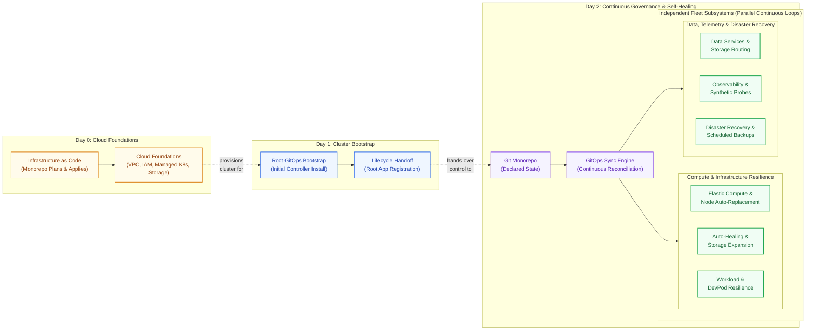
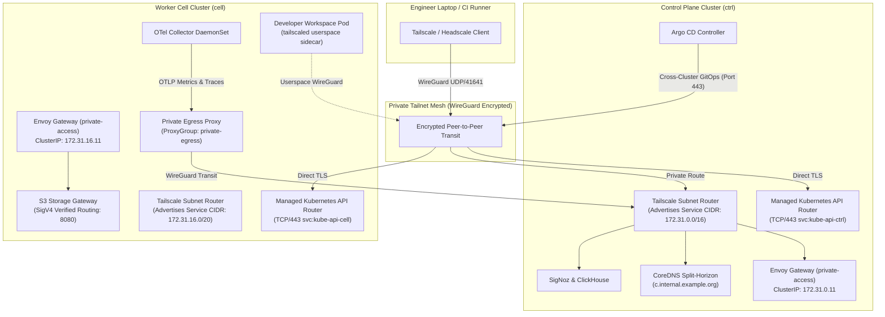
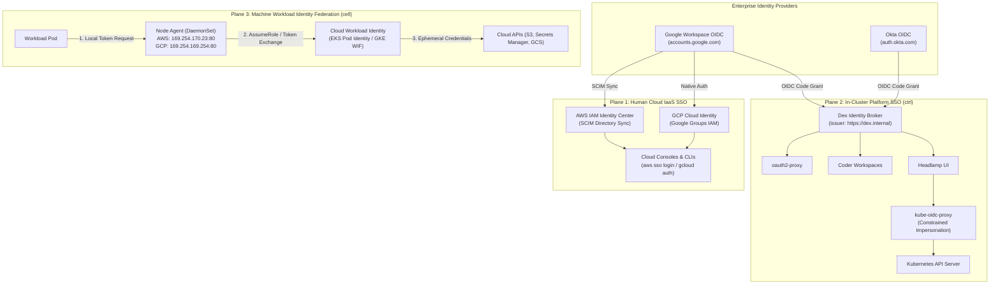
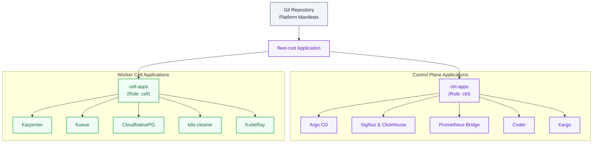
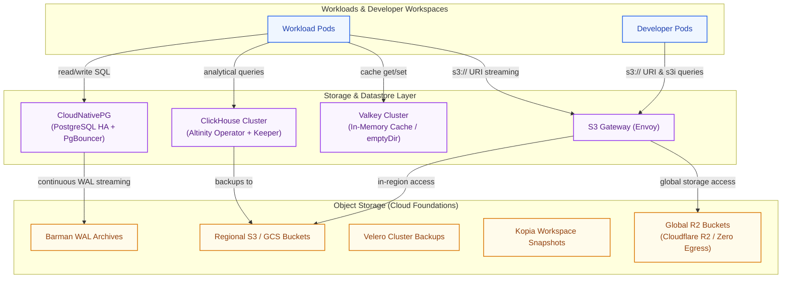
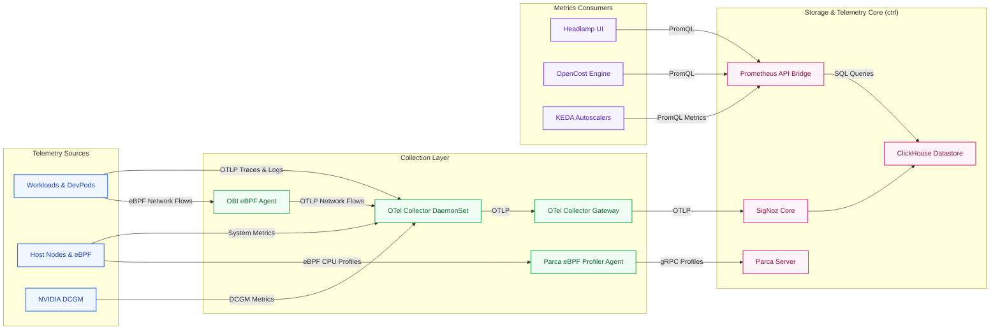
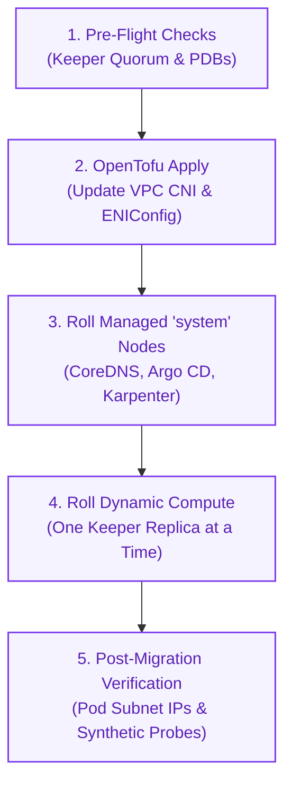

<!-- Guides platform engineers and operators through fleet architecture, provisioning, operations, and self-healing. -->

# Operator Guide

This guide is for platform engineers, SREs, and cluster operators responsible for fleet lifecycle, bootstrap, security posture, workload elasticity, storage, observability, and self-healing. The fleet provides a multi-cloud operational plane spanning an administrative control plane (`ctrl`) and regional worker cells (`cell`) running on [Amazon Web Services (AWS)](https://aws.amazon.com/) and [Google Cloud Platform (GCP)](https://cloud.google.com/).

---

## Fleet Architecture at a Glance

The fleet decouples shared control services from regional execution domains. The platform is designed around **isolated failure domains with no shared failure paths**:

- **Autonomous Worker Execution**: Workload pods, developer workspaces, and batch queues execute close to their data in regional worker cells (`cell`). If the central control plane (`ctrl`) undergoes maintenance or suffers a network partition, cells continue running and persisting storage without interruption.
- **Zero Public Attack Surface**: No administrative dashboards, database ports, or Kubernetes API endpoints are exposed to the public internet; all traffic enters through an encrypted [Tailscale](https://github.com/tailscale/tailscale) mesh tunnel.
- **Hermetic Cloud Decoupling**: Regional storage gateways, P2P image distribution caches, and telemetry query bridges abstract away cloud provider idiosyncrasies ([AWS](https://aws.amazon.com/) vs. [GCP](https://cloud.google.com/)), presenting uniform contracts to workloads.

Below is the complete cross-component dependency blueprint mapping client access, uniform cluster daemons, central control services, regional worker cells, and underlying cloud infrastructure foundations:

> [!NOTE]
> The architecture blueprint serves as a comprehensive reference map indexing all cross-system dependencies across the fleet. The sections below deconstruct each subsystem, protocol, and lifecycle phase sequentially.


<details>
<summary>Diagram legend and interaction flows</summary>

### How to Read this Blueprint

To navigate the blueprint effectively, identify the **5 structural domains** and follow the **6 color-coded edge flows**:

#### 1. Structural Domains (Boxes)

- **Dev Laptop (Slate Grey, Left)**: Client workstation environment where developers write code, manage sessions, and open private VPN tunnels into the platform.
- **Fleet-Wide Daemons (Cream / Grey, Outer Box)**: Background controllers running uniformly across *all* enrolled clusters (both control plane and cells) to enforce node elasticity, pod right-sizing, volume expansion, and automated hygiene.
- **Controller Cluster (`ctrl`, Lavender, Center Left)**: The centralized management plane hosting fleet-wide coordination services: GitOps sync, image promotion, telemetry aggregation, identity federation, and PromQL translation. Never runs batch jobs or developer workloads.
- **Worker Cells (`cell`, Mint Green, Center Right)**: Autonomous regional compute fabrics hosting interactive developer pods, batch queues, distributed ML runtimes, and local S3 caching proxies. Engineered to continue serving uninterrupted if the control plane becomes unreachable.
- **Cloud Foundations (Warm Amber, Right)**: Underlying cloud provider IaaS primitives (VPCs, managed Kubernetes, object storage, and cloud IAM) provisioned via Infrastructure as Code.

#### 2. Color-Coded Interaction Flows (Edges)

| Flow & Color | Operational Role & Mechanism |
| :--- | :--- |
| **Blue** (Access & Ingress) | Encrypted user access, private browser routing, and terminal multiplexing over Tailscale. |
| **Purple** (Delivery & GitOps) | Declarative state synchronization, automated image promotion, and P2P layer distribution. |
| **Green** (Elasticity & Lifecycle) | Just-in-time node provisioning, pod right-sizing, PVC expansion, and garbage collection. |
| **Orange** (Storage & Data Plane) | High-speed in-region object storage, S3i DuckDB metadata queries, and zero-egress Cloudflare R2 global storage. |
| **Red** (Security Posture) | Pre-admission validation, continuous CVE scanning, and real-time kernel anomaly detection. |
| **Magenta** (Telemetry & Bridging) | Unified OTLP pipeline ingestion, columnar storage, and PromQL-to-ClickHouse SQL translation. |

The numbered sections below deconstruct each of these interaction flows with detailed architectural contracts and recovery procedures.

</details>

---

## Fleet Operations at a Glance

The platform structures the operational lifecycle into three continuous phases:

- **Day 0 (Cloud Foundations)**: Infrastructure as Code provisions foundational cloud primitives (VPCs, subnets, IAM roles, managed Kubernetes control planes, and storage buckets) via pull-request automation.
- **Day 1 (Cluster Bootstrap & Handoff)**: OpenTofu installs the minimal root GitOps controller, establishes initial cluster trust, and deterministically hands over lifecycle authority to Argo CD.
- **Day 2 (Continuous Governance & Self-Healing)**: Continuous GitOps reconciles cluster state against the Git monorepo, while parallel fleet subsystems autonomously scale nodes, self-heal degraded hardware and pods, expand storage, route telemetry, and execute scheduled backups.



---

## 1. Cloud Foundations & Cluster Bootstrap (Day 0 & Day 1)

All cloud infrastructure outside the Kubernetes API is codified in [OpenTofu](https://github.com/opentofu/opentofu) and automated through [Atlantis](https://github.com/runatlantis/atlantis) pull-request workflows.

### 1.1 3-Tier Infrastructure as Code Architecture

1. **Tier 1: Components (`src/infra/terraform/components/`)**: Self-contained, reusable building blocks (e.g. `vpc`, `eks`, `gke`, `iam_roles`, `kms_keys`, `s3_bucket`) adhering to strict protocol-first input/output interfaces (`_interface/` and `record.tf`).
2. **Tier 2: Topologies (`src/infra/terraform/topologies/`)**: Cloud-specific composition layers wiring components together into cohesive regional architectures (e.g. AWS EKS cell topology, GCP GKE cell topology).
3. **Tier 3: Deployments (`src/infra/terraform/deployments/`)**: Concrete environment instantiations (`dns`, `research`, `local`) defining precise CIDR allocations, compute instance families, and cloud regions.

### 1.2 Physical Substrates & VPC Subnet Tiering

Cloud infrastructure provisions tiered VPC networks via provider-neutral [OpenTofu](https://github.com/opentofu/opentofu) modules:

- **Public Subnets**: Tied directly to an Internet Gateway (IGW). Public subnets host managed NAT Gateways and strictly allowlisted external webhook ingress endpoints (such as Atlantis GitHub webhooks). Kubernetes worker nodes, control planes, and workload pods are never placed in public subnets.
- **Private Subnets**: Tied to NAT Gateways for outbound internet egress. Private subnets host Kubernetes worker nodes, managed database clusters, and cloud-managed control plane endpoints (EKS / GKE).
- **Pod Secondary Subnets**: Dedicated secondary IP CIDR blocks allocated exclusively for Kubernetes pod IP assignment (AWS VPC CNI custom networking and GKE secondary alias ranges). Pod secondary subnets prevent IP exhaustion under high-density batch scheduling and large distributed Ray clusters without inflating the primary node subnet address space.

### 1.3 Atlantis Pull-Request Automation

Infrastructure changes follow an automated pull-request workflow:

- **Autoplan per Project**: Opening or updating a pull request triggers Atlantis to run non-destructive execution plans (`tofu plan`) per affected project (`dns`, `research`) based on modified files and declared dependencies, posting plan diffs directly as pull request comments. The local environment (`local`) runs on local workstations and is excluded from Atlantis automation.
- **Directory-Scoped Locking**: Atlantis locks each affected deployment directory (`src/infra/terraform/deployments/dns`, `src/infra/terraform/deployments/research`), preventing concurrent pull requests from applying conflicting infrastructure states.
- **Apply Requirements**: Applying plans requires pull request approval, a mergeable pull request state, and an undiverged branch (`[approved, mergeable, undiverged]`). Any newly generated plan automatically discards prior approvals.
- **Controlled Apply**: Cloud modifications are never executed from local developer machines. Because apply-all is disabled on the server, operators apply each planned project individually by running `atlantis apply -d <dir>` (for example, `atlantis apply -d src/infra/terraform/deployments/research`) in the pull request comment thread once requirements are met.
- **Automerge**: Once all planned projects are applied successfully, Atlantis automatically merges the pull request into the target branch and releases all directory locks.
- **Dual-Surface Split Architecture**:
  - **Private Web UI (`atlantis.<cluster_domain>`)**: The interactive dashboard, plan inspector, and lock manager are completely private, accessible only across the Tailscale mesh and guarded by Dex OIDC authentication.
  - **Hardened Webhook Ingress (`https://hooks.<domain>/github/atlantis`)**: Webhook deliveries from GitHub enter through the single public ingress entry point protected by IP CIDR allowlists and HMAC validation (detailed in Section 2.6).
- **Plan and Apply Least-Privilege IAM Split**:
  - **Pod Identity Role**: The pod runs with an ambient IAM role (`atlantis`) bound to ServiceAccount `atlantis/atlantis-apply`. This base role holds no direct infrastructure permissions. Its policy permits only `sts:AssumeRole` and `sts:TagSession` on the two scoped workflow roles.
  - **Plan Role (`*-atlantis-plan`)**: The plan role grants read-only metadata discovery (Get, List, and Describe actions across EC2, EKS, IAM, KMS, Route 53, and S3) and access to read fleet secrets and decrypt values needed for planning. It denies all resource mutations (no Create, Update, Delete, Tag, RunInstances, or PassRole). On EKS clusters (`ctrl` and `cell`), an EKS access entry grants cluster-scoped `AmazonEKSAdminViewPolicy`.
  - **Apply Role (`*-atlantis-apply`)**: The apply role grants the full administrative and provisioning permissions required to create, update, tag, and delete cloud resources. On EKS clusters, an EKS access entry grants cluster-scoped `AmazonEKSClusterAdminPolicy`. Both roles trust exclusively the Atlantis pod-identity role.
  - **Dynamic Role Switching via `AWS_PROFILE`**: OpenTofu saves provider configurations and resolved input variables directly into the serialized plan file (`tfplan`). Configuring credentials directly in OpenTofu provider blocks would cause `tofu apply` to deserialize and reuse plan-phase credentials. Instead, Atlantis mounts an AWS configuration file (`/etc/atlantis-aws/config`) populated from cluster annotations with `[profile atlantis-plan]` and `[profile atlantis-apply]`. The server-side `fleet` workflow sets `AWS_PROFILE=atlantis-plan` before running `init` and `plan`, and sets `AWS_PROFILE=atlantis-apply` before running `apply`. This ensures complete credential separation between planning and execution without hardcoding credentials into plan artifacts.
- **Private Kubernetes API Egress**: Atlantis reaches the fleet's private Kubernetes API endpoints through the `atlantis-cluster-api` NetworkPolicy built from the `network-cidrs` annotation.

### 1.4 Day-1 Bootstrap Contract

The handoff between OpenTofu and GitOps is deterministic:

- OpenTofu provisions VPC networks, managed Kubernetes control planes (EKS / GKE), KMS encryption keys, and base IAM permissions.
- In the final step of deployment, OpenTofu installs the minimal Argo CD bootstrap controller and registers the root application (`fleet-root`).
- OpenTofu's responsibility terminates at the Argo CD boundary. All subsequent cluster state, CRDs, system add-ons, and operators are owned and reconciled exclusively by Argo CD.

```bash
# Verify infrastructure plans locally before submitting pull requests
tofu plan

# Atlantis automatically executes tofu plan per project upon opening a pull request
# Once approved, mergeable, and undiverged, apply per deployment (apply-all is disabled):
atlantis apply -d src/infra/terraform/deployments/research
```

### 1.5 Deployment Inputs & Provider Credentials

OpenTofu reads every provider credential from AWS Secrets Manager in account `400920695547` (`us-west-2`), never from a personal token. Load each value into the environment for one command at a time; never write it to disk or print it.

| Deployment | Inputs | Credentials (Secrets Manager secret -> OpenTofu input) |
|---|---|---|
| `research` | `main.tf` decodes `deployment.yaml` itself; flags such as `enable_cloud_cost` default in `variables.tf`. | `ctrl-aws-usw2-tailscale-terraform-oauth` (JSON `client_id`, `client_secret`) -> `TF_VAR_tailscale_oauth_client_id`, `TF_VAR_tailscale_oauth_client_secret`; `ctrl-aws-usw2-mesh-router-tailscale-auth-key` (plain string) -> `TF_VAR_tailnet_auth_key`. |
| `dns` | `main.tf` decodes `deployment.yaml` itself; flags default in `variables.tf`. | `api_token` of `ctrl-aws-usw2-cloudflare-terraform-token` (JSON) -> `CLOUDFLARE_API_TOKEN`. |

The Tailscale credential is the tailnet-owned OAuth client "OpenTofu IaC provisioner", with scopes `auth_keys`, `devices:core` and `oauth_keys` and tags `tag:k8s-operator` and `tag:subnet-router`. These scopes and tags must cover the operator OAuth client that OpenTofu creates, because Tailscale only lets a client create clients with a subset of its own scopes and tags. Do not substitute a personal API access token: it belongs to one user and expires within 90 days. The provisioner needs no `policy_file` scope while `manage_tailscale_acl` is `false`.

The [Renovate](https://github.com/renovatebot/renovate) read-only ECR credential (`ctrl-aws-usw2-renovate-ecr-read` in Secrets Manager) provides IAM credentials (JSON `access_key_id`, `secret_access_key`) for automated dependency scanning against private Amazon ECR repositories (`400920695547.dkr.ecr.us-west-2.amazonaws.com`). It is strictly limited to `ecr:GetAuthorizationToken` on `*`, plus `ecr:ListImages` and `ecr:BatchGetImage` on `repository/src/*`, without `ecr:GetDownloadUrlForLayer` or write permissions. These credentials populate the exact Renovate secrets `RENOVATE_ECR_ACCESS_KEY_ID` and `RENOVATE_ECR_SECRET_ACCESS_KEY` configured in `.github/renovate.json` host rules.

> [!NOTE]
> The `ctrl-aws-usw2-renovate-ecr-read` IAM user only exists after the `research` apply has been run, so the `create-access-key`/`create-secret` commands below must be run after that apply.

To create the secret for the first time without saving secrets in OpenTofu state or printing the secret access key to console/logs, pipe the generated credentials directly:

```bash
aws iam create-access-key \
  --user-name ctrl-aws-usw2-renovate-ecr-read \
  --query 'AccessKey.{access_key_id:AccessKeyId,secret_access_key:SecretAccessKey}' \
  --output json \
| aws secretsmanager create-secret \
  --region us-west-2 \
  --name ctrl-aws-usw2-renovate-ecr-read \
  --description "Read-only ECR access key for Renovate dependency scanner" \
  --secret-string file:///dev/stdin
```

To rotate existing credentials without printing keys:

```bash
aws iam create-access-key \
  --user-name ctrl-aws-usw2-renovate-ecr-read \
  --query 'AccessKey.{access_key_id:AccessKeyId,secret_access_key:SecretAccessKey}' \
  --output json \
| aws secretsmanager put-secret-value \
  --region us-west-2 \
  --secret-id ctrl-aws-usw2-renovate-ecr-read \
  --secret-string file:///dev/stdin
```

Local applies authenticate with `aws sso login --profile openplex-admin`; OpenTofu needs a live SSO session for the state backend, not only cached CLI credentials.

```bash
# research
export AWS_PROFILE=openplex-admin
oauth="$(aws secretsmanager get-secret-value --region us-west-2 --secret-id ctrl-aws-usw2-tailscale-terraform-oauth --query SecretString --output text)"
export TF_VAR_tailscale_oauth_client_id="$(jq -r .client_id <<<"${oauth}")"
export TF_VAR_tailscale_oauth_client_secret="$(jq -r .client_secret <<<"${oauth}")"
unset oauth
export TF_VAR_tailnet_auth_key="$(aws secretsmanager get-secret-value --region us-west-2 --secret-id ctrl-aws-usw2-mesh-router-tailscale-auth-key --query SecretString --output text)"
tofu -chdir=src/infra/terraform/deployments/research plan -out=research.planfile

# dns
export CLOUDFLARE_API_TOKEN="$(aws secretsmanager get-secret-value --region us-west-2 --secret-id ctrl-aws-usw2-cloudflare-terraform-token --query SecretString --output text | jq -r .api_token)"
tofu -chdir=src/infra/terraform/deployments/dns plan -out=dns.planfile

# renovate
export AWS_PROFILE=openplex-admin
ecr_creds="$(aws secretsmanager get-secret-value --region us-west-2 --secret-id ctrl-aws-usw2-renovate-ecr-read --query SecretString --output text)"
export AWS_ACCESS_KEY_ID="$(jq -r .access_key_id <<<"${ecr_creds}")"
export AWS_SECRET_ACCESS_KEY="$(jq -r .secret_access_key <<<"${ecr_creds}")"
unset ecr_creds
```

### 1.6 Cloud Resource Naming, Compliance Variables & Tagging Architecture

Cloud infrastructure enforces unified conventions across resource naming, customer IAM compliance, and resource tagging:

- **Cloud Resource Naming**:
  - **Cluster Prefix**: Every cloud object name starts with its owning cluster name: `<cluster>-<purpose>[-<qualifier>]` using lowercase letters, digits, and single hyphens, with no repeated adjacent words, in at most 48 characters.
  - **Workload Purpose**: The purpose names the workload in at most three plain words without repeating its parent system. Terraform map keys that become name segments use the same hyphenated form.
  - **KMS Key Aliases**: Every KMS key receives an alias `alias/${kms_alias_prefix}${cluster}-${purpose}` (or `alias/${kms_alias_prefix}${secret_name}` for secret manager keys), ensuring no key is identified solely by its generated ID.
  - **Cross-Account Namespaces**: Names in globally shared or cross-account namespaces suffix the owning cloud account ID. Storage and cloud cost buckets follow `${cluster}-${class}-${account_id}` (such as `cell-aws-usw2-home-400920695547`).
  - **Control Plane Ownership for Shared Resources**: Objects shared across an entire deployment (such as operator credentials or global Cloudflare R2 storage buckets) take the control plane cluster name as their prefix (`ctrl-aws-usw2-...`), never a generic tenant, installation, or deployment word.
  - **Container Image Repositories**: Container repositories are named after the repository source path of the component they are built from (such as `src/infra/tools/coder_snapshot_portal`). They belong to the deployment registry rather than an individual cluster, carrying no cluster prefix.
  - **Deployment Isolation & `name_prefix`**: Deployments are isolated by cloud account, DNS domain, and tailnet. Deployments sharing a cloud account set `name_prefix` (default `""`), which prepends strictly to cluster names.
- **Customer Compliance Variables**:
  - Every OpenTofu module creating IAM roles, policies, users, instance profiles, or KMS aliases accepts standardized customer compliance variables:
    - `iam_name_prefix`: string, default `""`, validated to length <= 16 and pattern `^[a-z0-9-]*$`. Prepended verbatim before the cluster name of every IAM role, policy, user, and instance profile (`${iam_name_prefix}${cluster}-${purpose}`).
    - `kms_alias_prefix`: string, default `""`, validated to length <= 16 and pattern `^[a-z0-9-]*$`. Prepended verbatim before the cluster name of every KMS alias (`alias/${kms_alias_prefix}${cluster}-${purpose}`).
    - `iam_permissions_boundary`: string ARN, default `null`. Attached directly to every IAM role via `permissions_boundary`.
    - All three default to empty/null and apply exclusively to IAM objects and KMS aliases.
- **Unified Tagging Architecture**:
  - **Deployment Tag Map**: Each deployment declares a single `tags` map variable with lowercase kebab-case keys (such as `environment = "research"` or `environment = "local"`).
  - **Provider Default Tags**: Applied globally across all OpenTofu-managed resources through cloud provider `default_tags`.
  - **Cluster Registration Projection**: Passed downstream into Kubernetes cluster registrations via the annotation `resource-tags = jsonencode(tags)`.
  - **Runtime Controller Propagation**: In-cluster controllers that provision cloud resources dynamically consume this annotation:
    - Karpenter `EC2NodeClass` projects the tags onto EC2 worker instances via `spec.tags`.
    - AWS Load Balancer Controller applies the tags to Elastic Load Balancers via `defaultTags`.
    - EBS CSI Driver applies volume tags to provisioned EBS persistent volumes via the cluster component `tags` input.

---

## 2. Multi-Cluster Networking, Cross-Cluster Communication & Zero-Trust Ingress

The fleet enforces an asymmetric, zero-trust network topology built on three fundamental guarantees: **zero public ingress by default**, **software-defined WireGuard mesh transit**, and **authenticated Layer 7 service doors**.



### 2.1 Multi-Cloud CNI Dataplanes & Network Policies

Once cluster substrates are provisioned, container networking executes directly on cloud-native CNI dataplanes:

- **Multi-Cloud CNI Baseline**: Deploys the provider's first-party CNI for maximum wire-speed performance: AWS VPC CNI with ENI trunking and prefix delegation on AWS; GKE Dataplane V2 powered by [Cilium](https://github.com/cilium/cilium) with eBPF routing on GCP; [Flannel](https://github.com/flannel-io/flannel) inside pinned [k3s](https://github.com/k3s-io/k3s) worker nodes in local environments.
- **Portable NetworkPolicy Contract**: Regardless of the underlying CNI, all dataplanes strictly enforce standard Kubernetes `networking.k8s.io/v1` `NetworkPolicy`. Platform components never author proprietary CNI CRDs, guaranteeing complete multi-cloud policy portability.

### 2.2 The Private Access Plane (Tailscale & Headscale WireGuard Mesh)

All administrative access, browser portals, developer sessions, and cross-cluster control loops transit an encrypted WireGuard mesh managed by the [Tailscale](https://github.com/tailscale/tailscale) Kubernetes Operator (or self-hosted [Headscale](https://github.com/juanfont/headscale) locally):

- **Subnet Routers (`Connector`)**: A high-availability `Connector` deployment in the `tailscale` namespace advertises the cluster's Kubernetes Service CIDR (e.g. `172.31.0.0/16`) and CoreDNS resolver routes into the private tailnet. Authorized operators route directly to internal Service IPs without configuring local SOCKS proxies or port forwards.
- **Kubernetes API Routers (`svc:kube-api-<cluster>`)**: To keep managed Kubernetes control planes completely private while allowing remote Argo CD management, two VPC-external routers per cluster advertise stable Tailscale services: `svc:kube-api-<cluster>`. Argo CD connects to worker cells over the tailnet on port `443`, preserving raw TLS certificate validation against the cloud provider's API server CA.
- **Private Egress Proxies**: Worker cells deploy a `ProxyGroup` named `private-egress`. In-cluster cell daemons (such as [OpenTelemetry Collector](https://github.com/open-telemetry/opentelemetry-collector) exporting traces to SigNoz) reach the active control plane's private gateway IP through an in-cluster `active-ctrl-private-access` Service without leaving the tailnet.
- **Local Fleet Parity (Headscale)**: Local development environments run a self-hosted Headscale control plane federating with [Dex](https://github.com/dexidp/dex) for OIDC authentication, an embedded DERP relay on region `999` for container NAT traversal, and loopback port forwarding (`127.0.0.1:18443`) for local browser access.

### 2.3 Cross-Cell & In-Cluster Service Doors (Gateway API)

The fleet adopts the [Kubernetes Gateway API](https://gateway-api.sigs.k8s.io/) as its single Layer 7 routing abstraction, deployed via [Envoy Gateway](https://github.com/envoyproxy/gateway):

- **ClusterIP Private Ingress Contract**: The primary Gateway instance (`private-access` in namespace `envoy-gateway-system`) binds to a private `ClusterIP` with a deterministic IPv4 address (e.g. `172.31.0.11`) rather than creating expensive, internet-facing cloud load balancers. Because the Subnet Router advertises the Service CIDR, remote clusters dial Service IPs directly over WireGuard.
- **Canonical Door Routing**: Gateway instances author specialized listeners:
  - `coder-apps-https`: Listens on port `443` for `*.coder.<base-domain>`, routing to the Coder control plane with wildcard TLS termination.
  - `s3-http` & `s3-https`: Dedicated endpoints for the virtual S3 Storage Gateway on port `8080`. Routes use AWS SigV4 header matching to inspect authorization signatures, enforce team path boundaries, and route requests directly to regional cloud storage or Cloudflare R2 global buckets.
  - `kube-oidc-tls`: A `TLSRoute` on port `443` providing TLS Passthrough for `kube-oidc-proxy`, allowing the in-cluster proxy to present its own CA and validate client OIDC tokens directly.
- **Service Catalog Discovery**: The [Homer](https://github.com/bastienwirtz/homer) dashboard serves as the central private catalog at `https://home.<cluster_domain>`, linking directly to cluster UIs ([Headlamp](https://github.com/headlamp-k8s/headlamp)), GitOps ([Argo CD](https://github.com/argoproj/argo-cd)), telemetry dashboards ([SigNoz](https://github.com/signoz/signoz)), profiling ([Parca](https://github.com/parca-dev/parca)), and developer workspaces ([Coder](https://github.com/coder/coder)).

### 2.4 Split-Horizon DNS Architecture

DNS resolution is deterministic, private, and split-horizon across in-cluster pods and tailnet clients:

- **Domain Hierarchy Derivation**: All internal hostnames derive from `public_domain`:
  - `public_domain`: Root identity (e.g. `example.com` or `local.internal`).
  - `intranet_domain`: Internal identity domain (e.g. `internal.<public_domain>` or `<public_domain>`).
  - `cluster_domain`: Derived as `c.<intranet_domain>` (e.g. `c.internal.example.com`).
  - Per-Cluster Domain: `<cluster-name>.<cluster_domain>` (e.g. `ctrl-aws-usw2.c.internal.example.com`).
- **In-Cluster Resolution ([CoreDNS](https://github.com/coredns/coredns))**: CoreDNS registers custom server blocks mapping all service names directly to the private Envoy Gateway ClusterIP (`172.31.0.11`). It maintains static rewrite rules for remote cell storage doors (`s3-gateway.<cell>.<domain>`) and remote identity proxies (`kube-oidc-proxy.<cell>.<domain>`).
- **Route Synchronization ([ExternalDNS](https://github.com/kubernetes-sigs/external-dns))**: ExternalDNS watches Gateway API `HTTPRoute` resources carrying `app.kubernetes.io/component=external-dns-source` and synchronizes hostnames into private cloud DNS zones (AWS Route53 Private Hosted Zones or GCP Cloud DNS Private Zones) without manual DNS intervention.

### 2.5 Private PKI & The Certificate Transparency Protection Invariant

Internal cluster endpoints are encrypted using x509 certificates issued by in-cluster CAs:

- **Private CA Hierarchy ([cert-manager](https://github.com/cert-manager/cert-manager))**: The root `cluster-local-ca` certificate backs the cluster-wide `ClusterIssuer/cluster-local-ca`. Envoy Gateway instances request wildcards (`*.ctrl.<domain>` and `*.coder.<domain>`) directly from this private issuer.
- **CA Bundle Distribution ([trust-manager](https://github.com/cert-manager/trust-manager))**: The `trust-manager` operator projects the root CA bundle as a standard `ca.crt` ConfigMap into all namespaces, ensuring in-cluster workloads trust internal fleet doors without altering container images.
- **Cross-Cluster CA Publication & Federation**: For cross-cluster mTLS and federated OIDC/gRPC peering (e.g. Headlamp accessing cell Kubernetes APIs, Dragonfly manager-to-peer peering, SigNoz observability forwarding, Velero UI OIDC), each cluster publishes its own public root CA certificate via a dedicated `trust-manager` Bundle (`cluster-published-ca`) projecting into ConfigMap `cert-manager-system/cluster-published-ca`. OpenTofu reads only this public ConfigMap (guaranteeing private keys never enter Terraform state) and annotates Argo CD cluster secrets (`control-cluster-ca` on cells and `<cell>-cluster-ca` on the control plane).
- **Inline Scoped Trust Bundles**: Workload trust bundles (`headlamp-cluster-ca`, `dragonfly-grpc-ca-bundle`, `prometheus-api-bridge-control-ca`, `velero-ui-control-ca`, `kube-oidc-proxy-control-ca`, `otel-collector-control-ca`) are dynamically patched with `inLine` sources populated from these Argo cluster annotations, avoiding fleet-wide CA cross-contamination while maintaining cloud-agnostic portability.
- **ISRG Trust Rule for Public ACME Endpoints**: Workloads on cell clusters reaching control cluster endpoints terminated with public Let's Encrypt certificates (e.g. Dex OIDC and SigNoz telemetry doors under `*.corp.<domain>`) mount trust bundles containing public root certificates inline. To withstand cross-sign deprecation and future root transitions, these bundles inline both **ISRG Root X1** and **ISRG Root YR**.
- **The Certificate Transparency (CT) Protection Invariant**: Private internal hostnames must **never** request certificates from public ACME providers (such as Let's Encrypt). Public certificate authorities publish every issued certificate to immutable, searchable [Certificate Transparency logs](https://www.certkit.io/tools/ct-logs/). If an internal hostname (such as `database.team-alpha.cell-aws-usw2.c.<domain>`) requests a public certificate, the platform's internal topology, naming conventions, and team definitions are permanently leaked to external adversaries. Public ACME issuance is strictly restricted to true external ingress hostnames (such as `hooks.<domain>`) and to each private-access gateway's cluster wildcard (such as `*.cell-aws-usw2.c.<domain>`), which browsers must trust and which names only the cluster.[^dns-tls-boundary]

[^dns-tls-boundary]: Actively enforced. Platform manifests strictly divide internal certificates to `cluster-local-ca` and external to `public-acme`, and the `acme-domain-protection` Kyverno admission policy actively denies public ACME certificate requests for internal domain patterns.

### 2.6 Public Webhook Ingress & Defense-in-Depth

While the fleet enforces **zero public ingress by default** and keeps all UI dashboards and APIs strictly behind Tailscale, automated GitOps and pull-request runners require unsolicited inbound event deliveries from external platforms like GitHub. The platform provides a single hardened entry point (`hooks.<domain>`) architected with four defense-in-depth security layers:

1. **Generic Hostname & CT Log Obfuscation**: The ingress uses a generic hostname (`hooks.<domain>`) instead of application-specific hostnames like `atlantis.<domain>` or `argocd.<domain>`. When Let's Encrypt issues certificates and publishes them to Certificate Transparency logs, external observers cannot determine what automation tooling or internal services operate behind the endpoint.
2. **Path-Scoped Routing & Internal Rewriting**: External hooks are partitioned by source and application (`https://hooks.<domain>/github/atlantis`, `https://hooks.<domain>/github/argocd`). Envoy Gateway matches the exact path prefix and performs an internal `ReplaceFullPath` rewrite (`/events` for Atlantis, `/api/webhook` for Argo CD), isolating backend services and preventing arbitrary path probing.
3. **Envoy Gateway IP CIDR Filtering**: An Envoy Gateway `SecurityPolicy` attaches to the public HTTPRoute with a `defaultAction: Deny` rule that allows requests exclusively from GitHub's published webhook IP ranges ([GitHub IP Addresses](https://docs.github.com/en/authentication/keeping-your-account-and-data-secure/about-githubs-ip-addresses) sourced from `https://api.github.com/meta` under `.hooks`). Internet scans, bot traffic, and unauthorized callers are dropped at the Envoy proxy before reaching workload containers.
4. **Cryptographic HMAC SHA-256 Verification**: Both Atlantis and Argo CD independently validate the `X-Hub-Signature-256` header on every incoming webhook payload against the pre-shared secret configured in the secret store before executing any command or refreshing applications.

#### 2.6.1 Ingress Host Exposure & Source Ranges

On the control cluster (e.g. `ctrl-aws-usw2`, public domain `<publicDomain>`), the webhook ingress is composed of:

- **Dedicated Public Hooks Gateway & AWS Network Load Balancer (NLB)**: A dedicated `public-hooks` Gateway creates an EnvoyProxy Service of type `LoadBalancer` using `loadBalancerClass: service.k8s.aws/nlb`, internet-facing scheme, and IP target type placed in the VPC's public subnets.
- **Envoy Gateway Listener (`atlantisWebhookHttps`)**: Listens on port 443 of the `public-hooks` Gateway for hostname `hooks.<publicDomain>`. Terminating TLS is backed by certificate secret `public-hooks-atlantis-webhook-tls`, automatically requested by cert-manager from `ClusterIssuer/public-acme` via DNS-01 ACME challenges.
- **Dual CIDR Layering**: Inbound network traffic is filtered at two layers:
  1. *AWS NLB Layer*: `loadBalancerSourceRanges` is set on the EnvoyProxy service to GitHub's published webhook CIDRs, dropping unapproved traffic at the cloud network boundary before reaching worker nodes.
  2. *Envoy Gateway Proxy Layer*: An Envoy Gateway `SecurityPolicy` on the `atlantis-webhook` HTTPRoute enforces client IP filtering against the identical GitHub webhook CIDR ranges (kept in sync with `ctrl.yaml` via `LINT.IfChange`/`ThenChange`).
- **Cloudflare DNS Record**: A Terraform-managed `cloudflare_dns_record` CNAME for `hooks.<zone_name>` in `src/infra/terraform/deployments/dns` points directly at the AWS NLB hostname in DNS-only mode (`proxied = false`).
- **Published GitHub Webhook CIDR Ranges**:
  - `140.82.112.0/20`
  - `143.55.64.0/20`
  - `185.199.108.0/22`
  - `192.30.252.0/22`
  - `2606:50c0::/32`
  - `2a0a:a440::/29`
  *CIDR Currency*: GitHub publishes IP range updates through its `/meta` API endpoint and gives advance notice of range modifications via the GitHub Changelog. The platform tracks these authoritative CIDRs in `src/infra/argocd/components/routing_registry/helm/routes.yaml`.

#### 2.6.2 How Git Changes Reach Argo CD (Webhook vs. Polling Fallback)

GitOps continuous delivery operates on a two-tier synchronization pipeline:

1. **Immediate Delivery via Webhook (Primary Path)**:
   - When a commit is merged or pushed to `main`, GitHub fires a `push` webhook event to `https://hooks.<domain>/github/argocd`.
   - Envoy Gateway terminates TLS, validates that the source IP falls within the GitHub webhook CIDRs, and rewrites the path to `/api/webhook` on `argocd-server.argocd.svc:80`.
   - Argo CD validates the HMAC SHA-256 signature using `webhook.github.secret` projected into `argocd-secret` by External Secrets Operator from the authoritative secret record `atlantis-github-app`.
   - Argo CD's webhook engine normalizes the repository URL across both SSH (`git@github.com:<org>/<repo>.git`) and HTTPS (`https://github.com/<org>/<repo>.git`) formats and matches applications configured with `targetRevision: HEAD` or `targetRevision: main`.
   - Upon matching, Argo CD invalidates its cached Git revision and enqueues an immediate application reconciliation, resulting in near-instantaneous sync.
2. **Periodic Polling Fallback (Fail-Safe Path)**:
   - In the event of network disruption, webhook failure, or GitHub API rate limiting, Argo CD maintains a background reconciliation loop (`timeout.reconciliation = "3600s"` with `600s` jitter configured in `src/infra/terraform/components/argo_bootstrap/main.tf`).
   - Every ~60 minutes, Argo CD actively polls the remote Git repository to detect and reconcile any missed state changes.

#### 2.6.3 Verifying Webhook Delivery in GitHub

To confirm that GitHub push and pull request events reach the platform:

1. In GitHub, navigate to repository **Settings** -> **Webhooks** (or the corresponding GitHub App settings under **Developer settings** -> **GitHub Apps**).
2. Select the webhook configured for `https://hooks.<publicDomain>/github/argocd` or `https://hooks.<publicDomain>/github/atlantis`.
3. Open the **Recent Deliveries** tab.
4. Inspect recent deliveries:
   - **Response 200 OK**: The event was successfully received, authenticated, and processed.
   - **Response 401 Unauthorized**: HMAC signature validation failed (`webhook.github.secret` mismatch).
   - **Response 403 Forbidden**: Request was rejected by Envoy Gateway's `SecurityPolicy` because the source IP was not in GitHub's allowlist.
   - **Response 404 Not Found**: Path mismatch (verify the URL is `/github/argocd` or `/github/atlantis`).
   - **Connection Timed Out / Refused**: Public DNS resolution or Gateway listener is inactive.

#### 2.6.4 Operator Runbook: Webhook Registration

> [!NOTE]
> **GitHub App vs. Repository Webhook**:
>
> - **Atlantis** requires a GitHub App because it needs bidirectional API permissions (reading pull requests, posting plan output comments, setting commit status checks, requesting reviews). Its webhook secret lives in `atlantis-github-app`.
> - **Argo CD** does **not** need a separate GitHub App. It only consumes inbound `push` notifications. A standard repository webhook pointing to `/github/argocd` is sufficient.
> - To maintain credential segregation, Argo CD uses its own dedicated HMAC webhook secret stored in `argocd-github-webhook` (`webhook_secret`).

##### Where the Webhook Secrets Live

- **Atlantis Webhook Secret**:
  - **Cloud Clusters (`ctrl-aws-usw2`)**: In AWS Secrets Manager under `ctrl-aws-usw2-atlantis-github-app` (properties `private_key` and `webhook_secret`). External Secrets Operator fetches directly from `aws-secrets-manager` into `atlantis/atlantis-github-app` (`key.pem` and `github_secret`).
  - **Local Clusters (Floci)**: In Kubernetes namespace `secret-records`, Secret `atlantis-github-app` via `local-secret-records`.
- **Atlantis Plan Credentials**:
  - **Cloud Clusters (`ctrl-aws-usw2`)**: In AWS Secrets Manager under `<cluster>-cloudflare-terraform-token` (property `api_token`), `<cluster>-tailscale-terraform-oauth` (properties `client_id` and `client_secret`), and `<cluster>-mesh-router-tailscale-auth-key` (plain string). External Secrets Operator fetches directly from `aws-secrets-manager` into `atlantis/atlantis-plan-credentials` (`CLOUDFLARE_API_TOKEN`, `TF_VAR_tailscale_oauth_client_id`, `TF_VAR_tailscale_oauth_client_secret`, and `TF_VAR_tailnet_auth_key`) for OpenTofu planning.
  - **Local Clusters (Floci)**: In Kubernetes namespace `secret-records`, Secrets `cloudflare-terraform-token`, `tailscale-terraform-oauth`, and `mesh-router-tailscale-auth-key` via `local-secret-records`.
- **Argo CD Webhook Secret**:
  - **Cloud Clusters (`ctrl-aws-usw2`)**: In AWS Secrets Manager under `ctrl-aws-usw2-argocd-github-webhook` (property `webhook_secret`). External Secrets Operator fetches directly from `aws-secrets-manager` ClusterSecretStore into `argocd/argocd-secret` (`webhook.github.secret`).
  - **Local Clusters (Floci)**: In Kubernetes namespace `secret-records`, Secret `argocd-github-webhook` (property `webhook_secret`) via `local-secret-records`.
- **Coder Automation Token**:
  - **Cloud Clusters (`ctrl-aws-usw2`)**: In AWS Secrets Manager under `ctrl-aws-usw2-coder-automation-token` (property `token`). External Secrets Operator fetches directly from `aws-secrets-manager` ClusterSecretStore into `coder/coder-automation-token` (`token`) for `workspace-healer` and template reconciliation.
  - **Local Clusters (Floci)**: In Kubernetes namespace `secret-records`, Secret `coder-automation-token` (property `token`) via `local-secret-records`.
- **Cloudflare DNS-01 API Token**:
  - **Cloud Clusters (`ctrl-aws-usw2`, `cell-aws-usw2`)**: In AWS Secrets Manager under `<cluster>-cloudflare-cert-manager-token` (JSON key `api_token`; a Cloudflare token limited to DNS Write and Zone Read on the ACME zones). External Secrets Operator fetches directly from `aws-secrets-manager` ClusterSecretStore into `cert-manager-system/cloudflare-api-token` (`api-token`) for ACME wildcard certificate issuance.
  - **Local Clusters (Floci)**: Bypassed via local self-signed CA.
- **Tailscale Operator OAuth Credentials**:
  - **Cloud Clusters (`ctrl-aws-usw2`)**: In AWS Secrets Manager under `ctrl-aws-usw2-tailscale-operator-oauth` (properties `client_id` and `client_secret`).
  - **Local Clusters (Floci)**: In Kubernetes namespace `secret-records`, Secret `headscale-preauth-<cluster>` via `local-secret-records`.

##### Initial Secret Provisioning

Per the repository security invariant (*Provision secrets through cloud secret managers rather than Kubernetes*), cluster operators must never manually inject these credentials directly into application namespaces.

###### Cloud Clusters (`ctrl-aws-usw2`)

Secrets must be provisioned once in AWS Secrets Manager:

1. **Provision Atlantis GitHub App Secret**:

   ```bash
   AWS_PROFILE=<profile> aws secretsmanager create-secret \
     --region us-west-2 \
     --name "ctrl-aws-usw2-atlantis-github-app" \
     --description "Atlantis GitHub App private key and webhook secret" \
     --secret-string "$(jq -n \
       --rawfile key "/path/to/atlantis.private-key.pem" \
       --rawfile secret "/path/to/atlantis-secret.txt" \
       '{private_key: $key, webhook_secret: ($secret | rtrimstr("\n"))}')"
   ```

2. **Provision Argo CD GitHub Webhook Secret**:

   ```bash
   ARGOCD_WEBHOOK_SECRET=$(openssl rand -hex 32)
   AWS_PROFILE=<profile> aws secretsmanager create-secret \
     --region us-west-2 \
     --name "ctrl-aws-usw2-argocd-github-webhook" \
     --description "Argo CD GitHub push event webhook secret" \
     --secret-string "{\"webhook_secret\":\"${ARGOCD_WEBHOOK_SECRET}\"}"
   ```

3. **Provision Coder Automation Token**:

   ```bash
   CODER_TOKEN=$(coder tokens create --user argocd --name "ctrl-aws-usw2-automation" --lifetime 8760h)
   AWS_PROFILE=<profile> aws secretsmanager create-secret \
     --region us-west-2 \
     --name "ctrl-aws-usw2-coder-automation-token" \
     --description "Coder automation token for workspace healer and template reconciler" \
     --secret-string "{\"token\":\"${CODER_TOKEN}\"}"
   ```

###### Local Clusters (`ctrl-eaws-lh1` / Floci)

For local clusters, secret records are seeded in namespace `secret-records` via `secret-records-defaults.yaml`. After Coder deployment is ready, mint the Coder automation token and write it to `secret-records/coder-automation-token`:

- **Automated (via API)**:
  Run the automated token minting tool, which performs Dex OIDC authentication, mints an automation token via Coder API `/api/v2/users/me/keys/tokens`, and synchronizes it to `secret-records/coder-automation-token`:

  ```bash
  mise run mint-coder-token
  # or directly via Bazel
  bazel run //src/infra/tools/cloud_emulator/auth:coder_token
  ```

- **Manual (via Coder CLI & kubectl)**:

  ```bash
  CODER_TOKEN=$(coder tokens create --user admin --name "coder-automation-token" --lifetime 8760h)
  kubectl --context ctrl-eaws-lh1 -n secret-records patch secret coder-automation-token \
    --type=merge -p "{\"stringData\":{\"token\":\"${CODER_TOKEN}\"}}"
  ```

##### Operator Steps to Register Repo Webhook

1. **Retrieve the Argo CD Webhook Secret from AWS Secrets Manager**:

   ```bash
   WEBHOOK_SECRET=$(AWS_PROFILE=<profile> aws secretsmanager get-secret-value \
     --region us-west-2 \
     --secret-id "ctrl-aws-usw2-argocd-github-webhook" \
     --query SecretString --output text | jq -r .webhook_secret)
   ```

2. **Register the Argo CD Webhook**:
   Using the GitHub CLI:

   ```bash
   gh api repos/<org>/<repo>/hooks -f name="web" -F active=true \
     -F 'events[]=push' \
     -F 'config[url]=https://hooks.<publicDomain>/github/argocd' \
     -F 'config[content_type]=json' \
     -F "config[secret]=${WEBHOOK_SECRET}" \
     -F 'config[insecure_ssl]=0'
   ```

   Or via the GitHub UI:
   - Navigate to `https://github.com/<org>/<repo>/settings/hooks/new`.
   - **Payload URL**: `https://hooks.<publicDomain>/github/argocd`
   - **Content type**: `application/json`
   - **Secret**: `${WEBHOOK_SECRET}`
   - **SSL verification**: Enable SSL verification
   - **Events**: Select **Just the push event**.
   - Click **Add webhook**.

3. **Verify the Atlantis Webhook**:
   - In the Atlantis GitHub App settings (`Settings -> Developer settings -> GitHub Apps -> <atlantis-app-name>`), set the **Webhook URL** to `https://hooks.<publicDomain>/github/atlantis`.
   - Set the **Webhook secret** to the secret string configured in `ctrl-aws-usw2-atlantis-github-app` (`webhook_secret`).
   - Subscribe to events: `Issue comment`, `Pull request`, `Pull request review`, `Push`.

### 2.7 Network Isolation & Zero-Trust Guardrails

The network dataplane operates under a default-deny security model enforced by portable Kubernetes `NetworkPolicy` resources (sync wave 50):

- **Default-Deny Ingress Baseline**: Every platform and team namespace deploys an isolation baseline blocking all unsolicited inbound connections by default. Capabilities requiring ingress (metrics scraping, webhook calls, Envoy proxy routes) declare explicit point-to-point ingress rules colocated in their component manifests.
- **IMDS / Cloud Metadata Blocking**: All egress to the link-local cloud metadata service (`169.254.169.254/32` on AWS and GCP) is strictly blocked across team namespaces. Pods cannot harvest host IAM instance credentials or tamper with cloud hypervisor metadata.
- **Ray Cluster Isolation**: Ray head nodes admit ingress on port `8265` (Ray Dashboard) only from the KubeRay operator and the private Envoy Gateway. Worker pods admit traffic only from other pods within the same Ray cluster.

---

## 3. Unified 3-Plane Identity & Access Architecture

The platform partitions authentication and authorization into three distinct architectural planes to decouple human enterprise identities, in-cluster platform tooling, and machine workload permissions.



### 3.1 Plane 1: Human Cloud Infrastructure SSO

Direct access to underlying cloud management surfaces (AWS Management Console, Google Cloud Console) and cloud CLIs (`aws sso login`, `gcloud auth login`) is strictly restricted to platform infrastructure engineers and security auditors. Application developers never interact directly with Plane 1:

- **Invisible Cloud Layer for Developers**: Application engineers develop, submit batch runs, and inspect telemetry exclusively through in-cluster platform doors and the private Tailscale mesh. All cloud credentials for storage and runtime execution are provided ambiently via in-cluster node agents.
- **The Four Direct Cloud Access Scenarios**: Direct human interaction with Plane 1 is confined to four narrow operational cases:
  1. *Day-0 Foundations & Root Bootstrapping*: Orchestrating initial VPC topologies, internet gateways, KMS keys, and EKS/GKE control planes via OpenTofu before in-cluster GitOps engines exist.
  2. *Emergency Break-Glass & Disaster Recovery*: Intervening during catastrophic cluster outages (such as API server unreachability or expired admission webhook certificates) where in-cluster controllers cannot reconcile.
  3. *Cloud FinOps, Invoicing & Quotas*: Auditing cloud provider invoices, purchasing Savings Plans or Committed Use Discounts, and submitting quota increase requests (such as large GPU allocations).
  4. *Hardware Diagnostics & Cloud Support*: Triaging physical hypervisor degradation, AWS Health Dashboard incidents, and filing enterprise support tickets with raw diagnostic bundles.
- **AWS IAM Identity Center & SCIM Synchronization**: SCIM synchronizes users and groups from Google Workspace into AWS IAM Identity Center in near-real time. Permissions model as reusable Permission Sets (`PlatformAdministrator`, `ReadOnlyInspector`, `NetworkOperator`) mapped to multi-account roles. Engineers authenticate via `aws sso login` to receive short-lived, rotating STS credentials. Long-lived IAM user access keys are strictly prohibited.
- **GCP Cloud Identity & Cloud IAM Federation**: Google Workspace accounts natively authenticate against GCP Cloud IAM. Permissions are assigned exclusively to Google Groups at the GCP Organization, Folder, and Project levels. Service account keys (`.json` files) are strictly banned on operator workstations.

### 3.2 Plane 2: In-Cluster Platform & Web Application SSO

Web-based developer portals, operational dashboards, and cluster APIs share an in-cluster federated identity broker: [Dex](https://github.com/dexidp/dex), operating in sync wave 20 within the `dex` namespace of `ctrl`:

- **The Single Federated OIDC Broker Model**: Dex acts as the single authoritative OIDC broker fronting upstream enterprise identity providers (Google Workspace OIDC, Okta OIDC) in cloud clusters, and synthetic credentials (`ops@local.internal`, `dev@local.internal`) via an internal password database in local development. Downstream platform services point exclusively to Dex (`https://dex.<access_domain>`), ensuring that migrating from Okta to Google Workspace requires zero configuration changes across platform portals or RBAC bindings.
- **Transparent Downstream OAuth Proxy Delegation**: [oauth2-proxy](https://github.com/oauth2-proxy/oauth2-proxy) guards internal web consoles that lack native multi-user OIDC integration (such as [Parca](https://github.com/parca-dev/parca), [Ray](https://github.com/ray-project/ray) Dashboard, [Velero](https://github.com/vmware-tanzu/velero) UI, and [OpenCost](https://github.com/opencost/opencost)). It inspects normalized `email` and `groups` claims injected into upstream request headers (`X-Auth-Request-Email`, `X-Auth-Request-Groups`) to enforce route-level authorization.
- **The `application-oidc` Shared Secret Contract**: Platform applications do not communicate directly with cloud secret managers. Instead, an authoritative secret record named `application-oidc` in namespace `application-identity` is maintained and projected by External Secrets Operator into target namespaces (`argocd-secret`, `coder-oidc`, `headlamp-oidc`, `signoz-oidc`), completely decoupling Helm release manifests from secret values.
- **SigNoz Dual-Mode Authentication**:
  - *Community / OSS Edition*: Operates via Two-Layer Gateway Impersonation. Envoy Gateway verifies user identity against Dex via `auth: oidc-gateway`, and SigNoz impersonates the shared root identity (`signoz@`), enabling team access without commercial license restrictions.[^signoz-trusted-header]
  - *Enterprise OIDC Mode*: Switching the routing contract in `routes.yaml` to `auth: oidc-native` connects SigNoz directly to native OIDC authentication for per-user audit logging and individual dashboard ownership.
- **Native Kubernetes RBAC via `kube-oidc-proxy`**: Managed cloud Kubernetes services (EKS / GKE) restrict custom `--oidc-*` API flags. The platform deploys [kube-oidc-proxy](https://github.com/TremoloSecurity/kube-oidc-proxy) in `kube-system`. It validates Dex OIDC tokens and proxies requests to the upstream Kubernetes API using Kubernetes 1.36 constrained impersonation headers (`Impersonate-User: cluster:user:<username>`, `Impersonate-Group: cluster:group:<group>`). Impersonation of `system:masters` is unconditionally rejected, and identity derives exclusively from verified OIDC tokens. Every cluster runs its own proxy, so a workspace reaches any cluster with the same Dex token: the workspace kubeconfig lists one context per registered cluster, the workspace trust bundle holds every cluster's CA, and the research deployment derives the mesh routes and the workspace HTTPS egress (`private-https-cidrs`) from the set of registered clusters.

<!-- TODO(simonepri): Migrate SigNoz Community Edition from impersonation mode to trusted-header authentication once upstream PR https://github.com/SigNoz/signoz/pull/12379 is merged -->
[^signoz-trusted-header]: Intended capability. Upstream PR [#12379](https://github.com/SigNoz/signoz/pull/12379) implements a `trusted_header` `IdentN` provider with verified proxy provenance. Once merged upstream and released, the fleet will migrate from shared root impersonation to trusted header authentication, restoring individual user attribution in Community Edition.

### 3.3 Plane 3: Machine Workload Identity Federation

Workload containers running in worker cells frequently require access to cloud provider APIs (such as External Secrets Operator fetching keys, Velero uploading snapshots, or Prowler auditing cloud posture). The platform strictly prohibits long-lived static credentials (`AWS_ACCESS_KEY_ID` or GCP Service Account keys), standardizing on keyless Machine Workload Identity Federation:

- **Native In-Cluster Node Agents & Link-Local Routing**: Node agents run as DaemonSets intercepting local link-local traffic:
  - *AWS EKS Pod Identity*: The [EKS Pod Identity Agent](https://github.com/aws/eks-pod-identity-agent) listens at `169.254.170.23:80`. IAM roles grant `sts:AssumeRole` to the `pods.eks.amazonaws.com` service principal. OpenTofu establishes associations between the cluster, namespace, ServiceAccount, and IAM role via `aws_eks_pod_identity_association`. Workload pods seamlessly fetch short-lived STS credentials from the node agent without requiring manual role ARN annotations or OIDC provider thumbprints.
  - *GCP GKE Workload Identity*: The GKE metadata server listens at `169.254.169.254:80`. Google Service Accounts bind `roles/iam.workloadIdentityUser` to the Kubernetes ServiceAccount in the cluster's workload identity pool (`<project_id>.svc.id.goog`). The node agent issues short-lived Google OAuth 2.0 access tokens.
- **Retained Cross-Cloud Federation (Web Identity Federation)**: OIDC token projection via Web Identity Federation (`sts:AssumeRoleWithWebIdentity`) is retained exclusively for cross-cloud federation; specifically when workloads in non-AWS worker cells (such as GCP `cell-gcp-euw4` or local clusters) must assume an AWS IAM role to pull images from AWS Elastic Container Registry (ECR) or read Amazon S3 buckets.

---

## 4. GitOps Engine & Continuous Delivery (Day 2 State)

Fleet configuration is version-controlled in the Git monorepo and continuously reconciled by [Argo CD](https://github.com/argoproj/argo-cd).

### 4.1 2-Tier ApplicationSet Hierarchy

Argo CD uses a 2-tier ApplicationSet architecture driven by a central inventory in `src/infra/argocd/clusters.yaml`:

- **Root Application (`fleet-root`)**: Deployed during bootstrap on `ctrl`. It watches `src/infra/argocd/apps/` and generates cluster-level applications (`ctrl-apps` for the control plane and `cell-apps` for each worker cell).
- **Cluster ApplicationSets (`ctrl.yaml`, `cells.yaml`)**: Read `clusters.yaml` and matrix-generate atomic component applications across enrolled clusters based on cluster labels and roles (`ctrl` vs `cell`).



### 4.2 Deterministic Fleet Sync Waves

To prevent race conditions during cluster bring-up or wholesale disaster recovery, the fleet orchestrates synchronization through a two-level model: an outer **Two-Tier ApplicationSet RollingSync** strategy governing application dependencies, and inner **Intra-Chart Numeric Sync Waves** ordering individual Kubernetes resources.

#### Two-Tier ApplicationSet RollingSync Architecture

At the fleet `ApplicationSet` dispatch layer (`ctrl-apps` and `cell-apps`), synchronizations are partitioned into two progressive rollout steps using `spec.strategy.type: RollingSync`:

- **Tier 0: Substrate (`tier: substrate`)**: The foundational infrastructure components required to establish cluster invariants, admission webhooks, scheduling priority definitions, DNS resolution, secret distribution, and storage abstractions before upper-level controllers or workloads can safely execute. Substrate components include: `scheduling-priorities`, `coredns`, `cert-manager`, `trust-manager`, `kyverno`, `external-secrets`, `storage-classes`, `vpa`, plus cloud provider node scalers (`karpenter-aws`, `karpenter-gcp`) and host storage provisioners (`rawfile-localpv`).
- **Tier 1: Fleet (`tier: fleet`)**: All dependent platform controllers, telemetry collectors, service doors, database operators, developer tooling, security scanners, and runtime components.

During fleet reconciliations or upgrades, the ApplicationSet controller guarantees that all `tier: substrate` applications reach a Healthy and Synced state before initiating deployments for `tier: fleet` applications (`maxUpdate: 100%`).

#### Intra-Chart Fine-Grained Numeric Sync Waves

Within each individual application boundary, fine-grained numeric waves (`argocd.argoproj.io/sync-wave` annotations from `-5` through `5`) order intra-chart resources deterministically so schemas, namespaces, credentials, and admission hooks activate in strict prerequisite order:

| Wave | Layer | Core Components | Contract & Intent |
| :--- | :--- | :--- | :--- |
| **Wave -5** | CRDs & API Contracts | CustomResourceDefinitions | Registers schemas for Gateway API, Kyverno, Karpenter, CNPG, and KEDA before controllers start. |
| **Wave -4** | Secrets & Namespaces | [External Secrets Operator](https://github.com/external-secrets/external-secrets), Namespaces, RBAC | Establishes namespaces, baseline security policies, and credential sync from cloud secret managers. |
| **Wave -3** | Trust & Policy | [cert-manager](https://github.com/cert-manager/cert-manager), [Kyverno](https://github.com/kyverno/kyverno) | Bootstraps internal root CAs and activates admission webhooks to validate subsequent manifests. |
| **Wave -2** | Ingress & Autoscaling | [Envoy Gateway](https://github.com/envoyproxy/gateway), [Karpenter](https://github.com/kubernetes-sigs/karpenter) | Installs edge data planes and activates dynamic EC2/GCE instance provisioning for pending pods. |
| **Wave -1** | Acceleration & Cache | [Dragonfly](https://github.com/dragonflyoss/dragonfly), [OTel Collector](https://github.com/open-telemetry/opentelemetry-collector) | Establishes P2P layer caching and telemetry pipelines so upcoming workloads pull images rapidly. |
| **Wave 0** | Core Datastores | [CloudNativePG](https://github.com/cloudnative-pg/cloudnative-pg), [ClickHouse](https://github.com/ClickHouse/ClickHouse), [Valkey](https://github.com/valkey-io/valkey-operator) | Deploys clustered transactional and columnar persistence with automated backup streaming. |
| **Wave 1** | Batch & Schedulers | [Kueue](https://github.com/kubernetes-sigs/kueue), [KubeRay](https://github.com/ray-project/kuberay), [Coder](https://github.com/coder/coder) | Initializes gang scheduling queues, Ray operator runtimes, and developer workspace templates. |
| **Wave 2** | Team Perimeters | Team Namespaces, Dev Secrets | Projects team quotas, default service accounts, and developer credentials from team definitions. |
| **Wave 3** | Workloads & DevPods | Team Jobs, Dev Workspaces | End-user machine learning pipelines, batch inference services, and active developer containers. |
| **Wave 5** | Auditing & Compliance | [Trivy](https://github.com/aquasecurity/trivy), [Prowler](https://github.com/prowler-cloud/prowler) | Periodic security scanners that audit running containers and cloud configurations without blocking deployments. |

### 4.3 Continuous Image Promotion & Remote Caching

- **Automated Promotion**: [Kargo](https://github.com/akuity/kargo) monitors OCI container registries for new digests published by [Bazel](https://github.com/bazelbuild/bazel) CI builds. When tests succeed in staging, Kargo updates target image digests directly in GitOps manifests across promotion stages.
- **Hermetic Builds & RBE**: [BuildBuddy](https://github.com/buildbuddy-io/buildbuddy) provides remote build execution (RBE) and remote artifact caching for Bazel builds executed locally by developers or in GitHub Actions, reducing compilation and container assembly times by over 90%.

---

## 5. Compute Capacity, Elastic Scaling & Workload Governance

Compute across the fleet decouples administrative control operations (`ctrl`) from regional workload execution domains (`cell`), eliminating static over-provisioning while guaranteeing high availability for core cluster controllers.

### 5.1 Control Cluster (`ctrl`) Node Architecture

The administrative control plane (`ctrl`) implements a dual-tier compute model separating immutable cluster bootstrap infrastructure from dynamic operational services:

- **Single-Tier Dedicated Managed System Node Group (`system`)**:
  - **Provisioning & Sizing**: Provisioned directly via OpenTofu as an AWS EKS managed node group (`aws_eks_node_group.system`). It is sized statically at `min 2`, `desired 2`, and `max 3` across multiple availability zones to ensure fault tolerance, zone spread, and headroom during rolling upgrades or node repair events.
  - **Taints & Workload Isolation**: Nodes are tainted with `CriticalAddonsOnly=true:NoSchedule`. This taint guarantees that general workloads, batch processes, and non-critical services cannot schedule onto foundational system infrastructure.
  - **Hosted Core Add-Ons**: Only critical cluster bootstrap and infrastructure controllers carrying an explicit `CriticalAddonsOnly` toleration run on the `system` node group:
    - **CoreDNS**: Cluster-internal DNS service and split-horizon private resolution.
    - **AWS VPC CNI**: Low-level ENI and pod IPAM management (`aws-node`).
    - **Karpenter**: Dynamic compute provisioner and autoscaling engine.
    - **Kyverno**: Admission controller and policy enforcement engine.
    - **Argo CD**: Root GitOps controller and ApplicationSet synchronizer.
    - **OpenTelemetry collector agent**: The node-local log and metrics DaemonSet also tolerates the taint so system-node controllers keep shipping logs.
  - **Native Node Auto-Repair**: Backed by AWS EKS native auto-repair (`node_repair_config`), which continuously monitors instance health checks and kubelet heartbeats, automatically replacing unhealthy instances without manual operator intervention.
- **Elastic Control Workload Provisioning (`control` NodePool)**:
  - All other control-plane applications and platform services, including Dex (identity federation), Coder (workspace management), SigNoz and ClickHouse (observability and telemetry storage), Atlantis (Terraform/OpenTofu PR automation), Parca (continuous profiling), OpenCost, and Velero (backup controllers), scale elastically onto on-demand compute managed by Karpenter's on-demand `control` NodePool.
  - Karpenter provisions instances just-in-time based directly on container CPU and memory requests and consolidates underutilized nodes when workloads scale down. This prevents auxiliary management services from starving core cluster daemons while eliminating the cost of static, over-provisioned control worker pools.
  - Consolidation drains nodes at any time, so every CloudNativePG database (Coder, SigNoz, BuildBuddy, the BuildBuddy cache, and the Dragonfly manager) runs a primary and a standby on separate nodes behind a PodDisruptionBudget; CloudNativePG switches the primary over before the drain evicts it. The minimal profile runs one instance.

### 5.2 Dynamic Worker Cell Provisioning with Karpenter

Worker cells eliminate static, over-provisioned node pools by scaling right-sized compute just-in-time directly from pod scheduling specifications. [Karpenter](https://github.com/kubernetes-sigs/karpenter) monitors the Kubernetes API for unschedulable pending pods and provisions optimal compute instances in seconds:

- **No Static Auto-Scaling Groups**: Nodes launch directly via cloud APIs (EC2 Fleet / GCE APIs) sized precisely to pending container CPU, memory, and accelerator requests.
- **Node Consolidation & Defragmentation**: When workloads terminate, Karpenter consolidates underutilized nodes, drains pods safely respecting `PodDisruptionBudgets`, and terminates unneeded instances to eliminate cloud waste.

### 5.3 2D Scheduling & QoS Matrix

Workloads declare their scheduling semantics via two orthogonal dimensions: **Availability Class** (`availability-class`) and **Latency Class** (`latency-class`), which policy engines automatically compose into a standard Kubernetes `PriorityClass` (`<availability>-<latency>`):

- **Availability Classes**:
  - **Highly Available (`ha`)**: Guaranteed nominal capacity for mission-critical services, datastores, and ingress. Multi-AZ on-demand compute protected by `PodDisruptionBudgets`. Never preempted.
  - **Mostly Available (`ma`)**: High-priority training jobs and internal production services on on-demand compute that cannot tolerate spot preemption restart costs.
  - **Weakly Available (`wa`)**: Elastic compute tier for distributed AI training, batch processing, and standard developer workspaces (`DevPods`). Runs on spot or dynamically provisioned on-demand instances with graceful preemption signals and Kueue checkpointing.
  - **Best-Effort (`be`)**: Lowest scheduling priority. Opportunistic spot compute preemptible at any moment without warranty; ideal for asynchronous queues and scale-to-zero tasks.
- **Latency Classes**:
  - **Latency-Sensitive (`ls`)**: Interactive services, developer environments, and real-time inference requiring immediate compute provisioning, low CPU throttling, and dedicated resource headroom.
  - **Latency-Tolerant (`lt`)**: Batch workloads, offline data processing pipelines, model training runs, and background tasks that can tolerate queue delays, node startup latency, and higher resource packing.

| Availability \ Latency | Latency-Sensitive (`ls`) *(Interactive & Real-Time)* | Latency-Tolerant (`lt`) *(Batch & Offline)* |
| :--- | :--- | :--- |
| **Highly Available (`ha`)** | **`ha-ls` (Priority 42)**: Mission-critical user-facing services, ingress proxies, and interactive production systems. Multi-AZ on-demand compute; never preempted. | **`ha-lt` (Priority 41)**: Critical database backups, continuous data replication streams, and scheduled compliance audits. Protected against preemption. |
| **Mostly Available (`ma`)** | **`ma-ls` (Priority 32)**: High-priority interactive developer environments and internal low-latency APIs requiring dedicated on-demand stability. | **`ma-lt` (Priority 31)**: High-priority distributed model training jobs and production ETL pipelines on on-demand compute immune to spot interruptions. |
| **Weakly Available (`wa`)** | **`wa-ls` (Priority 22)**: Standard developer workspaces (`DevPods`) and interactive batch queries running on elastic capacity with rapid replacement. | **`wa-lt` (Priority 21)**: Elastic distributed AI training (Ray Train), data processing (Ray Data), and ad-hoc batch runs borrowing cohort quota with graceful preemption. |
| **Best-Effort (`be`)** | **`be-ls` (Priority 12)**: Opportunistic sandbox experiments and interactive exploration running on excess spot capacity. | **`be-lt` (Priority 11)**: Lowest-priority asynchronous queues, cache warming, and scale-to-zero background tasks preemptible at any time. |

### 5.4 Accelerator Management

The [NVIDIA GPU Operator](https://github.com/NVIDIA/gpu-operator) automates driver injection, container toolkit configuration, and telemetry collection across GPU-enabled worker nodes:

- Supports time-slicing and Multi-Instance GPU (MIG) partitioning, allowing lightweight inference and development workloads to share physical GPU hardware efficiently.
- Exposes detailed hardware metrics (tensor core utilization, memory bandwidth, temperature) directly to Prometheus and SigNoz via the NVIDIA Data Center GPU Manager (DCGM).

### 5.5 Multi-Team Fair Sharing with Kueue

Multi-team batch jobs and distributed Ray clusters are governed by [Kueue](https://github.com/kubernetes-sigs/kueue):

- **Cohort Quota Borrowing**: Team quotas are declared in `src/teams/`. When a team has idle quota, other teams in the cohort can borrow excess CPU and GPU capacity. When the owning team submits work, borrowed resources are preempted gracefully.
- **Gang Scheduling**: Kueue ensures distributed training runs (such as multi-node PyTorch or Ray jobs) schedule atomically: all worker pods provision simultaneously, preventing cluster deadlocks where partial allocations hold idle GPUs while waiting for remaining pods.

### 5.6 Workload Defragmentation & Descheduling Architecture

To maximize node binpacking and prevent non-preemptible workloads from anchoring underutilized physical or reserved instances, the cluster combines online admission steering with background defragmentation:

- **Soft Pod Affinity by Availability Class**: At admission time, the `team-scheduling-defaults` mutating admission policy injects `preferredDuringSchedulingIgnoredDuringExecution` pod affinity matching `availability-class` onto `kubernetes.io/hostname`, alongside soft anti-affinity for `ha` pods against elastic `wa` and `be` workloads. This guides `kube-scheduler` to binpack like-with-like when free slots exist without rejecting workloads during capacity spikes.
- **Continuous Descheduler Controller**: Deployed as an HA controller deployment (`descheduler-system`) in cell clusters running with a conservative sweep interval (`deschedulingInterval: 10m`) powered by [Descheduler](https://github.com/kubernetes-sigs/descheduler).
  - **Priority Guardrails**: Configured with `priorityThreshold: 30`, ensuring mission-critical `ha` (41–42) and `ma` (31–32) workloads are structurally immune to descheduling eviction.
  - **Eviction Strategies**: Uses `RemovePodsViolatingInterPodAntiAffinity` and `LowNodeUtilization` to evict scattered elastic `wa` and `be` workloads from nodes holding `ha` workloads or underutilized instances.
  - **PDB and Safety Limits**: Enforces `node-fit: true` (only evicts if another node can admit the pod), respects PodDisruptionBudgets, and bounds eviction churn via `max-pods-to-evict-per-node: 2`.
- **Reserved GPU Pool Coordination (Kueue TAS)**: On static, reserved accelerator pools (such as 512-GPU training clusters), Kueue Topology-Aware Scheduling (TAS) couples topology-aware admission with atomic gang preemption. High-priority distributed runs preempt elastic scavengers across contiguous nodes at admission, while the Descheduler periodically compacts fragmented low-priority workloads during quiet windows.
- **Karpenter Consolidation**: As Descheduler clears elastic pods from underutilized or mixed nodes, Karpenter's `WhenEmptyOrUnderutilized` policy consolidates remaining PDB-protected workloads and terminates unneeded instances.

---

## 6. Developer Workspace Infrastructure (DevPods)

Developer workspaces run as containerized pods managed by [Coder](https://github.com/coder/coder) in worker cells close to compute resources and datasets.

### 6.1 Crash Safety & OOM Resistance Properties

Interactive developer workspaces exhibit unpredictable memory spikes during large compilation runs, Bazel dependency analysis, or interactive DataFrame transformations. DevPods are engineered with specific structural properties to prevent abrupt process termination:

- **Cgroup v2 LimitedSwap Protection**: Karpenter configures worker nodes running DevPods with `swapBehavior: LimitedSwap`. Instead of the Linux kernel immediately killing a process via the Out-Of-Memory (OOM) killer the moment resident memory crosses container memory limits, the container gracefully spills excess anonymous pages into host-managed swap disk.
- **Latency Trade-Off for Crash Safety**: Swapping introduces temporary I/O latency, but keeps IDE processes, language servers, terminal sessions, and debuggers alive. This grants runtime garbage collectors (Python, V8, JVM) and developers time to free memory before reaching hard node eviction limits.
- **Burstable QoS Sizing**: DevPod templates define asymmetric resource requests and limits (`requests.memory < limits.memory`), allowing developers to utilize unallocated node headroom during bursty tasks without reserving expensive cloud memory 24/7.
- **Independent Storage Partitions**: User homes (`/home/<user>`) and build depots (`/depot`) are provisioned on dedicated PersistentVolumeClaims. Container root filesystem exhaustion cannot crash the pod or corrupt developer code.

### 6.2 Userspace Tailscale Architecture & Isolation Trade-offs

Developer workspaces run `tailscaled` as an unprivileged user process (`UID 1000`) with userspace networking (`--tun=userspace-networking`). This ensures developer pods never require Linux `CAP_NET_ADMIN` privileges, host network access, or kernel TUN device mounts:

- **Local Port Publishing**: The workspace enrolls into Tailscale/Headscale with an ephemeral node key and publishes two loopback listeners via `tailscale serve`:
  1. OpenSSH (`tcp:2222` -> `127.0.0.1:2222`): Authenticates connections using an ed25519 public key injected during workspace provisioning.
  2. Paseo Daemon (`tcp:6767` -> `tailscale serve 6767`): Connects to the Paseo collaborative development agent.
- **Why Direct Workspace-to-Workspace Access Is Blocked**: Cross-developer connections to a workspace's private DNS are hard-blocked by Tailnet ACLs (`dst: autogroup:self`). Unauthenticated development servers (Vite, Next.js, Flask debug mode) frequently expose interactive debug consoles allowing arbitrary remote code execution (RCE). Blocking peer-to-peer workspace access prevents an adversary who compromises one workspace from scanning or laterally pivoting into other engineers' development environments.
- **How Temporary Apps Are Shared (Coder Subdomain Routing)**: When engineers must share running web apps or APIs with teammates, Coder generates an authenticated wildcard subdomain (`https://<port>--<workspace>--<user>.coder.<domain>`). Traffic routes through Envoy Gateway, which validates the teammate's session against Dex OIDC before proxying HTTP traffic down the active Coder agent reverse tunnel into the workspace localhost.

### 6.3 Workspace SSH Connectivity & Hostname Architecture

Developer workspaces expose an authenticated OpenSSH service on standard port 22 reachable across the private Tailscale network:

- **Service Port Mapping**: The Kubernetes Service for SSH listens on port 22 with `targetPort: 2222`, routing incoming connections directly to the OpenSSH server daemon running inside the workspace container.
- **ExternalDNS Hostname Publication**: ExternalDNS discovers the workspace SSH Service and provisions two DNS names from the comma-separated `external-dns.kubernetes.io/hostname` annotation; the deployed ExternalDNS ignores the legacy `alpha` prefix, and publishes ClusterIP Services because `--publish-internal-services` is enabled:
  1. `${workspace_name}.${owner_username}.${access_alias_domain}`: The user-facing canonical SSH hostname.
  2. `ssh--${workspace_name}--${owner_username}.${coder_app_domain}`: The Coder application wildcard routing hostname, where `coder_app_domain` is derived by the template reconciler as `coder.<ctrl_cluster>.<access_domain>`.
- **User Connection Command**: Users connect to their workspace directly using standard SSH: `ssh <user>@<ws>.<user>.<access domain>`.
- **Reserved Username Guards**: Workspace templates reject owner usernames matching first labels published directly under the access domain (including `coder`, `dex`, `hooks`, `s3`, `kube`, `argocd`, `headlamp`, `signoz`, `grafana`, `atlantis`, and `buildbuddy`) to avoid hostname collisions. Workspace template tests reject any Coder application slug named `ssh`.
- **Tailscale Access Controls**: Tailscale ACLs explicitly grant developers access to workspace SSH ports across worker cells via `{src: "autogroup:member", dst: ["<cell service CIDRs>"], ip: "tcp:22"}`.

### 6.4 Workspace Suite & Developer Tooling

- **Web IDEs**: [VS Code](https://github.com/coder/code-server) in-browser or local desktop VS Code connected over SSH via the Coder CLI (`coder ssh <workspace>`).
- **AI Execution Agents**: [Paseo](https://github.com/paseo-ai/paseo) runtime environment hosting automated developer coding agents.
- **Interactive Analytics**: [Zasper](https://github.com/zasper-io/zasper) notebook environment for data analysis and model exploration.
- **Container Sandbox**: [Herdr](https://github.com/herdr-io/herdr) container daemon orchestration enabling rootless container builds within the workspace pod.

---

## 7. Storage Architecture, In-Cluster Datastores & Data Movement

Stateful services follow a 3-tier architecture ensuring durability, high read/write throughput, and automated point-in-time recovery.



### 7.1 3-Tier In-Cluster Datastore Architecture

1. **Relational OLTP State ([CloudNativePG](https://github.com/cloudnative-pg/cloudnative-pg) / PostgreSQL)**: Primary transactional datastore for platform capabilities (Coder, SigNoz metadata, BuildBuddy). CloudNativePG provides High Availability (HA) streaming replication across availability zones, automatic failover via in-instance consensus, dedicated Write-Ahead Logging (WAL) disk volumes to isolate IOPS, continuous WAL archiving to object storage via [Barman](https://github.com/EnterpriseDB/barman), and connection pooling via [PgBouncer](https://github.com/pgbouncer/pgbouncer).
2. **Columnar OLAP Telemetry ([ClickHouse](https://github.com/ClickHouse/ClickHouse))**: Distributed analytics engine managed by the [Altinity ClickHouse Operator](https://github.com/Altinity/clickhouse-operator) for high-throughput telemetry logs, traces, DCGM GPU metrics, and daily storage inventories, coordinated by ClickHouse Keeper Raft consensus.
3. **In-Memory Key-Value Caching ([Valkey](https://github.com/valkey-io/valkey))**: Ephemeral, Redis-compatible caching engine managed by the official [Valkey Operator](https://github.com/valkey-io/valkey-operator). Valkey runs as lightweight, zero-PVC deployments backed by `emptyDir` and LRU eviction, serving as disposable compile caches for [PyTorch](https://github.com/pytorch/pytorch) (`torch.compile`) and metadata buffers for Dragonfly.

### 7.2 Virtual S3 Object Gateway & Global Cloudflare R2 Storage

- **Virtual S3 Protocol & Global R2 Architecture**: Workloads access object storage using canonical virtual coordinates (`s3://aws-usw2/home/<team>/...` for cell-local datasets, or `s3://global/home/<team>/...`, `s3://global/scratch/<team>/...`, and `s3://global/meta/...` for global storage). An internal Envoy S3 gateway translates virtual coordinates into concrete regional or global endpoints, injecting authentication headers dynamically. Global storage is backed by Cloudflare R2 with zero egress fees, using per-team buckets named `<ctrl-cluster>-global-<team>-<aws-account-id>` (such as `ctrl-aws-usw2-global-<team>-400920695547`, with location hint `wnam`). Every cloud object name starts with its owning cluster's full name (`<cluster>-<purpose>[-<qualifier>]`, lowercase, hyphens only). Resources belonging to the whole installation are owned by the control plane cluster (`ctrl`), and objects in namespaces shared beyond one AWS account (such as S3 and R2 buckets) end with the AWS account ID. Every cell mounts the global buckets uniformly via Rclone CSI under `/fs/s3/global/{home,scratch,meta}` or accesses them via the gateway and direct R2 S3 credentials (`team-s3`).
- **Cloudflare Credential for OpenTofu**: OpenTofu provisions and reconciles the global R2 buckets and credentials using a Cloudflare API token stored in AWS Secrets Manager (`<ctrl-cluster>-cloudflare-terraform-token`, such as `ctrl-aws-usw2-cloudflare-terraform-token`, in the deployment's AWS account and region). The secret payload contains JSON `{"api_token": "<token>", "account_id": "<account_id>"}` from an account-owned Cloudflare API token with `Workers R2 Storage: Edit` and `Account API Tokens: Edit`. OpenTofu provisions per-team R2 buckets and creates one account-owned API token per team, scoped to read and write that team's bucket. The derived S3 access credentials (`access_key_id = token.id`, `secret_access_key = sha256(token.value)`) are stored in `<cluster>-s3-gateway-config` and `<cluster>-s3-team-<team>` Secrets Manager records for gateway routing and workload secret projection.
- **Bucket Lifecycle Rules**: Global buckets enforce automated retention rules: objects under the `scratch/` prefix expire automatically after 30 days, and incomplete multipart uploads abort after 7 days. OpenTofu manages lifecycle policies declaratively via the Cloudflare provider resource `cloudflare_r2_bucket_lifecycle`, preventing unbounded storage growth on temporary artifacts without requiring manual cleanup cron jobs.
- **S3 Inventory Indexing (`s3i`)**: AWS cells publish daily S3 Inventory reports and GCP cells publish daily Cloud Storage Storage Insights reports, both as flat Parquet shards with completion manifests in each cell's `meta` bucket. Coder workspaces query mounted reports locally with `s3i` and [DuckDB](https://duckdb.org/), without listing source buckets; results can lag object changes by about a day. The ClickHouse rollup reads AWS and GCS reports through each cell's S3 gateway, then aggregates each object into its parent folders up to 50 levels below `s3/<cell>`, with global and legacy namespaces represented as folders beneath the cell. Large groupings spill to a bounded temporary volume; the rollup reads AWS control-plane reports through the dedicated storage-stats identity. Cloudflare R2 global buckets do not publish object-level inventory reports, so the current `s3i` index does not cover global storage. R2 bucket-level storage counts and bytes are available through Cloudflare's analytics API, but object-level search needs a separately generated inventory.
- **S3 CSI Mount Checksum Policy**: Rclone CSI volumes mounting S3 storage across workspace templates and team workloads configure `volumeAttribute "no-checksum" = "true"`. Writes are covered by node-plugin RCLONE_IGNORE_CHECKSUM + RCLONE_STREAMING_UPLOAD_CUTOFF=0 (Content-MD5 on every multipart part, verified by the gateway); reads skip the ETag comparison via no-checksum. Kyverno client admission policies (`s3_gateway/kustomize/client-policy.yaml`) explicitly authorize this additional attribute for storage mounts. Workspaces and workloads configure `AWS_REQUEST_CHECKSUM_CALCULATION=when_required` and `AWS_RESPONSE_CHECKSUM_VALIDATION=when_required` to prevent unnecessary checksum recalculations and avoid upload/download payload errors when streaming through CSI volume mounts.

### 7.3 P2P Container Distribution & Lazy Loading

Worker cells eliminate container pull bottlenecks when launching thousands of pods simultaneously:

- **P2P Layer Distribution**: [Dragonfly](https://github.com/dragonflyoss/dragonfly) peers run as daemonsets on every worker node. Nodes download image layers cooperatively from neighboring peers over local VPC networks rather than saturating central container registries.
- **Lazy Image Loading**: Workloads use [eStargz](https://github.com/containerd/stargz-snapshotter) container images. Nodes begin container execution immediately after pulling the manifest and file metadata index, streaming individual file contents on demand and reducing pod startup latency from minutes to seconds.

---

## 8. Observability, Telemetry & FinOps Cost Tracking

Fleet telemetry unifies logs, distributed traces, system metrics, continuous profiling, and cloud cost attribution into an integrated operational backend.



### 8.1 Unified Telemetry Pipeline

- **Unified Ingestion**: Every node runs an [OpenTelemetry Collector](https://github.com/open-telemetry/opentelemetry-collector) daemonset collecting container stdout logs, host system metrics, and application traces. Daemonsets route telemetry to the central collector gateway on `ctrl`.
- **SigNoz & ClickHouse Backend**: SigNoz aggregates and indexes all traces, logs, and metrics directly in ClickHouse columnar storage, enabling millisecond search across billions of telemetry records without running separate Elasticsearch or Loki stacks.
- **Continuous Profiling**: [Parca](https://github.com/parca-dev/parca) agents leverage kernel eBPF to continuously sample CPU and memory call stacks across all running containers with less than 1% overhead, pinpointing performance bottlenecks down to the source line.
- **Kernel eBPF Flow Telemetry & Service Mapping**: [OpenTelemetry eBPF Instrumentation (OBI)](https://github.com/open-telemetry/opentelemetry-ebpf-instrumentation) DaemonSets run across all nodes to capture workload-to-workload network flows for every pod with zero application code changes, routing telemetry to the local OpenTelemetry Collector over OTLP.

### 8.2 Prometheus API Bridge

Traditional Kubernetes tools ([Headlamp](https://github.com/headlamp-k8s/headlamp), [OpenCost](https://github.com/opencost/opencost), [KEDA](https://github.com/kedacore/keda)) expect standard Prometheus HTTP endpoints (`/api/v1/query`, `/api/v1/query_range`). Rather than running redundant, memory-heavy Prometheus scrapers alongside SigNoz:

- The **Prometheus API Bridge** runs as a stateless Go proxy in `ctrl`.
- It accepts standard PromQL queries from Headlamp, OpenCost, and KEDA, translates them dynamically into optimized SQL queries, and executes them against ClickHouse.
- This provides unified storage: all platform telemetry resides once in ClickHouse, while standard Kubernetes tooling operates unmodified.

### 8.3 In-Cluster Cost Allocation with OpenCost

The platform standardizes on [OpenCost](https://github.com/opencost/opencost) deployed in the `opencost` namespace across `ctrl` and `cell` clusters:

- **Usage-Based Cost Attribution**: OpenCost measures real container resource requests, usage, and node provisioning costs against cloud list pricing and negotiated enterprise discounts. It queries metrics directly through the Prometheus API Bridge.
- **Unified 3-Dimension Cost Taxonomy**: Every infrastructure resource is tagged with three canonical dimensions: `cost-center`, `environment`, and `team`. Kyverno admission policies ensure all namespaces and pods declare these labels, while OpenTofu provider default tags propagate them to cloud infrastructure.
- **Cloud Cost Table**: The `cloud_cost` component delivers hourly Parquet CUR data to the billing bucket and runs a daily Glue crawler (`<cluster>-cur`) that creates the Athena table OpenCost queries (named after the Glue database, with `year`/`month` partitions). The table does not exist until the crawler first runs: after the first apply, wait for the first report delivery (up to 24 hours), then start the crawler once (`aws glue start-crawler --name <cluster>-cur`, with the explicit `AWS_PROFILE`) instead of waiting for the schedule.
- **Cost Discovery**: The central OpenCost UI is accessible via the Homer catalog, and Headlamp embeds the OpenCost catalog plugin to present live spend metrics directly to developers.

### 8.4 Cloud Telemetry & Audit Ingestion

A dedicated OpenTelemetry Collector (`cloud-telemetry`) reads cloud audit, DNS, and network logs, drops the noisy records, and exports the rest to SigNoz.

#### 8.4.1 Architecture & Collector Topology

- **Deployment**: The collector runs as the single-replica Deployment `cloud-telemetry-opentelemetry-collector` in `otel-system`, managed by Argo CD from [`src/infra/argocd/components/cloud_telemetry/`](../argocd/components/cloud_telemetry). It runs as non-root user 10001 with a read-only root filesystem, all capabilities dropped, and the `RuntimeDefault` seccomp profile. A NetworkPolicy limits egress to cluster DNS, the cloud identity endpoints, HTTPS to public addresses, and the SigNoz collector on port 4318.
- **Recreate rollout**: The receiver locks its checkpoint file, so a new pod cannot start while the old one runs. The rollout strategy is `Recreate`, which stops the old pod first.
- **Checkpoints**: A 1 GiB `ReadWriteOnce` PVC named `cloud-telemetry-storage` is mounted at `/var/lib/otelcol/file_storage`. The `file_storage` extension keeps the receiver's read position there across restarts.
- **Receiver injection**: The collector config in [`helm/values.yaml`](../argocd/components/cloud_telemetry/helm/values.yaml) has no receiver. The `cloud-telemetry` block in [`src/infra/argocd/apps/ctrl.yaml`](../argocd/apps/ctrl.yaml) adds it for each cluster, together with the `K8S_CLUSTER_NAME` and `INTERNAL_DNS_SUFFIXES` environment variables.
- **AWS (`awscloudwatch`)**: The receiver polls every minute and starts each log group 15 minutes back on first start (`initial_lookback: 15m`). The ctrl cluster collects `/aws/cloudtrail/<cluster>`, plus these groups for itself and for every registered `cell-aws-*` cell: `/aws/eks/<cell>/cluster` (only streams prefixed `kube-apiserver-audit` and `authenticator`), `/aws/vpc/<cell>-vpc/flow-logs`, and `/aws/route53/resolver-queries/<cell>-vpc`. The render fails if the cluster has no `aws-region` annotation.
- **GCP (`googlecloudpubsub`)**: The receiver pulls from the subscription named in the `telemetry-pubsub-subscription` annotation. Terraform creates a Log Router sink (Cloud Audit activity and data access, VPC flow, and Cloud DNS query logs) that publishes to a Pub/Sub topic with a pull subscription. The `googlecloudlogentry_encoding` extension decodes each Log Router entry. This path exists in code only and is not deployed.
- **Export**: The collector sends logs over OTLP/HTTP to `http://signoz-otel-collector.signoz.svc.cluster.local:4318`. Batches hold at most 1024 records (5 s timeout), because larger batches exceed the SigNoz request body limit.

#### 8.4.2 Cloud Identity & Authentication

The collector uses no static credentials.

- **AWS**: EKS Pod Identity binds the `cloud-telemetry` ServiceAccount in `otel-system` to an IAM role. Terraform ([`policies.tf`](../terraform/components/identity/aws/policies.tf)) grants it:
  - `logs:DescribeLogGroups`, `logs:DescribeLogStreams`, `logs:GetLogEvents`, and `logs:FilterLogEvents` on all resources.
  - `s3:GetObject` and `s3:ListBucket` on the `<cluster>-logs-<account>` and `<cluster>-billing-access-logs-<account>` buckets. The collector configuration does not read from S3.
  - `kms:Decrypt` and `kms:DescribeKey` on all resources.
- **GCP**: Workload Identity binds the `otel-system/cloud-telemetry` ServiceAccount to a Google service account with `roles/pubsub.subscriber`, `roles/monitoring.metricWriter`, `roles/cloudtrace.agent`, and `roles/logging.logWriter`.

#### 8.4.3 Record Format & Ingestion Filtering

Every record carries `service.name = cloud-telemetry` and `k8s.cluster.name`. AWS records carry the resource attribute `cloudwatch.log.group.name`, and the `transform/parse` processor sets `log.source` from it and lifts fields out of the JSON or flow-log text. Google Cloud records carry the scope attribute `encoding.format` set by the LogEntry encoding, and the processor maps it to the same `log.source` values: `gcp.auditlog` to `cloud-audit` (`kubernetes-audit` for the `k8s_cluster` resource type), `gcp.dns` to `dns-query` with `dns.query_name`, `dns.query_type` and `dns.rcode`, and `gcp.vpcflow` to `network-flow` with `flow_srcaddr`, `flow_dstaddr`, `flow_srcport`, `flow_dstport` and `flow_action = ACCEPT`, since Google Cloud flow logs record only allowed connections. The AWS-specific `aws.*` and `k8s.audit.*` fields are not set for Google Cloud records. The raw record stays in the body.

| `log.source` | Log group prefix | Attributes |
| --- | --- | --- |
| `cloud-audit` | `/aws/cloudtrail/` | `aws.event_name`, `aws.event_source`, `aws.read_only`, `aws.error_code`, `aws.principal_arn`, `aws.source_ip`, `aws.bucket_name` |
| `kubernetes-audit` | `/aws/eks/` | `k8s.audit.verb`, `k8s.audit.user`, `k8s.audit.resource`, `k8s.audit.subresource`, `k8s.audit.namespace`, `k8s.audit.name` |
| `dns-query` | `/aws/route53/` | `dns.query_name`, `dns.query_type`, `dns.rcode` |
| `network-flow` | `/aws/vpc/` | `flow_srcaddr`, `flow_dstaddr`, `flow_srcport`, `flow_dstport`, `flow_protocol`, `flow_action`, `flow_log_status`, and the other default flow-log fields (`flow_version`, `flow_account_id`, `flow_interface_id`, `flow_packets`, `flow_bytes`, `flow_start`, `flow_end`) |

The `filter/noise` processor drops these records before export:

- **Routine Kubernetes reads**: `get`, `list`, and `watch` verbs from `system:node:*`, `system:kube-controller-manager`, `system:kube-scheduler`, `system:apiserver`, `eks:*`, and the service accounts in `kube-system`, `argocd`, `kyverno`, `external-secrets-system`, and `cert-manager-system`. Reads of `secrets` are kept.
- **Internal DNS lookups**: queries whose name equals or ends in one of the internal suffixes. Ctrl.yaml builds the list from `localhost`, `cluster.local`, the intranet and cluster domains from the cluster annotations, and the hosted domains. It adds `amazonaws.com` and `compute.internal` on AWS, or `googleapis.com` and `internal` on GCP.
- **Empty flow windows**: flow records with `flow_log_status = NODATA`.
- **Private accepted flows**: `ACCEPT` flows where both addresses are in `10.0.0.0/8`, `172.16.0.0/12`, or `192.168.0.0/16`. Rejected flows and flows with a public address are kept.

#### 8.4.4 Storage Recursion Prevention

S3 server access logging writes a log object for each request, so a logging bucket that logs to itself would grow without bound. The storage module ([`src/infra/terraform/components/storage/aws/main.tf`](../terraform/components/storage/aws/main.tf)) enables access logging only for tiers other than `logs`, and delivers it to the `logs` bucket:

```hcl
resource "aws_s3_bucket_logging" "this" {
  for_each = contains(var.storage_tiers, "logs") ? toset([for t in var.storage_tiers : t if t != "logs"]) : toset([])

  bucket        = aws_s3_bucket.this[each.key].id
  target_bucket = aws_s3_bucket.this["logs"].id
  target_prefix = "s3-access-logs/${each.key}/"
}
```

#### 8.4.5 Operator Runbook: Checkpoints, Log Groups & Alert Response

##### Troubleshooting Collector Checkpoints & Log Groups

- **Collector health**: Read the logs with `kubectl -n otel-system logs deployment/cloud-telemetry-opentelemetry-collector`. The health check extension listens on port `13133`.
- **Resetting checkpoints**: If the receiver is stuck or its checkpoint is corrupt, scale the Deployment to 0, delete the PVC `cloud-telemetry-storage`, and let Argo CD recreate it, then scale back to 1. On the next start each log group is read from 15 minutes back, so records older than that are not replayed.
- **Checking log groups**: Confirm the groups exist with `aws logs describe-log-groups --log-group-name-prefix /aws/` (with the explicit `AWS_PROFILE`). Flow logs are kept for 7 days in CloudWatch.
- **Querying**: Group by `k8s.cluster.name` to separate clusters, and by the resource attribute `cloudwatch.log.group.name` to separate log groups.

##### Alert Response Playbook for Cloud Telemetry Rules

Five rules in [`src/infra/definitions/observability/rules/`](../definitions/observability/rules) evaluate over a rolling 5 minute window every minute. Each fires when the count of matching records exceeds the threshold.

1. **`cloudtrail-unauthorized-api` (Warning)**:
   - **Trigger**: More than 0 records with `log.source = 'cloud-audit'` and `aws.error_code` in `AccessDenied`, `AccessDeniedException`, `UnauthorizedOperation`, or `Client.UnauthorizedOperation`. Renotifies hourly.
   - **Triage**: Read `aws.principal_arn`, `aws.source_ip`, `aws.event_source`, and `aws.event_name` on the matching records.
   - **Action**: Decide whether a workload's IAM role lacks a permission after a deployment or an unknown principal is probing. If the access is not legitimate, revoke the session credentials, rotate affected keys, and review CloudTrail for further activity from the same principal.
2. **`s3-backup-deletion` (Critical)**:
   - **Trigger**: More than 0 CloudTrail records with `aws.event_source = 's3.amazonaws.com'`, `aws.event_name` in `DeleteObject`, `DeleteObjects`, or `DeleteBucket`, and `aws.bucket_name` matching `*-backups-*`, made by a principal other than the backup writer roles (`<cluster>-*-backups`, `<cluster>-kopia`, `<cluster>-velero`, `<cluster>-clickhouse`). Those roles delete routinely during retention and Kopia maintenance. Renotifies hourly. Object-level deletes appear only when the bucket is listed in `s3_data_event_bucket_arns` for the CloudTrail trail.
   - **Triage**: Identify `aws.principal_arn` and `aws.source_ip`, and check whether a lifecycle rule or a planned recovery test explains the deletion.
   - **Action**: If it was not expected, add an explicit `Deny` on `s3:Delete*` for the bucket, confirm versioning is intact, and check whether data must be restored from another copy.
3. **`eks-suspicious-exec` (Warning)**:
   - **Trigger**: More than 0 records with `log.source = 'kubernetes-audit'`, `k8s.audit.subresource` in `exec` or `attach`, and `k8s.audit.namespace` in `kube-system` or `signoz`. Renotifies every 2 hours.
   - **Triage**: Read `k8s.audit.user`, `k8s.audit.name` (the pod), and the body for the client address.
   - **Action**: Check for an approved incident or debugging ticket. If there is none, end the session, delete the pod, rotate the user's credentials, and review which RBAC bindings grant `pods/exec`.
4. **`vpc-rejected-flows-surge` (Warning)**:
   - **Trigger**: More than 100 records with `log.source = 'network-flow'` and `flow_action = 'REJECT'`. Renotifies every 2 hours.
   - **Triage**: Open the **Security** (`fleet-security`) dashboard and read **VPC flow log rejections over time** and **Top rejected VPC destination ports**. Group the records by `flow_srcaddr`, `flow_dstaddr`, and `flow_dstport`.
   - **Action**: For internal sources, check for a recent NetworkPolicy or security group change that blocks legitimate traffic. For public sources, confirm that no endpoint is exposed unintentionally.
5. **`dns-potential-exfiltration` (Warning)**:
   - **Trigger**: More than 200 records with `log.source = 'dns-query'` (internal names are already filtered out). Renotifies every 2 hours.
   - **Triage**: Group by `dns.query_name` and look for long or high-entropy subdomains, rare top-level domains, or a steady query rate to one domain.
   - **Action**: Find the source from the flow logs and ENI, isolate the workload with an egress-blocking NetworkPolicy, and review it with Parca and Falco.

---

## 9. Health Monitoring, Auto-Healing & Autonomous Remediation

The fleet enforces continuous health verification and autonomous remediation to repair runtime degradation without operator intervention.

### 9.1 Host Anomaly & Portable Node Condition Detection (`node-problem-detector`)

Silent hardware, kernel, storage, and runtime failures are detected early by [node-problem-detector](https://github.com/kubernetes/node-problem-detector) running as a cluster-wide DaemonSet on all compute nodes. The detector surfaces host anomalies directly into standardized Kubernetes `NodeConditions` and cluster events:

- **`KernelDeadlock`**: Monitors kernel logs and system traces for D-state uninterruptible sleep hangs, blocked task backtraces, memory management deadlock loops, and kernel panic events.
- **`ReadonlyFilesystem`**: Detects when underlying host or container storage filesystems are silently remounted read-only following uncorrectable block device I/O errors or NVMe subsystem faults.
- **GPU Xid Errors**: Intercepts NVIDIA GPU driver error events to capture critical accelerator hardware anomalies, such as fatal page faults (Xid 31), driver/firmware assertion failures (Xid 43), PCIe bus disconnects (Xid 45/62/79), and uncorrectable double-bit ECC memory corruption.
- **Mount Health**: Tracks local and network storage mount responsiveness, catching hung NFS/S3 CSI driver mounts and corrupted block device attachments.
- **Systemd Restart Loops**: Monitors critical system daemons (`containerd`, `kubelet`, and `systemd-resolved`) to identify supervisor thrashing and crash-restart loops before the kubelet heartbeat completely fails.

### 9.2 Multi-Tier Autonomous Node Repair Architecture

When nodes experience hardware degradation or persistent failure conditions, the fleet orchestrates autonomous repair across both managed system infrastructure and elastic dynamic worker pools:

- **EKS Auto-Repair (`node_repair_config`)**: Managed system node groups hosting critical cluster controllers, CNI agents, and Karpenter operate with AWS EKS native auto-repair enabled (`node_repair_config`). When instances fail EC2 hardware status checks or experience sustained kubelet heartbeat loss exceeding the remediation window, AWS EKS automatically cordons, drains, terminates, and replaces the degraded instance with a fresh EC2 node without manual operator intervention.
- **Karpenter Dynamic `nodeRepair`**: Dynamic compute provisioned by Karpenter enables native node repair (`nodeRepair: true`). When dynamic worker nodes develop persistent fatal conditions (such as uncorrectable GPU Xid faults or prolonged `NotReady` states), Karpenter automatically initiates repair: the node is cordoned, existing workloads are drained respecting `PodDisruptionBudgets`, the degraded instance is terminated, and replacement compute capacity is launched immediately.
- **Interruption Queue & EventBridge Handling**: To shield workloads against spot reclamation and cloud provider maintenance, AWS EventBridge rules stream infrastructure events into a dedicated SQS interruption queue (`${cluster_name}-karpenter`):
  - *EC2 Spot Instance Interruption Warnings*: 2-minute advance notice prior to spot instance reclamation.
  - *EC2 Instance Rebalance Recommendations*: Proactive notice that a spot instance is at elevated risk of interruption, enabling preemptive replacement before hard termination notices arrive.
  - *EC2 Instance State-Change Notifications*: Immediate detection of instance shutdown, stopping, or termination events.
  - *AWS Health Events*: Scheduled hardware maintenance and persistent instance retirement events (`AWS_EC2_PERSISTENT_INSTANCE_RETIREMENT_SCHEDULED`).
  Karpenter's interruption controller continuously monitors the SQS queue, cordons affected instances, triggers graceful drain sequences, and provisions replacement capacity just-in-time before underlying instances terminate.

### 9.3 Policy-Driven Autonomous Remediation & Hygiene (`k8s-cleaner`)

The [k8s-cleaner](https://github.com/gianlucam76/k8s-cleaner) controller continuously evaluates declarative `Cleaner` policies on cron schedules to enforce cluster hygiene and self-healing:

- **Corrupt Image Cross-Node Anomaly Detection (`corrupt-image-node-cleaner`)**: Evaluates pods and nodes cluster-wide using Lua aggregated selection to flag nodes where pods with a specific container image digest crashloop (3 or more restarts in 10 minutes) while healthy replicas of the same digest run successfully elsewhere. On detection, the policy taints the node `NoSchedule` (`node.kubernetes.io/corrupt-image=true:NoSchedule`), evicts affected pods, emits a `CorruptImageAnomalyDetected` event, and recycles the node (deleting the Karpenter `NodeClaim` for dynamic compute or notifying the operator for managed node groups). Deployed in dry-run mode by default.
- **Persistent Node Condition Remediation**: Evaluates portable node conditions surfaced by `node-problem-detector` or cloud health probes. When a node exhibits persistent degraded conditions exceeding a grace period, `Cleaner` policies initiate declarative cordoning, safe workload eviction, and signal Karpenter or cloud providers to cycle the node.
- **Dry-Run Safety**: Every `Cleaner` custom resource supports declarative dry-run evaluation (`spec.dryRun: true`), allowing operators to verify resource selectors, match criteria, and projected remediation actions in controller logs and telemetry metrics prior to activating live enforcement.
- **Dead Pod Pruning**: Scans namespaces and purges completed, failed, or evicted pods lingering longer than 1 hour.
- **Orphaned Volume Clean-up**: Evaluates PersistentVolumes in `Released` status and applies declarative reclamation transforms to release cloud EBS/PD blocks.
- **Completed Job Expiration**: Automatically purges completed batch jobs and ephemeral debug pods to keep Kubernetes etcd lean and responsive.

### 9.4 Autonomous Volume Expansion (`pvc-autoresizer`)

Disk exhaustion in stateful workloads is mitigated automatically by [pvc-autoresizer](https://github.com/topolvm/pvc-autoresizer):

- Monitors volume utilization metrics across PersistentVolumeClaims via the CSI driver.
- When disk usage exceeds 85% of volume capacity, the controller automatically patches the PVC specification to expand storage capacity before database writes fail or pods crash.

### 9.5 Policy-Driven Admission Self-Remediation

[Kyverno](https://github.com/kyverno/kyverno) acts as an admission-time self-healing engine using mutation rules:

- Automatically injects required security contexts (e.g. `runAsNonRoot`, `readOnlyRootFilesystem`) into non-compliant workload submissions.
- Projects standard node tolerations and affinity configurations based on workload priority class, preventing misconfigured pods from failing to schedule.

### 9.6 Continuous Synthetic Health Verification & Chainsaw Conformance

In addition to passive metrics and node condition monitoring, the fleet verifies end-to-end functionality using [Chainsaw](https://github.com/kyverno/chainsaw) integration test suites across two distinct execution tiers:

- **Local & CI Behavioral Conformance in Floci**:
  Comprehensive behavioral conformance test suites execute locally against the Floci-emulated fleet (`mise run //src/infra:chainsaw` or `bazel run //src/infra/definitions/conformance:chainsaw`) and in CI pipelines prior to merge:
  - Validates 21+ comprehensive conformance suites spanning `access`, `storage`, `rclone-csi`, `networking`, `team-isolation`, `team-networking`, `team-pod-security`, `scheduling`, `identity`, `secrets`, `opencost`, `headlamp`, `headscale-workspace-isolation`, `ray-serve`, `security`, `security-reports`, `warning-regressions`, `workspace-secret-admission`, and Argo CD project boundaries.
  - Exercises full multi-cluster flows, cross-cell routing, gate admission, and Ray distributed training acceptance scripts in a zero-cost local environment.
- **In-Cluster Continuous Probing via Kuberhealthy (15-Minute Cadence)**:
  A focused, lightweight subset of non-destructive synthetic smoke and behavioral checks executes continuously in live clusters every 15 minutes as `HealthCheck` resources under the `kuberhealthy` namespace:[^kuberhealthy-chainsaw]
  - `chainsaw-smoke-cli`: Verifies CLI tool execution and cluster client binaries.
  - `chainsaw-smoke-dns`: Verifies core DNS lookups and split-horizon internal domain resolution.
  - `chainsaw-smoke-apiserver`: Tests Kubernetes API server latency, responsiveness, and basic object lifecycle operations.
  - `chainsaw-smoke-metrics`: Verifies v1beta1.metrics.k8s.io APIService availability and node metrics ingestion.
  - `chainsaw-identity`: Validates local login authentication and Dex SSO OIDC token issuance.
  - `chainsaw-scheduling`: Exercises Kueue gang scheduling, priority classes, and probe job queues.
  - `chainsaw-networking`: Asserts cross-team network traffic isolation and network policy enforcement.
  - `chainsaw-secrets`: Confirms ExternalSecrets store synchronization and credential rotation paths.
  - `chainsaw-storage`: Validates S3 virtual gateway host name resolution and storage write/read probe access.
  - `chainsaw-observability`: Validates SigNoz telemetry query ingress and log forwarding via the telemetry egress door.
  Recurring probe execution results and status transitions stream directly into the centralized SigNoz Synthetic Monitoring dashboard for synthetic uptime and SLA tracking. The status table groups logs by Kuberhealthy check label and displays an action name for each check; the `chainsaw-` names above identify the Kubernetes resources.

[^kuberhealthy-chainsaw]: Chainsaw suites execute during CI and local verification via `mise run //src/infra:chainsaw`, and recurring synthetic smoke checks run continuously in-cluster via Kuberhealthy on a 15-minute schedule.

---

## 10. Security Posture, Threat Detection & Continuous Compliance

Security follows a defense-in-depth model across supply chain, admission control, runtime detection, and continuous compliance verification.

### 10.1 Admission Control & Vulnerability Scanning

- **Kyverno Policy Engine**: Enforces strict Pod Security Standards across all namespaces: rejects privileged containers, prohibits host path mounts, requires read-only root filesystems, and validates container image registry origins.
- **Vulnerability Scanning**: [Trivy](https://github.com/aquasecurity/trivy) automatically scans container images during CI builds and periodically scans live container registries for known CVEs.
- **Posture Audits**: [Trivy](https://github.com/aquasecurity/trivy) runs scheduled CIS Kubernetes benchmark tests against cluster configurations. [Prowler](https://github.com/prowler-cloud/prowler) conducts automated audits of cloud foundation IAM roles, KMS policies, and network exposure.

### 10.2 Runtime Threat Detection with Falco

[Falco](https://github.com/falcosecurity/falco) monitors Linux kernel system calls using eBPF probes across all worker nodes:

- Detects unexpected runtime behavior: spawning shells inside production containers, modifying system binaries, unexpected outbound network connections, or attempts to read sensitive system files.
- Threat alerts stream directly into the OpenTelemetry pipeline and alert channels for instant triage.

### 10.3 Workload Network Flow Telemetry with OBI

[OpenTelemetry eBPF Instrumentation (OBI)](https://github.com/open-telemetry/opentelemetry-ebpf-instrumentation) monitors Linux kernel network events and socket connections across all worker nodes:

- Provides zero-code workload-to-workload network flow maps for every pod, tracking ingress and egress traffic volumes between Kubernetes owners and external endpoints.
- Labels network flows with named network ranges for internal cluster, peering, and external destinations.
- Streams telemetry over local OTLP pipelines directly into the central SigNoz and ClickHouse observability platform.

### 10.4 Dynamic Secret Projection

No secret values or private keys are ever stored in Git repositories:

- Secrets are declared in AWS Secrets Manager or GCP Secret Manager.
- The [External Secrets Operator](https://github.com/external-secrets/external-secrets) synchronizes secret values dynamically into native, ephemeral Kubernetes `Secret` objects inside authorized namespaces.
- Tokens rotate automatically when changed upstream in the cloud secret manager.

### 10.5 Continuous Compliance & Audit Trail (SOC 2 & ISO 27001)

Rather than relying on periodic manual screenshot collection, the fleet generates continuous, machine-verifiable evidence mapped directly to **SOC 2 Type II Trust Services Criteria** and **ISO/IEC 27001:2022 Annex A** controls:

- **SDLC & Static Gates**: Hermetic Bazel builds, Opengrep security rules, and Trivy SPDX SBOM generation.
- **Declarative Change Management**: Pull-request automation via Atlantis and Argo CD GitOps sync waves ensure zero direct infrastructure mutation.
- **Automated Evidence Collection**: Prowler and Trivy operators continuously write compliance scan reports into object storage buckets protected by KMS encryption and object versioning.

---

## 11. Fleet Operations, Upgrades & Disaster Recovery

Fleet maintenance and disaster recovery procedures follow tested, repeatable runbooks to maintain zero downtime.

### 11.1 4-Step Rolling Fleet Upgrade Sequence

Cluster upgrades (Kubernetes minor versions or node OS images) execute sequentially across the fleet:

1. **Control Plane (`ctrl`) Upgrade**: Upgrade managed control plane components (EKS/GKE master nodes) via OpenTofu. Verify Argo CD and core routing health.
2. **Worker Cell (`cell`) Control Plane Upgrade**: Upgrade worker cell Kubernetes control planes. Existing worker nodes continue running uninterrupted.
3. **Karpenter NodePool Rolling Rotation**: Trigger Karpenter node drift detection. Karpenter launches new nodes with the updated AMI/OS image, drains old nodes respecting `PodDisruptionBudgets`, and terminates retired nodes.
4. **GitOps Component Sync**: Argo CD reconciles updated Helm chart releases, CRDs, and system add-on versions across sync waves.

### 11.2 4-Tier State Preservation & Disaster Recovery

State preservation guarantees a strict Recovery Point Objective (RPO) and Recovery Time Objective (RTO):

| Preservation Tier | Engine | Target State | RPO Contract | Recovery Mechanism |
| :--- | :--- | :--- | :--- | :--- |
| **Tier 1: Declarative State** | Git | All infrastructure, cluster manifests, and configs | 0s (Committed) | Full GitOps re-sync from commit history via Argo CD. |
| **Tier 2: Cluster Metadata & Volumes** | [Velero](https://github.com/vmware-tanzu/velero) | Kubernetes object state, PV block storage snapshots | &le; 1 hour | Automated scheduled snapshots to cloud object storage. Restores via `velero restore`. |
| **Tier 3: Relational Transactions** | [Barman](https://github.com/EnterpriseDB/barman) / CloudNativePG | PostgreSQL databases (Argo CD, Coder, team state) | &le; 1 minute | Continuous WAL streaming to object storage. Point-in-time recovery (PITR) to any second. |
| **Tier 4: Developer Workspaces** | [Kopia](https://github.com/kopia/kopia) | Developer persistent home directories | &le; 4 hours | Fast deduplicated, encrypted snapshot backups to object storage. |

### 11.3 Brokerless Developer Workspace Snapshot Architecture

Developer workspaces preserve user home directories and local depot state through point-in-time Kopia snapshots streamed directly to regional cloud object storage without an intermediate snapshot broker or central lease proxy:

- **Root Key Generation & Projection**: OpenTofu provisions an AWS Secrets Manager secret `${ctrl_cluster}-workspace-snapshot-root` in the control plane containing JSON `{"root_key": <random 64 chars>}`. In the `coder` namespace on `ctrl`, an ExternalSecret synchronizes this value to Kubernetes Secret `workspace-snapshot-root` (key `root_key`). The Coder server pod mounts this secret read-only at `/etc/coder/workspace-snapshot-root/root_key` and references it via the environment variable `WORKSPACE_SNAPSHOT_ROOT_KEY_FILE=/etc/coder/workspace-snapshot-root/root_key`.
- **Deterministic Password Derivation**: When a workspace provisions, Coder executes the template external data hook `hooks/snapshot-repository-password.sh`. The hook takes input `{"owner_id": ...}`, reads the root key from `$WORKSPACE_SNAPSHOT_ROOT_KEY_FILE`, and computes the deterministic owner password `base64url_nopad(HMAC-SHA256(root_key, "workspace-snapshot-repository-password\0" + owner_id))` truncated to 43 characters (`[A-Za-z0-9_-]{43}`). If the root key file is missing, the hook immediately fails with a clear error.
- **Per-Workspace Secret Projection**: The workspace template (`storage.tf`) creates a Kubernetes Secret `coder-${workspace_id}-snapshot-repository` in the workspace namespace with data `{password = <derived password>}` and standard application labels.
- **Workspace In-Pod Mounting & Environment**: The workspace pod mounts this Secret read-only at `/var/run/workspace/snapshot-repository/password` (volume `snapshot-repository`) and exports the environment variable `KOPIA_PASSWORD_FILE=/var/run/workspace/snapshot-repository/password`.
- **Direct Snapshot Execution**: In-pod maintenance scripts (`workspace-snapshots.sh` and `kopia-sync.sh`) read `KOPIA_PASSWORD_FILE` to authenticate directly against the cell's backup S3 bucket. There are no snapshot broker HTTP endpoints, central lease clients, or fallback mechanisms. If the repository is not configured (no password file present), `kopia-sync.sh` exits 0 quietly; otherwise, any snapshot or repository failure fails loudly.
- **Multi-Bucket Snapshot Portal**: The snapshot catalog portal (`coder_snapshot_portal`) serves the snapshot restoration web interface. It accepts a comma-separated list of buckets in the environment variable `S3_BUCKETS` (configured in Helm values via `s3.buckets`). The control plane reconciler dynamically computes `S3_BUCKETS` from the cluster registration annotations `registered-cells` (comma-separated cell names) and `bucket-suffix`, producing `<cell>-backups-<bucket-suffix>` for every registered cell. The portal IAM role holds `s3:ListBucket` and `s3:GetObject` permissions (along with KMS decryption via S3) scoped across all registered cell backup buckets (`arn:aws:s3:::cell-*-backups-${account_id}` and its objects).

### 11.4 Cold-Cluster Disaster Recovery Runbook

In the catastrophic event of a complete cloud region failure:

1. **Cloud Foundation Bring-Up**: Run OpenTofu to provision replacement VPCs, IAM roles, and managed Kubernetes clusters in the target failover region:

   ```bash
   tofu -chdir=src/infra/terraform/deployments/ctrl-aws-use1 apply
   ```

2. **Argo CD Bootstrap Convergence**: OpenTofu provisions the initial Argo CD controller, which immediately pulls GitOps manifests and starts reconciling Wave -5 through Wave 0 components.
3. **Database Restoration**: CloudNativePG initializes PostgreSQL clusters using Barman's point-in-time recovery from the cross-region object storage bucket replica.
4. **Cluster State Restore**: Velero restores namespace metadata and persistent volumes from the latest cloud storage snapshot:

   ```bash
   velero restore create --from-backup latest-daily-backup
   ```

5. **DNS Cutover**: Update [Tailscale](https://github.com/tailscale/tailscale) subnet routes and ExternalDNS records to route mesh traffic to the new regional ingress doors.

### 11.5 AWS VPC CNI Mode Transition & Rolling Node Replacement Runbook

When switching between standard AWS VPC CNI networking and custom networking with secondary pod subnets (`AWS_VPC_K8S_CNI_CUSTOM_NETWORK_CFG=true`), all compute nodes across the cluster must undergo a coordinated rolling replacement.

#### Architectural Rationale: Why Rolling Node Replacement Is Required

1. **Immutable Network Interfaces (ENIs)**: Under standard CNI, pod IP addresses are allocated directly from the primary subnet attached to the node's primary network interface (`eth0`). In custom networking mode, pods receive IP addresses from dedicated secondary pod subnets attached to secondary network interfaces (`eth1+`) configured via per-AZ `ENIConfig` custom resources. Running EC2 instances cannot dynamically swap existing ENIs across different subnets or transition active network interfaces between subnets without detaching and recreating the network stack.
2. **IPAM & Interface Incompatibilities**: Active pods running on existing nodes retain IP leases assigned from the node's primary subnet. The VPC CNI daemon (`aws-node`) cannot operate in a mixed state on an individual node where some pods use primary subnet IPAM while others use secondary ENIConfigs.
3. **Bootstrap User Data & Kubelet Configuration**: Custom networking enables prefix delegation, which alters the node's available IP capacity. The node launch template configures kubelet `maxPods` via nodeadm `NodeConfig` during instance bootstrap. Live nodes cannot have their kubelet capacity contracts updated dynamically.

Consequently, adopting or reverting custom networking requires provisioning replacement instances with the new networking configuration, draining workloads from old nodes, and terminating the legacy instances.

#### Step-by-Step Transition Procedure



##### Step 1: Pre-Flight Safety Checks & Raft Quorum Verification

Before modifying network configurations, verify cluster health and stateful quorum:

1. **Verify ClickHouse Keeper Raft Quorum**: ClickHouse Keeper runs as a 3-replica Raft ensemble (`chk-signoz-keeper-keeper-0-0`, `0-1`, `0-2`) in the `signoz` namespace. Raft consensus requires a strict majority (`(N/2) + 1` = 2 out of 3 replicas) to maintain leadership and commit transactions. Confirm all 3 replicas are healthy and identify the current leader:

   ```bash
   for i in 0 1 2; do
     echo "=== Checking chk-signoz-keeper-keeper-0-${i} ==="
     kubectl exec -n signoz "chk-signoz-keeper-keeper-0-${i}" -c clickhouse-keeper -- \
       bash -c 'exec 3<>/dev/tcp/127.0.0.1/2181; echo -e "ruok" >&3; cat <&3'
     echo ""
     kubectl exec -n signoz "chk-signoz-keeper-keeper-0-${i}" -c clickhouse-keeper -- \
       bash -c 'exec 3<>/dev/tcp/127.0.0.1/2181; echo -e "mntr" >&3; cat <&3' | grep -E "(zk_version|zk_server_state|zk_synced_followers)"
   done
   ```

   All nodes must return `imok` and exhibit one `leader` and two `follower` states.

2. **Verify PodDisruptionBudgets (PDBs)**: Inspect cluster-wide PDBs to ensure no budget has `ALLOWED DISRUPTIONS: 0` that would deadlock eviction:

   ```bash
   kubectl get pdb -A
   ```

   > [!IMPORTANT]
   > ClickHouse Keeper manages a PDB permitting at most 1 replica to be unavailable simultaneously (`maxUnavailable: 1`). Never attempt to drain or terminate multiple nodes hosting Keeper pods concurrently.

3. **Verify Secondary Subnet Allocations**: Ensure secondary pod subnets and CIDR blocks are declared in the deployment configuration (e.g. `src/infra/terraform/deployments/<target>/main.tf`).

##### Step 2: OpenTofu Apply & VPC CNI Addon Rollout

Apply the infrastructure changes to update the `vpc-cni` EKS addon:

1. **Apply OpenTofu Configuration**:

   ```bash
   tofu -chdir=src/infra/terraform/deployments/<target> apply -target=module.cluster.aws_eks_addon.vpc_cni
   ```

   This configures `AWS_VPC_K8S_CNI_CUSTOM_NETWORK_CFG=true`, generates per-AZ `ENIConfig` custom resources matching `pod_subnet_ids`, and activates the extended 45-minute addon update timeout (`timeouts { update = "45m" }`).

2. **Monitor `aws-node` DaemonSet Rollout**:

   ```bash
   kubectl rollout status daemonset/aws-node -n kube-system --timeout=15m
   ```

3. **Verify `ENIConfig` Resources**: Ensure an `ENIConfig` exists for each availability zone with the correct secondary pod subnet ID and cluster security group:

   ```bash
   kubectl get eniconfigs -o custom-columns=NAME:.metadata.name,SUBNET:.spec.subnet,SECURITY_GROUPS:.spec.securityGroups
   ```

##### Step 3: Rolling Replacement of Managed System Nodes (`system`)

The dedicated `system` node group hosts foundational cluster daemons (CoreDNS, CNI, Karpenter, Kyverno, and Argo CD). Replace these nodes first:

1. **Trigger Managed Node Group Update or Manual Rolling Drain**:
   Update the launch template version or scale out the node group to launch fresh instances. When cordoning and draining system nodes manually:

   ```bash
   # Cordon the target system node
   kubectl cordon <system-node-name>

   # Drain respecting the 15-minute timeout window
   kubectl drain <system-node-name> \
     --ignore-daemonsets \
     --delete-emptydir-data \
     --force \
     --timeout=15m
   ```

2. **Manage 15-Minute Drain Timeouts**:
   - Karpenter and cluster operations enforce a 15-minute drain timeout. If pods fail to terminate within 15 minutes due to hung finalizers or shutdown hooks, the drain operation errors out before instances are terminated.
   - If a pod hangs during eviction, inspect pod termination logs (`kubectl describe pod <pod-name> -n <namespace>`) to identify blocking pre-stop hooks or volume detach delays.

3. **Confirm System Node Convergence**:
   Verify that new `system` nodes are `Ready`, carry the `CriticalAddonsOnly=true:NoSchedule` taint, and host healthy CoreDNS, Argo CD, and Karpenter pods.

##### Step 4: Rolling Replacement of Dynamic Compute & Raft Quorum Preservation

Dynamic worker compute managed by Karpenter must be rotated while strictly preserving distributed state:

1. **Sequential Rotation for ClickHouse Keeper Nodes**:
   - Identify which nodes host ClickHouse Keeper pods:

     ```bash
     kubectl get pods -n signoz -l app.kubernetes.io/name=clickhouse-keeper -o wide
     ```

   - **Never drain two Keeper nodes simultaneously**.
   - Cordon and drain the first Keeper node:

     ```bash
     kubectl cordon <node-hosting-keeper-0>
     kubectl drain <node-hosting-keeper-0> --ignore-daemonsets --delete-emptydir-data --timeout=15m
     ```

   - Kyverno ClusterPolicy `signoz-clickhouse-runtime-hardening` provides a 60-second termination grace period (`give-keeper-time-to-drain`), allowing the Keeper pod to cleanly flush write-ahead logs and surrender leadership.
   - Wait for the displaced Keeper replica to reschedule on a replacement node and reach `Running` state:

     ```bash
     kubectl rollout status statefulset/chk-signoz-keeper-keeper -n signoz --timeout=10m
     ```

   - **Verify Raft Re-Convergence**: Before proceeding to the next Keeper node, confirm the relocated replica has rejoined the quorum and synchronized its log:

     ```bash
     kubectl exec -n signoz <rescheduled-keeper-pod> -c clickhouse-keeper -- \
       bash -c 'exec 3<>/dev/tcp/127.0.0.1/2181; echo -e "ruok" >&3; cat <&3'
     ```

     Must return `imok`. Check `mntr` output to ensure the cluster has re-established full 3-node quorum (`zk_synced_followers` or `zk_server_state: leader/follower`).

2. **Rotate Remaining Worker Nodes via Karpenter Drift**:
   For remaining stateless and batch worker nodes, trigger Karpenter node drift or rolling expiration:

   ```bash
   # Annotate Karpenter NodeClaims to trigger rolling drift replacement
   kubectl annotate nodeclaims.karpenter.sh --all karpenter.sh/drifted=true
   ```

   Karpenter will launch replacement nodes with updated user data, drain old nodes respecting `PodDisruptionBudgets` and the 15-minute termination grace period (`spec.template.spec.terminationGracePeriod: 15m`), and terminate old EC2 instances within budget limits (`disruption.budgets: [{ nodes: "10%" }]`).

##### Step 5: Post-Migration Verification

Verify cluster-wide networking contracts and application connectivity:

1. **Verify Pod IP Allocation from Secondary Subnets**:
   Inspect pod IP assignments across namespaces. All newly scheduled workload pods must have IP addresses belonging to the secondary pod subnet CIDR (e.g. `100.64.x.x`), whereas node internal IPs remain in the primary subnet CIDR:

   ```bash
   kubectl get pods -A -o custom-columns=NAMESPACE:.metadata.namespace,NAME:.metadata.name,IP:.status.podIP,NODE:.spec.nodeName
   ```

2. **Verify Split-Horizon DNS & In-Cluster Routing**:
   Run the synthetic DNS and API smoke checks:

   ```bash
   # Execute in-cluster DNS and apiserver smoke probes
   kubectl create job --from=cronjob/chainsaw-smoke-dns cni-verify-dns -n kuberhealthy
   kubectl wait --for=condition=complete job/cni-verify-dns -n kuberhealthy --timeout=3m

   kubectl create job --from=cronjob/chainsaw-smoke-apiserver cni-verify-api -n kuberhealthy
   kubectl wait --for=condition=complete job/cni-verify-api -n kuberhealthy --timeout=3m
   ```

3. **Verify ClickHouse & Telemetry Ingestion**:
   Execute a test query against the ClickHouse cluster and confirm SigNoz telemetry ingestion using the read-only query tool:

   ```bash
   mise run //src/infra:clickhouse-query -- "SELECT 1"
   ```

   The tool authenticates with credentials from the Kubernetes secret (`signoz-clickhouse` in namespace `signoz`), establishes a port-forward to `svc/clickhouse-coordinator`, and enforces read-only mode server-side (`readonly=1`).

4. **Verify Outbound Internet Egress (NAT Gateway)**:
   Verify pods in secondary pod subnets can successfully reach external destinations via VPC route tables and NAT Gateways.

### 11.5 Cloud Registry Maintenance & Hygiene (ECR Empty Repository Cleanup)

When image tags are pruned or workspace template definitions change, empty container repositories may linger under the `src/` hierarchy. Operators can sweep empty repositories under `src/` using the following AWS CLI command:

```bash
aws ecr describe-repositories --query 'repositories[?starts_with(repositoryName, `src/`)].repositoryName' --output text | tr '\t' '\n' | while read -r repo; do
  if [ -n "$repo" ] && [ "$(aws ecr list-images --repository-name "$repo" --max-items 1 --query 'length(imageIds)' --output text)" = "0" ]; then
    echo "Sweeping empty repo $repo..."
    aws ecr delete-repository --repository-name "$repo"
  fi
done
```
