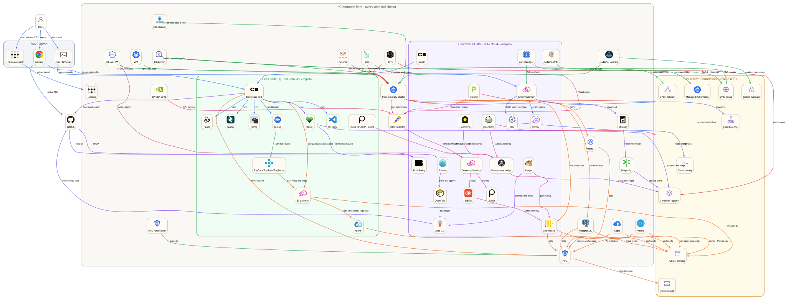
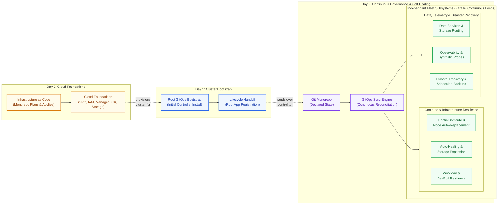
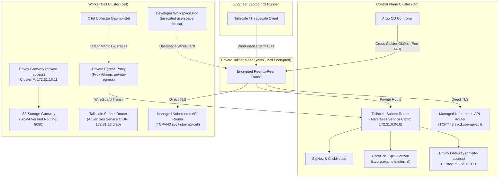
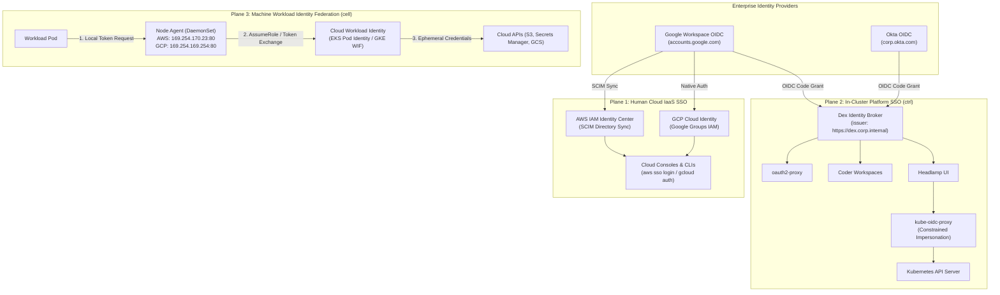
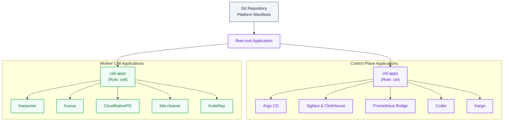
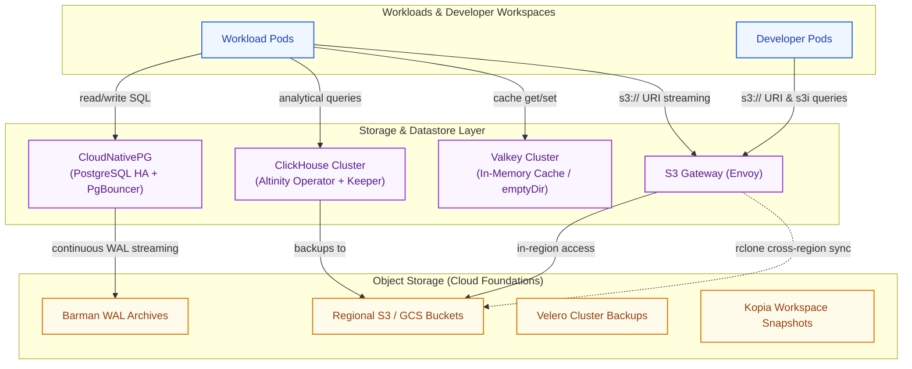
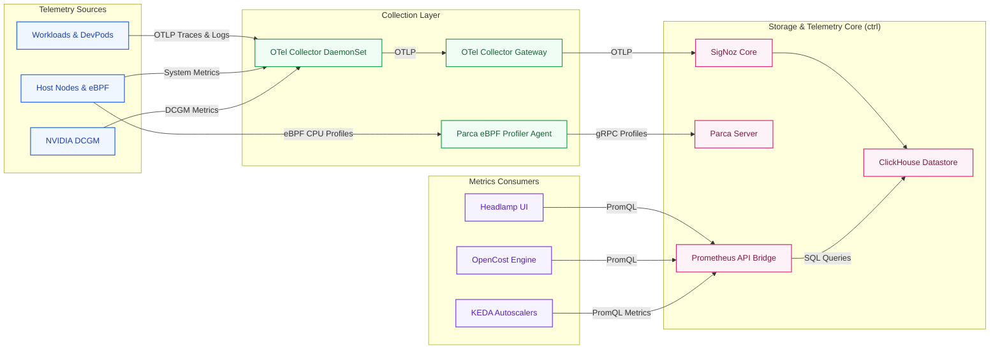

<!-- Guides platform engineers and operators through fleet architecture, provisioning, operations, and self-healing. -->

# Operator Guide

This guide is for platform engineers, SREs, and cluster operators responsible for fleet lifecycle, bootstrap, security posture, workload elasticity, storage, observability, and self-healing. The fleet provides a multi-cloud operational plane spanning an administrative control plane (`ctrl`) and regional worker cells (`cell`) running on [Amazon Web Services (AWS)](https://aws.amazon.com/) and [Google Cloud Platform (GCP)](https://cloud.google.com/).

---

## Fleet Architecture at a Glance

The fleet decouples shared control services from regional execution domains. The platform is designed around **isolated failure domains with no shared failure paths**:

- **Autonomous Worker Execution**: Workload pods, developer workspaces, and batch queues execute close to their data in regional worker cells (`cell`). If the central control plane (`ctrl`) undergoes maintenance or suffers a network partition, cells continue running and persisting storage without interruption.
- **Zero Public Attack Surface**: No administrative dashboards, database ports, or Kubernetes API endpoints are exposed to the public internet; all traffic enters through an encrypted [Tailscale](https://github.com/tailscale/tailscale) mesh tunnel.
- **Hermetic Cloud Decoupling**: Regional storage gateways, P2P image distribution caches, and telemetry query bridges abstract away cloud provider idiosyncrasies ([AWS](https://aws.amazon.com/) vs. [GCP](https://cloud.google.com/)), presenting uniform contracts to workloads.

Below is the complete cross-component dependency blueprint mapping client access, uniform cluster daemons, central control services, regional worker cells, and underlying cloud infrastructure foundations:

> [!NOTE]
> The architecture blueprint serves as a comprehensive reference map indexing all cross-system dependencies across the fleet. The sections below deconstruct each subsystem, protocol, and lifecycle phase sequentially.



<details>
<summary>Diagram legend and interaction flows</summary>

### How to Read this Blueprint

To navigate the blueprint effectively, identify the **5 structural domains** and follow the **6 color-coded edge flows**:

#### 1. Structural Domains (Boxes)

- ⬜ **Dev Laptop (Slate Grey, Left)**: Client workstation environment where developers write code, manage sessions, and open private VPN tunnels into the platform.
- 🟫 **Fleet-Wide Daemons (Cream / Grey, Outer Box)**: Background controllers running uniformly across *all* enrolled clusters (both control plane and cells) to enforce node elasticity, pod right-sizing, volume expansion, and automated hygiene.
- 🟪 **Controller Cluster (`ctrl`, Lavender, Center Left)**: The centralized management plane hosting fleet-wide coordination services: GitOps sync, image promotion, telemetry aggregation, identity federation, and PromQL translation. Never runs batch jobs or developer workloads.
- 🟩 **Worker Cells (`cell`, Mint Green, Center Right)**: Autonomous regional compute fabrics hosting interactive developer pods, batch queues, distributed ML runtimes, and local S3 caching proxies. Engineered to continue serving uninterrupted if the control plane becomes unreachable.
- 🟧 **Cloud Foundations (Warm Amber, Right)**: Underlying cloud provider IaaS primitives (VPCs, managed Kubernetes, object storage, and cloud IAM) provisioned via Infrastructure as Code.

#### 2. Color-Coded Interaction Flows (Edges)

| Flow & Color | Operational Role & Mechanism |
| :--- | :--- |
| 🔵 **Blue** (Access & Ingress) | Encrypted user access, private browser routing, and terminal multiplexing over Tailscale. |
| 🟣 **Purple** (Delivery & GitOps) | Declarative state synchronization, automated image promotion, and P2P layer distribution. |
| 🟢 **Green** (Elasticity & Lifecycle) | Just-in-time node provisioning, pod right-sizing, PVC expansion, and garbage collection. |
| 🟠 **Orange** (Storage & Data Plane) | High-speed in-region object storage, S3i DuckDB metadata queries, and rate-limited cross-region sync. |
| 🔴 **Red** (Security Posture) | Pre-admission validation, continuous CVE scanning, and real-time kernel anomaly detection. |
| 🌸 **Magenta** (Telemetry & Bridging) | Unified OTLP pipeline ingestion, columnar storage, and PromQL-to-ClickHouse SQL translation. |

The numbered sections below deconstruct each of these interaction flows with detailed architectural contracts and recovery procedures.

</details>

---

## Fleet Operations at a Glance

The platform structures the operational lifecycle into three continuous phases:

- **Day 0 (Cloud Foundations)**: Infrastructure as Code provisions foundational cloud primitives (VPCs, subnets, IAM roles, managed Kubernetes control planes, and storage buckets) via pull-request automation.
- **Day 1 (Cluster Bootstrap & Handoff)**: OpenTofu installs the minimal root GitOps controller, establishes initial cluster trust, and deterministically hands over lifecycle authority to Argo CD.
- **Day 2 (Continuous Governance & Self-Healing)**: Continuous GitOps reconciles cluster state against the Git monorepo, while parallel fleet subsystems autonomously scale nodes, self-heal degraded hardware and pods, expand storage, route telemetry, and execute scheduled backups.



---

## 1. Cloud Foundations & Cluster Bootstrap (Day 0 & Day 1)

All cloud infrastructure outside the Kubernetes API is codified in [OpenTofu](https://github.com/opentofu/opentofu) and automated through [Atlantis](https://github.com/runatlantis/atlantis) pull-request workflows.

### 1.1 3-Tier Infrastructure as Code Architecture

1. **Tier 1: Components (`src/infra/terraform/components/`)**: Self-contained, reusable building blocks (e.g. `vpc`, `eks`, `gke`, `iam_roles`, `kms_keys`, `s3_bucket`) adhering to strict protocol-first input/output interfaces (`_interface/` and `record.tf`).
2. **Tier 2: Topologies (`src/infra/terraform/topologies/`)**: Cloud-specific composition layers wiring components together into cohesive regional architectures (e.g. AWS EKS cell topology, GCP GKE cell topology).
3. **Tier 3: Deployments (`src/infra/terraform/deployments/`)**: Concrete environment instantiations (`ctrl-aws-usw2`, `cell-aws-usw2`, `cell-gcp-euw4`) defining precise CIDR allocations, compute instance families, and cloud regions.

### 1.2 Physical Substrates & VPC Subnet Tiering

Cloud infrastructure provisions tiered VPC networks via provider-neutral [OpenTofu](https://github.com/opentofu/opentofu) modules:

- **Public Subnets**: Tied directly to an Internet Gateway (IGW). Public subnets host managed NAT Gateways and strictly allowlisted external webhook ingress endpoints (such as Atlantis GitHub webhooks). Kubernetes worker nodes, control planes, and workload pods are never placed in public subnets.
- **Private Subnets**: Tied to NAT Gateways for outbound internet egress. Private subnets host Kubernetes worker nodes, managed database clusters, and cloud-managed control plane endpoints (EKS / GKE).
- **Pod Secondary Subnets**: Dedicated secondary IP CIDR blocks allocated exclusively for Kubernetes pod IP assignment (AWS VPC CNI custom networking and GKE secondary alias ranges). Pod secondary subnets prevent IP exhaustion under high-density batch scheduling and large distributed Ray clusters without inflating the primary node subnet address space.

### 1.3 Atlantis Pull-Request Automation

Infrastructure changes follow an automated pull-request workflow:

- **Automated Planning**: Opening a pull request triggers Atlantis to generate non-destructive execution plans (`tofu plan`) and post the plan output directly as a comment in the pull request thread.
- **Directory-Scoped Locking**: Atlantis locks the target deployment directory (`src/infra/terraform/deployments/<target>`), preventing concurrent conflicting modifications.
- **Controlled Apply**: Merging or executing `atlantis apply` inside the pull request applies the changes directly to cloud foundations, ensuring zero out-of-band state drifts.
- **Dual-Surface Split Architecture**:
  - **Private Web UI (`atlantis.corp.<domain>`)**: The interactive dashboard, plan inspector, and lock manager are completely private, accessible only across the Tailscale mesh and guarded by Dex OIDC authentication.
  - **Hardened Webhook Ingress (`https://hooks.<domain>/github/atlantis`)**: Webhook deliveries from GitHub enter through the single public ingress entry point protected by IP CIDR allowlists and HMAC validation (detailed in Section 2.6).

### 1.4 Day-1 Bootstrap Contract

The handoff between OpenTofu and GitOps is deterministic:

- OpenTofu provisions VPC networks, managed Kubernetes control planes (EKS / GKE), KMS encryption keys, and base IAM permissions.
- In the final step of deployment, OpenTofu installs the minimal Argo CD bootstrap controller and registers the root application (`fleet-root`).
- OpenTofu's responsibility terminates at the Argo CD boundary. All subsequent cluster state, CRDs, system add-ons, and operators are owned and reconciled exclusively by Argo CD.

```bash
# Verify infrastructure plans locally before submitting pull requests
tofu plan

# Atlantis automatically executes tofu plan upon opening a pull request
# Approvals trigger automated apply runs directly within the pull request thread:
atlantis apply -d src/infra/terraform/deployments/ctrl-aws-usw2
```

---

## 2. Multi-Cluster Networking, Cross-Cluster Communication & Zero-Trust Ingress

The fleet enforces an asymmetric, zero-trust network topology built on three fundamental guarantees: **zero public ingress by default**, **software-defined WireGuard mesh transit**, and **authenticated Layer 7 service doors**.



### 2.1 Multi-Cloud CNI Dataplanes & Network Policies

Once cluster substrates are provisioned, container networking executes directly on cloud-native CNI dataplanes:

- **Multi-Cloud CNI Baseline**: Deploys the provider's first-party CNI for maximum wire-speed performance: AWS VPC CNI with ENI trunking and prefix delegation on AWS; GKE Dataplane V2 powered by [Cilium](https://github.com/cilium/cilium) with eBPF routing on GCP; [Flannel](https://github.com/flannel-io/flannel) inside pinned [k3s](https://github.com/k3s-io/k3s) worker nodes in local environments.
- **Portable NetworkPolicy Contract**: Regardless of the underlying CNI, all dataplanes strictly enforce standard Kubernetes `networking.k8s.io/v1` `NetworkPolicy`. Platform components never author proprietary CNI CRDs, guaranteeing complete multi-cloud policy portability.

### 2.2 The Private Access Plane (Tailscale & Headscale WireGuard Mesh)

All administrative access, browser portals, developer sessions, and cross-cluster control loops transit an encrypted WireGuard mesh managed by the [Tailscale](https://github.com/tailscale/tailscale) Kubernetes Operator (or self-hosted [Headscale](https://github.com/juanfont/headscale) locally):

- **Subnet Routers (`Connector`)**: A high-availability `Connector` deployment in the `tailscale` namespace advertises the cluster's Kubernetes Service CIDR (e.g. `172.31.0.0/16`) and CoreDNS resolver routes into the private tailnet. Authorized operators route directly to internal Service IPs without configuring local SOCKS proxies or port forwards.
- **Kubernetes API Routers (`svc:kube-api-<cluster>`)**: To keep managed Kubernetes control planes completely private while allowing remote Argo CD management, two VPC-external routers per cluster advertise stable Tailscale services: `svc:kube-api-<cluster>`. Argo CD connects to worker cells over the tailnet on port `443`, preserving raw TLS certificate validation against the cloud provider's API server CA.
- **Private Egress Proxies**: Worker cells deploy a `ProxyGroup` named `private-egress`. In-cluster cell daemons (such as [OpenTelemetry Collector](https://github.com/open-telemetry/opentelemetry-collector) exporting traces to SigNoz) reach the active control plane's private gateway IP through an in-cluster `active-ctrl-private-access` Service without leaving the tailnet.
- **Local Fleet Parity (Headscale)**: Local development environments run a self-hosted Headscale control plane federating with [Dex](https://github.com/dexidp/dex) for OIDC authentication, an embedded DERP relay on region `999` for container NAT traversal, and loopback port forwarding (`127.0.0.1:18443`) for local browser access.

### 2.3 Cross-Cell & In-Cluster Service Doors (Gateway API)

The fleet adopts the [Kubernetes Gateway API](https://gateway-api.sigs.k8s.io/) as its single Layer 7 routing abstraction, deployed via [Envoy Gateway](https://github.com/envoyproxy/gateway):

- **ClusterIP Private Ingress Contract**: The primary Gateway instance (`private-access` in namespace `envoy-gateway-system`) binds to a private `ClusterIP` with a deterministic IPv4 address (e.g. `172.31.0.11`) rather than creating expensive, internet-facing cloud load balancers. Because the Subnet Router advertises the Service CIDR, remote clusters dial Service IPs directly over WireGuard.
- **Canonical Door Routing**: Gateway instances author specialized listeners:
  - `coder-apps-https`: Listens on port `443` for `*.coder.<base-domain>`, routing to the Coder control plane with wildcard TLS termination.
  - `s3-http` & `s3-https`: Dedicated endpoints for the virtual S3 Storage Gateway on port `8080`. Routes use AWS SigV4 header matching to inspect authorization signatures, enforce team path boundaries, and proxy cross-region write operations to the active writer cell.
  - `kube-oidc-tls`: A `TLSRoute` on port `443` providing TLS Passthrough for `kube-oidc-proxy`, allowing the in-cluster proxy to present its own CA and validate client OIDC tokens directly.
- **Service Catalog Discovery**: The [Homer](https://github.com/bastienwirtz/homer) dashboard serves as the central private catalog at `https://home.c.corp.<domain>`, linking directly to cluster UIs ([Headlamp](https://github.com/headlamp-k8s/headlamp)), GitOps ([Argo CD](https://github.com/argoproj/argo-cd)), telemetry dashboards ([SigNoz](https://github.com/signoz/signoz)), profiling ([Parca](https://github.com/parca-dev/parca)), and developer workspaces ([Coder](https://github.com/coder/coder)).

### 2.4 Split-Horizon DNS Architecture

DNS resolution is deterministic, private, and split-horizon across in-cluster pods and tailnet clients:

- **Domain Hierarchy Derivation**: All internal hostnames derive from `public_domain`:
  - `public_domain`: Root identity (e.g. `example.com` or `local.internal`).
  - `intranet_domain`: Derived as `corp.<public_domain>` (e.g. `corp.example.com`).
  - `cluster_domain`: Derived as `c.<intranet_domain>` (e.g. `c.corp.example.com`).
  - Per-Cluster Domain: `<cluster-name>.<cluster_domain>` (e.g. `ctrl-aws-usw2.c.corp.example.com`).
- **In-Cluster Resolution ([CoreDNS](https://github.com/coredns/coredns))**: CoreDNS registers custom server blocks mapping all service names directly to the private Envoy Gateway ClusterIP (`172.31.0.11`). It maintains static rewrite rules for remote cell storage doors (`s3-gateway.<cell>.<domain>`) and remote identity proxies (`kube-oidc-proxy.<cell>.<domain>`).
- **Route Synchronization ([ExternalDNS](https://github.com/kubernetes-sigs/external-dns))**: ExternalDNS watches Gateway API `HTTPRoute` resources carrying `app.kubernetes.io/component=external-dns-source` and synchronizes hostnames into private cloud DNS zones (AWS Route53 Private Hosted Zones or GCP Cloud DNS Private Zones) without manual DNS intervention.

### 2.5 Private PKI & The Certificate Transparency Protection Invariant

Internal cluster endpoints are encrypted using x509 certificates issued by in-cluster CAs:

- **Private CA Hierarchy ([cert-manager](https://github.com/cert-manager/cert-manager))**: The root `cluster-local-ca` certificate backs the cluster-wide `ClusterIssuer/cluster-local-ca`. Envoy Gateway instances request wildcards (`*.ctrl.<domain>` and `*.coder.<domain>`) directly from this private issuer.
- **CA Bundle Distribution ([trust-manager](https://github.com/cert-manager/trust-manager))**: The `trust-manager` operator projects the root CA bundle as a standard `ca.crt` ConfigMap into all namespaces, ensuring in-cluster workloads trust internal fleet doors without altering container images.
- **The Certificate Transparency (CT) Protection Invariant**: Private internal hostnames must **never** request certificates from public ACME providers (such as Let's Encrypt). Public certificate authorities publish every issued certificate to immutable, searchable [Certificate Transparency logs](https://www.certkit.io/tools/ct-logs/). If an internal hostname (such as `database.team-alpha.cell-aws-usw2.c.<domain>`) requests a public certificate, the platform's internal topology, naming conventions, and team definitions are permanently leaked to external adversaries. Public ACME issuance is strictly restricted to true external ingress hostnames (such as `hooks.<domain>`).[^dns-tls-boundary]

[^dns-tls-boundary]: Actively enforced. Platform manifests strictly divide internal certificates to `cluster-local-ca` and external to `public-acme`, and the `acme-domain-protection` Kyverno admission policy actively denies public ACME certificate requests for internal domain patterns.

### 2.6 Public Webhook Ingress & Defense-in-Depth

While the fleet enforces **zero public ingress by default** and keeps all UI dashboards and APIs strictly behind Tailscale, automated GitOps and pull-request runners require unsolicited inbound event deliveries from external platforms like GitHub. The platform provides a single hardened entry point (`hooks.<domain>`) architected with four defense-in-depth security layers:

1. **Generic Hostname & CT Log Obfuscation**: The ingress uses a generic hostname (`hooks.<domain>`) instead of application-specific hostnames like `atlantis.<domain>`. When Let's Encrypt issues certificates and publishes them to Certificate Transparency logs, external observers cannot determine what automation tooling or internal services operate behind the endpoint.
2. **Path-Scoped Routing & Internal Rewriting**: External hooks are partitioned by source and application (`https://hooks.<domain>/github/atlantis`). Envoy Gateway matches the exact path and performs an internal `ReplaceFullPath` rewrite to `/events`, isolating backend services and preventing arbitrary path probing.
3. **Envoy Gateway IP CIDR Filtering**: An Envoy Gateway `SecurityPolicy` attaches to the public HTTPRoute with a `defaultAction: Deny` rule that allows requests exclusively from GitHub's published webhook IP ranges ([GitHub IP Addresses](https://docs.github.com/en/authentication/keeping-your-account-and-data-secure/about-githubs-ip-addresses) sourced from `https://api.github.com/meta`). Internet scans, bot traffic, and unauthorized callers are dropped at the Envoy proxy before reaching workload containers.
4. **Cryptographic HMAC SHA-256 Verification**: Atlantis validates the `X-Hub-Signature-256` header on every incoming webhook payload against the pre-shared secret configured in the GitHub App before executing any plan or apply command.

### 2.7 Network Isolation & Zero-Trust Guardrails

The network dataplane operates under a default-deny security model enforced by portable Kubernetes `NetworkPolicy` resources (sync wave 50):

- **Default-Deny Ingress Baseline**: Every platform and team namespace deploys an isolation baseline blocking all unsolicited inbound connections by default. Capabilities requiring ingress (metrics scraping, webhook calls, Envoy proxy routes) declare explicit point-to-point ingress rules colocated in their component manifests.
- **IMDS / Cloud Metadata Blocking**: All egress to the link-local cloud metadata service (`169.254.169.254/32` on AWS and GCP) is strictly blocked across team namespaces. Pods cannot harvest host IAM instance credentials or tamper with cloud hypervisor metadata.
- **Ray Cluster Isolation**: Ray head nodes admit ingress on port `8265` (Ray Dashboard) only from the KubeRay operator and the private Envoy Gateway. Worker pods admit traffic only from other pods within the same Ray cluster.

---

## 3. Unified 3-Plane Identity & Access Architecture

The platform partitions authentication and authorization into three distinct architectural planes to decouple human enterprise identities, in-cluster platform tooling, and machine workload permissions.



### 3.1 Plane 1: Human Cloud Infrastructure SSO

Direct access to underlying cloud management surfaces (AWS Management Console, Google Cloud Console) and cloud CLIs (`aws sso login`, `gcloud auth login`) is strictly restricted to platform infrastructure engineers and security auditors. Application developers never interact directly with Plane 1:

- **Invisible Cloud Layer for Developers**: Application engineers develop, submit batch runs, and inspect telemetry exclusively through in-cluster platform doors and the private Tailscale mesh. All cloud credentials for storage and runtime execution are provided ambiently via in-cluster node agents.
- **The Four Direct Cloud Access Scenarios**: Direct human interaction with Plane 1 is confined to four narrow operational cases:
  1. *Day-0 Foundations & Root Bootstrapping*: Orchestrating initial VPC topologies, internet gateways, KMS keys, and EKS/GKE control planes via OpenTofu before in-cluster GitOps engines exist.
  2. *Emergency Break-Glass & Disaster Recovery*: Intervening during catastrophic cluster outages (such as API server unreachability or expired admission webhook certificates) where in-cluster controllers cannot reconcile.
  3. *Cloud FinOps, Invoicing & Quotas*: Auditing cloud provider invoices, purchasing Savings Plans or Committed Use Discounts, and submitting quota increase requests (such as large GPU allocations).
  4. *Hardware Diagnostics & Cloud Support*: Triaging physical hypervisor degradation, AWS Health Dashboard incidents, and filing enterprise support tickets with raw diagnostic bundles.
- **AWS IAM Identity Center & SCIM Synchronization**: SCIM synchronizes users and groups from Google Workspace into AWS IAM Identity Center in near-real time. Permissions model as reusable Permission Sets (`PlatformAdministrator`, `ReadOnlyInspector`, `NetworkOperator`) mapped to multi-account roles. Engineers authenticate via `aws sso login` to receive short-lived, rotating STS credentials. Long-lived IAM user access keys are strictly prohibited.
- **GCP Cloud Identity & Cloud IAM Federation**: Google Workspace accounts natively authenticate against GCP Cloud IAM. Permissions are assigned exclusively to Google Groups at the GCP Organization, Folder, and Project levels. Service account keys (`.json` files) are strictly banned on operator workstations.

### 3.2 Plane 2: In-Cluster Platform & Web Application SSO

Web-based developer portals, operational dashboards, and cluster APIs share an in-cluster federated identity broker: [Dex](https://github.com/dexidp/dex), operating in sync wave 20 within the `dex` namespace of `ctrl`:

- **The Single Federated OIDC Broker Model**: Dex acts as the single authoritative OIDC broker fronting upstream corporate identity providers (Google Workspace OIDC, Okta OIDC) in cloud clusters, and synthetic credentials (`ops@local.internal`, `dev@local.internal`) via an internal password database in local development. Downstream platform services point exclusively to Dex (`https://dex.<access_domain>`), ensuring that migrating from Okta to Google Workspace requires zero configuration changes across platform portals or RBAC bindings.
- **Transparent Downstream OAuth Proxy Delegation**: [oauth2-proxy](https://github.com/oauth2-proxy/oauth2-proxy) guards internal web consoles that lack native multi-user OIDC integration (such as [Parca](https://github.com/parca-dev/parca), [Ray](https://github.com/ray-project/ray) Dashboard, [Velero](https://github.com/vmware-tanzu/velero) UI, and [OpenCost](https://github.com/opencost/opencost)). It inspects normalized `email` and `groups` claims injected into upstream request headers (`X-Auth-Request-Email`, `X-Auth-Request-Groups`) to enforce route-level authorization.
- **The `application-oidc` Shared Secret Contract**: Platform applications do not communicate directly with cloud secret managers. Instead, an authoritative secret record named `application-oidc` in namespace `application-identity` is maintained and projected by External Secrets Operator into target namespaces (`argocd-secret`, `coder-oidc`, `headlamp-oidc`, `signoz-oidc`), completely decoupling Helm release manifests from secret values.
- **SigNoz Dual-Mode Authentication**:
  - *Community / OSS Edition*: Operates via Two-Layer Gateway Impersonation. Envoy Gateway verifies user identity against Dex via `auth: oidc-gateway`, and SigNoz impersonates the shared root identity (`signoz@`), enabling team access without commercial license restrictions.[^signoz-trusted-header]
  - *Enterprise OIDC Mode*: Switching the routing contract in `routes.yaml` to `auth: oidc-native` connects SigNoz directly to native OIDC authentication for per-user audit logging and individual dashboard ownership.
- **Native Kubernetes RBAC via `kube-oidc-proxy`**: Managed cloud Kubernetes services (EKS / GKE) restrict custom `--oidc-*` API flags. The platform deploys [kube-oidc-proxy](https://github.com/TremoloSecurity/kube-oidc-proxy) in `kube-system`. It validates Dex OIDC tokens and proxies requests to the upstream Kubernetes API using Kubernetes 1.36 constrained impersonation headers (`Impersonate-User: cluster:user:<username>`, `Impersonate-Group: cluster:group:<group>`). Impersonation of `system:masters` is unconditionally rejected, and identity derives exclusively from verified OIDC tokens.

<!-- TODO(simonepri): Migrate SigNoz Community Edition from impersonation mode to trusted-header authentication once upstream PR https://github.com/SigNoz/signoz/pull/12379 is merged -->
[^signoz-trusted-header]: Intended capability. Upstream PR [#12379](https://github.com/SigNoz/signoz/pull/12379) implements a `trusted_header` `IdentN` provider with verified proxy provenance. Once merged upstream and released, the fleet will migrate from shared root impersonation to trusted header authentication, restoring individual user attribution in Community Edition.

### 3.3 Plane 3: Machine Workload Identity Federation

Workload containers running in worker cells frequently require access to cloud provider APIs (such as External Secrets Operator fetching keys, Velero uploading snapshots, or Prowler auditing cloud posture). The platform strictly prohibits long-lived static credentials (`AWS_ACCESS_KEY_ID` or GCP Service Account keys), standardizing on keyless Machine Workload Identity Federation:

- **Native In-Cluster Node Agents & Link-Local Routing**: Node agents run as DaemonSets intercepting local link-local traffic:
  - *AWS EKS Pod Identity*: The [EKS Pod Identity Agent](https://github.com/aws/eks-pod-identity-agent) listens at `169.254.170.23:80`. IAM roles grant `sts:AssumeRole` to the `pods.eks.amazonaws.com` service principal. OpenTofu establishes associations between the cluster, namespace, ServiceAccount, and IAM role via `aws_eks_pod_identity_association`. Workload pods seamlessly fetch short-lived STS credentials from the node agent without requiring manual role ARN annotations or OIDC provider thumbprints.
  - *GCP GKE Workload Identity*: The GKE metadata server listens at `169.254.169.254:80`. Google Service Accounts bind `roles/iam.workloadIdentityUser` to the Kubernetes ServiceAccount in the cluster's workload identity pool (`<project_id>.svc.id.goog`). The node agent issues short-lived Google OAuth 2.0 access tokens.
- **Retained Cross-Cloud Federation (Web Identity Federation)**: OIDC token projection via Web Identity Federation (`sts:AssumeRoleWithWebIdentity`) is retained exclusively for cross-cloud federation; specifically when workloads in non-AWS worker cells (such as GCP `cell-gcp-euw4` or local clusters) must assume an AWS IAM role to pull images from AWS Elastic Container Registry (ECR) or read Amazon S3 buckets.

---

## 4. GitOps Engine & Continuous Delivery (Day 2 State)

Fleet configuration is version-controlled in the Git monorepo and continuously reconciled by [Argo CD](https://github.com/argoproj/argo-cd).

### 4.1 2-Tier ApplicationSet Hierarchy

Argo CD uses a 2-tier ApplicationSet architecture driven by a central inventory in `src/infra/argocd/clusters.yaml`:

- **Root Application (`fleet-root`)**: Deployed during bootstrap on `ctrl`. It watches `src/infra/argocd/apps/` and generates cluster-level applications (`ctrl-apps` for the control plane and `cell-apps` for each worker cell).
- **Cluster ApplicationSets (`ctrl.yaml`, `cells.yaml`)**: Read `clusters.yaml` and matrix-generate atomic component applications across enrolled clusters based on cluster labels and roles (`ctrl` vs `cell`).



### 4.2 Deterministic Fleet Sync Waves

To prevent race conditions during cluster bring-up or wholesale disaster recovery, the fleet orchestrates synchronization through a two-level model: an outer **Two-Tier ApplicationSet RollingSync** strategy governing application dependencies, and inner **Intra-Chart Numeric Sync Waves** ordering individual Kubernetes resources.

#### Two-Tier ApplicationSet RollingSync Architecture

At the fleet `ApplicationSet` dispatch layer (`ctrl-apps` and `cell-apps`), synchronizations are partitioned into two progressive rollout steps using `spec.strategy.type: RollingSync`:

- **Tier 0: Substrate (`tier: substrate`)**: The foundational infrastructure components required to establish cluster invariants, admission webhooks, scheduling priority definitions, DNS resolution, secret distribution, and storage abstractions before upper-level controllers or workloads can safely execute. Substrate components include: `scheduling-priorities`, `coredns`, `cert-manager`, `trust-manager`, `kyverno`, `external-secrets`, `storage-classes`, `vpa`, plus cloud provider node scalers (`karpenter-aws`, `karpenter-gcp`) and host storage provisioners (`rawfile-localpv`).
- **Tier 1: Fleet (`tier: fleet`)**: All dependent platform controllers, telemetry collectors, service doors, database operators, developer tooling, security scanners, and runtime components.

During fleet reconciliations or upgrades, the ApplicationSet controller guarantees that all `tier: substrate` applications reach a Healthy and Synced state before initiating deployments for `tier: fleet` applications (`maxUpdate: 100%`).

#### Intra-Chart Fine-Grained Numeric Sync Waves

Within each individual application boundary, fine-grained numeric waves (`argocd.argoproj.io/sync-wave` annotations from `-5` through `5`) order intra-chart resources deterministically so schemas, namespaces, credentials, and admission hooks activate in strict prerequisite order:

| Wave | Layer | Core Components | Contract & Intent |
| :--- | :--- | :--- | :--- |
| **Wave -5** | CRDs & API Contracts | CustomResourceDefinitions | Registers schemas for Gateway API, Kyverno, Karpenter, CNPG, and KEDA before controllers start. |
| **Wave -4** | Secrets & Namespaces | [External Secrets Operator](https://github.com/external-secrets/external-secrets), Namespaces, RBAC | Establishes namespaces, baseline security policies, and credential sync from cloud secret managers. |
| **Wave -3** | Trust & Policy | [cert-manager](https://github.com/cert-manager/cert-manager), [Kyverno](https://github.com/kyverno/kyverno) | Bootstraps internal root CAs and activates admission webhooks to validate subsequent manifests. |
| **Wave -2** | Ingress & Autoscaling | [Envoy Gateway](https://github.com/envoyproxy/gateway), [Karpenter](https://github.com/kubernetes-sigs/karpenter) | Installs edge data planes and activates dynamic EC2/GCE instance provisioning for pending pods. |
| **Wave -1** | Acceleration & Cache | [Dragonfly](https://github.com/dragonflyoss/dragonfly), [OTel Collector](https://github.com/open-telemetry/opentelemetry-collector) | Establishes P2P layer caching and telemetry pipelines so upcoming workloads pull images rapidly. |
| **Wave 0** | Core Datastores | [CloudNativePG](https://github.com/cloudnative-pg/cloudnative-pg), [ClickHouse](https://github.com/ClickHouse/ClickHouse), [Valkey](https://github.com/valkey-io/valkey-operator) | Deploys clustered transactional and columnar persistence with automated backup streaming. |
| **Wave 1** | Batch & Schedulers | [Kueue](https://github.com/kubernetes-sigs/kueue), [KubeRay](https://github.com/ray-project/kuberay), [Coder](https://github.com/coder/coder) | Initializes gang scheduling queues, Ray operator runtimes, and developer workspace templates. |
| **Wave 2** | Team Perimeters | Team Namespaces, Dev Secrets | Projects team quotas, default service accounts, and developer credentials from team definitions. |
| **Wave 3** | Workloads & DevPods | Team Jobs, Dev Workspaces | End-user machine learning pipelines, batch inference services, and active developer containers. |
| **Wave 5** | Auditing & Compliance | [Trivy](https://github.com/aquasecurity/trivy), [Kubescape](https://github.com/kubescape/kubescape), [Prowler](https://github.com/prowler-cloud/prowler) | Periodic security scanners that audit running containers and cloud configurations without blocking deployments. |

### 4.3 Continuous Image Promotion & Remote Caching

- **Automated Promotion**: [Kargo](https://github.com/akuity/kargo) monitors OCI container registries for new digests published by [Bazel](https://github.com/bazelbuild/bazel) CI builds. When tests succeed in staging, Kargo updates target image digests directly in GitOps manifests across promotion stages.
- **Hermetic Builds & RBE**: [BuildBuddy](https://github.com/buildbuddy-io/buildbuddy) provides remote build execution (RBE) and remote artifact caching for Bazel builds executed locally by developers or in GitHub Actions, reducing compilation and container assembly times by over 90%.

---

## 5. Compute Capacity, Elastic Scaling & Workload Governance

Worker cells eliminate static, over-provisioned node pools by scaling right-sized compute just-in-time directly from pod scheduling specifications.

### 5.1 Karpenter Dynamic Node Provisioning

[Karpenter](https://github.com/kubernetes-sigs/karpenter) monitors the Kubernetes API for unschedulable pending pods and provisions optimal compute instances in seconds:

- **No Static Auto-Scaling Groups**: Nodes launch directly via cloud APIs (EC2 Fleet / GCE APIs) sized precisely to pending container CPU, memory, and accelerator requests.
- **Node Consolidation & Defragmentation**: When workloads terminate, Karpenter consolidates underutilized nodes, drains pods safely respecting `PodDisruptionBudgets`, and terminates unneeded instances to eliminate cloud waste.

### 5.2 2D Scheduling & QoS Matrix

Workloads declare their scheduling semantics via two orthogonal dimensions: **Availability Class** (`availability-class`) and **Latency Class** (`latency-class`), which policy engines automatically compose into a standard Kubernetes `PriorityClass` (`<availability>-<latency>`):

- **Availability Classes**:
  - **Highly Available (`ha`)**: Guaranteed nominal capacity for mission-critical services, datastores, and ingress. Multi-AZ on-demand compute protected by `PodDisruptionBudgets`. Never preempted.
  - **Mostly Available (`ma`)**: High-priority training jobs and internal production services on on-demand compute that cannot tolerate spot preemption restart costs.
  - **Weakly Available (`wa`)**: Elastic compute tier for distributed AI training, batch processing, and standard developer workspaces (`DevPods`). Runs on spot or dynamically provisioned on-demand instances with graceful preemption signals and Kueue checkpointing.
  - **Best-Effort (`be`)**: Lowest scheduling priority. Opportunistic spot compute preemptible at any moment without warranty; ideal for asynchronous queues and scale-to-zero tasks.
- **Latency Classes**:
  - **Latency-Sensitive (`ls`)**: Interactive services, developer environments, and real-time inference requiring immediate compute provisioning, low CPU throttling, and dedicated resource headroom.
  - **Latency-Tolerant (`lt`)**: Batch workloads, offline data processing pipelines, model training runs, and background tasks that can tolerate queue delays, node startup latency, and higher resource packing.

| Availability \ Latency | Latency-Sensitive (`ls`) *(Interactive & Real-Time)* | Latency-Tolerant (`lt`) *(Batch & Offline)* |
| :--- | :--- | :--- |
| **Highly Available (`ha`)** | **`ha-ls` (Priority 42)**: Mission-critical user-facing services, ingress proxies, and interactive production systems. Multi-AZ on-demand compute; never preempted. | **`ha-lt` (Priority 41)**: Critical database backups, continuous data replication streams, and scheduled compliance audits. Protected against preemption. |
| **Mostly Available (`ma`)** | **`ma-ls` (Priority 32)**: High-priority interactive developer environments and internal low-latency APIs requiring dedicated on-demand stability. | **`ma-lt` (Priority 31)**: High-priority distributed model training jobs and production ETL pipelines on on-demand compute immune to spot interruptions. |
| **Weakly Available (`wa`)** | **`wa-ls` (Priority 22)**: Standard developer workspaces (`DevPods`) and interactive batch queries running on elastic capacity with rapid replacement. | **`wa-lt` (Priority 21)**: Elastic distributed AI training (Ray Train), data processing (Ray Data), and ad-hoc batch runs borrowing cohort quota with graceful preemption. |
| **Best-Effort (`be`)** | **`be-ls` (Priority 12)**: Opportunistic sandbox experiments and interactive exploration running on excess spot capacity. | **`be-lt` (Priority 11)**: Lowest-priority asynchronous queues, cache warming, and scale-to-zero background tasks preemptible at any time. |

### 5.3 Accelerator Management

The [NVIDIA GPU Operator](https://github.com/NVIDIA/gpu-operator) automates driver injection, container toolkit configuration, and telemetry collection across GPU-enabled worker nodes:

- Supports time-slicing and Multi-Instance GPU (MIG) partitioning, allowing lightweight inference and development workloads to share physical GPU hardware efficiently.
- Exposes detailed hardware metrics (tensor core utilization, memory bandwidth, temperature) directly to Prometheus and SigNoz via the NVIDIA Data Center GPU Manager (DCGM).

### 5.4 Multi-Team Fair Sharing with Kueue

Multi-team batch jobs and distributed Ray clusters are governed by [Kueue](https://github.com/kubernetes-sigs/kueue):

- **Cohort Quota Borrowing**: Team quotas are declared in `src/teams/`. When a team has idle quota, other teams in the cohort can borrow excess CPU and GPU capacity. When the owning team submits work, borrowed resources are preempted gracefully.
- **Gang Scheduling**: Kueue ensures distributed training runs (such as multi-node PyTorch or Ray jobs) schedule atomically: all worker pods provision simultaneously, preventing cluster deadlocks where partial allocations hold idle GPUs while waiting for remaining pods.

---

## 6. Developer Workspace Infrastructure (DevPods)

Developer workspaces run as containerized pods managed by [Coder](https://github.com/coder/coder) in worker cells close to compute resources and datasets.

### 6.1 Crash Safety & OOM Resistance Properties

Interactive developer workspaces exhibit unpredictable memory spikes during large compilation runs, Bazel dependency analysis, or interactive DataFrame transformations. DevPods are engineered with specific structural properties to prevent abrupt process termination:

- **Cgroup v2 LimitedSwap Protection**: Karpenter configures worker nodes running DevPods with `swapBehavior: LimitedSwap`. Instead of the Linux kernel immediately killing a process via the Out-Of-Memory (OOM) killer the moment resident memory crosses container memory limits, the container gracefully spills excess anonymous pages into host-managed swap disk.
- **Latency Trade-Off for Crash Safety**: Swapping introduces temporary I/O latency, but keeps IDE processes, language servers, terminal sessions, and debuggers alive. This grants runtime garbage collectors (Python, V8, JVM) and developers time to free memory before reaching hard node eviction limits.
- **Burstable QoS Sizing**: DevPod templates define asymmetric resource requests and limits (`requests.memory < limits.memory`), allowing developers to utilize unallocated node headroom during bursty tasks without reserving expensive cloud memory 24/7.
- **Independent Storage Partitions**: User homes (`/home/<user>`) and build depots (`/depot`) are provisioned on dedicated PersistentVolumeClaims. Container root filesystem exhaustion cannot crash the pod or corrupt developer code.

### 6.2 Userspace Tailscale Architecture & Isolation Trade-offs

Developer workspaces run `tailscaled` as an unprivileged user process (`UID 1000`) with userspace networking (`--tun=userspace-networking`). This ensures developer pods never require Linux `CAP_NET_ADMIN` privileges, host network access, or kernel TUN device mounts:

- **Local Port Publishing**: The workspace enrolls into Tailscale/Headscale with an ephemeral node key and publishes two loopback listeners via `tailscale serve`:
  1. OpenSSH (`tcp:2222` -> `127.0.0.1:2222`): Authenticates connections using an ed25519 public key injected during workspace provisioning.
  2. Paseo Daemon (`tcp:6767` -> `tailscale serve 6767`): Connects to the Paseo collaborative development agent.
- **Why Direct Workspace-to-Workspace Access Is Blocked**: Cross-developer connections to a workspace's private DNS are hard-blocked by Tailnet ACLs (`dst: autogroup:self`). Unauthenticated development servers (Vite, Next.js, Flask debug mode) frequently expose interactive debug consoles allowing arbitrary remote code execution (RCE). Blocking peer-to-peer workspace access prevents an adversary who compromises one workspace from scanning or laterally pivoting into other engineers' development environments.
- **How Temporary Apps Are Shared (Coder Subdomain Routing)**: When engineers must share running web apps or APIs with teammates, Coder generates an authenticated wildcard subdomain (`https://<port>--<workspace>--<user>.coder.<domain>`). Traffic routes through Envoy Gateway, which validates the teammate's session against Dex OIDC before proxying HTTP traffic down the active Coder agent reverse tunnel into the workspace localhost.

### 6.3 Workspace Suite & Developer Tooling

- **Web IDEs**: [VS Code](https://github.com/coder/code-server) in-browser or local desktop VS Code connected over SSH via the Coder CLI (`coder ssh <workspace>`).
- **AI Execution Agents**: [Paseo](https://github.com/paseo-ai/paseo) runtime environment hosting automated developer coding agents.
- **Interactive Analytics**: [Zasper](https://github.com/zasper-io/zasper) notebook environment for data analysis and model exploration.
- **Container Sandbox**: [Herdr](https://github.com/herdr-io/herdr) container daemon orchestration enabling rootless container builds within the workspace pod.

---

## 7. Storage Architecture, In-Cluster Datastores & Data Movement

Stateful services follow a 3-tier architecture ensuring durability, high read/write throughput, and automated point-in-time recovery.



### 7.1 3-Tier In-Cluster Datastore Architecture

1. **Relational OLTP State ([CloudNativePG](https://github.com/cloudnative-pg/cloudnative-pg) / PostgreSQL)**: Primary transactional datastore for platform capabilities (Coder, SigNoz metadata, BuildBuddy). CloudNativePG provides High Availability (HA) streaming replication across availability zones, automatic failover via in-instance consensus, dedicated Write-Ahead Logging (WAL) disk volumes to isolate IOPS, continuous WAL archiving to object storage via [Barman](https://github.com/EnterpriseDB/barman), and connection pooling via [PgBouncer](https://github.com/pgbouncer/pgbouncer).
2. **Columnar OLAP Telemetry ([ClickHouse](https://github.com/ClickHouse/ClickHouse))**: Distributed analytics engine managed by the [Altinity ClickHouse Operator](https://github.com/Altinity/clickhouse-operator) for high-throughput telemetry logs, traces, DCGM GPU metrics, and daily storage inventories, coordinated by ClickHouse Keeper Raft consensus.
3. **In-Memory Key-Value Caching ([Valkey](https://github.com/valkey-io/valkey))**: Ephemeral, Redis-compatible caching engine managed by the official [Valkey Operator](https://github.com/valkey-io/valkey-operator). Valkey runs as lightweight, zero-PVC deployments backed by `emptyDir` and LRU eviction, serving as disposable compile caches for [PyTorch](https://github.com/pytorch/pytorch) (`torch.compile`) and metadata buffers for Dragonfly.

### 7.2 Virtual S3 Object Gateway & Dataset Indexing

- **Virtual S3 Protocol**: Workloads access object storage using canonical coordinates (`s3://aws-usw2/home/...` or `s3://global/backups/...`). An internal Envoy S3 gateway translates virtual coordinates into regional cloud endpoints, injecting authentication headers dynamically.
- **Cross-Region Replication**: Cross-region transfers are scheduled via [rclone](https://github.com/rclone/rclone) daemon jobs with built-in bandwidth throttling to prevent egress cost spikes.
- **S3 Inventory Indexing (`s3i`)**: Object storage buckets generate daily Parquet-based inventories. Workloads and developer pods query petabyte-scale storage metadata instantly using [DuckDB](https://github.com/duckdb/duckdb) via the `s3i` CLI tool without issuing slow, expensive `s3:ListObjects` API calls. Because inventories generate periodically, `s3i` queries reflect object state delayed by up to 24 hours. Direct recursive S3 bucket scans incur financial cost and are rate-limited to a fixed quota per day per pod.

### 7.3 P2P Container Distribution & Lazy Loading

Worker cells eliminate container pull bottlenecks when launching thousands of pods simultaneously:

- **P2P Layer Distribution**: [Dragonfly](https://github.com/dragonflyoss/dragonfly) peers run as daemonsets on every worker node. Nodes download image layers cooperatively from neighboring peers over local VPC networks rather than saturating central container registries.
- **Lazy Image Loading**: Workloads use [eStargz](https://github.com/containerd/stargz-snapshotter) container images. Nodes begin container execution immediately after pulling the manifest and file metadata index, streaming individual file contents on demand and reducing pod startup latency from minutes to seconds.

---

## 8. Observability, Telemetry & FinOps Cost Tracking

Fleet telemetry unifies logs, distributed traces, system metrics, continuous profiling, and cloud cost attribution into an integrated operational backend.



### 8.1 Unified Telemetry Pipeline

- **Unified Ingestion**: Every node runs an [OpenTelemetry Collector](https://github.com/open-telemetry/opentelemetry-collector) daemonset collecting container stdout logs, host system metrics, and application traces. Daemonsets route telemetry to the central collector gateway on `ctrl`.
- **SigNoz & ClickHouse Backend**: SigNoz aggregates and indexes all traces, logs, and metrics directly in ClickHouse columnar storage, enabling millisecond search across billions of telemetry records without running separate Elasticsearch or Loki stacks.
- **Continuous Profiling**: [Parca](https://github.com/parca-dev/parca) agents leverage kernel eBPF to continuously sample CPU and memory call stacks across all running containers with less than 1% overhead, pinpointing performance bottlenecks down to the source line.

### 8.2 Prometheus API Bridge

Traditional Kubernetes tools ([Headlamp](https://github.com/headlamp-k8s/headlamp), [OpenCost](https://github.com/opencost/opencost), [KEDA](https://github.com/kedacore/keda)) expect standard Prometheus HTTP endpoints (`/api/v1/query`, `/api/v1/query_range`). Rather than running redundant, memory-heavy Prometheus scrapers alongside SigNoz:

- The **Prometheus API Bridge** runs as a stateless Go proxy in `ctrl`.
- It accepts standard PromQL queries from Headlamp, OpenCost, and KEDA, translates them dynamically into optimized SQL queries, and executes them against ClickHouse.
- This provides unified storage: all platform telemetry resides once in ClickHouse, while standard Kubernetes tooling operates unmodified.

### 8.3 In-Cluster Cost Allocation with OpenCost

The platform standardizes on [OpenCost](https://github.com/opencost/opencost) deployed in the `opencost` namespace across `ctrl` and `cell` clusters:

- **Usage-Based Cost Attribution**: OpenCost measures real container resource requests, usage, and node provisioning costs against cloud list pricing and negotiated enterprise discounts. It queries metrics directly through the Prometheus API Bridge.
- **Unified 3-Dimension Cost Taxonomy**: Every infrastructure resource is tagged with three canonical dimensions: `cost-center`, `environment`, and `team`. Kyverno admission policies ensure all namespaces and pods declare these labels, while OpenTofu provider default tags propagate them to cloud infrastructure.
- **Cost Discovery**: The central OpenCost UI is accessible via the Homer catalog, and Headlamp embeds the OpenCost catalog plugin to present live spend metrics directly to developers.

---

## 9. Health Monitoring, Auto-Healing & Autonomous Remediation

The fleet enforces continuous health verification and autonomous remediation to repair runtime degradation without operator intervention.

### 9.1 Proactive Resource Reclamation with `k8s-cleaner`

The [k8s-cleaner](https://github.com/gianlucam76/k8s-cleaner) controller runs cluster-wide, continuously evaluating declarative `Cleaner` policies on cron schedules:

- **Dead Pod Pruning**: Scans namespaces and purges completed, failed, or evicted pods lingering longer than 1 hour.
- **Orphaned Volume Clean-up**: Evaluates PersistentVolumes in `Released` status and applies declarative reclamation transforms to release cloud EBS/PD blocks.
- **Completed Job Expiration**: Automatically purges completed batch jobs and ephemeral debug pods to keep Kubernetes etcd lean and responsive.

### 9.2 Autonomous Volume Expansion (`pvc-autoresizer`)

Disk exhaustion in stateful workloads is mitigated automatically by [pvc-autoresizer](https://github.com/topolvm/pvc-autoresizer):

- Monitors volume utilization metrics across PersistentVolumeClaims via the CSI driver.
- When disk usage exceeds 85% of volume capacity, the controller automatically patches the PVC specification to expand storage capacity before database writes fail or pods crash.

### 9.3 Policy-Driven Admission Self-Remediation

[Kyverno](https://github.com/kyverno/kyverno) acts as an admission-time self-healing engine using mutation rules:

- Automatically injects required security contexts (e.g. `runAsNonRoot`, `readOnlyRootFilesystem`) into non-compliant workload submissions.
- Projects standard node tolerations and affinity configurations based on workload priority class, preventing misconfigured pods from failing to schedule.

### 9.4 Continuous Synthetic Health Verification

In addition to static health checks, the fleet verifies end-to-end functionality using [Chainsaw](https://github.com/kyverno/chainsaw) integration tests:

- Chainsaw suites exercise real cluster capabilities: launching GPU compute jobs, mounting S3 volumes, writing and reading from PostgreSQL clusters, and verifying secret rotation.
- Scheduled continuous in-cluster health validation via [Kuberhealthy](https://github.com/kuberhealthy/kuberhealthy) executing live Chainsaw suites provides synthetic uptime probes visualized in the central SigNoz Synthetic Monitoring dashboard.[^kuberhealthy-chainsaw]

[^kuberhealthy-chainsaw]: Chainsaw suites execute during CI and local verification via `mise run //src/infra:chainsaw`, and recurring synthetic smoke checks run continuously in-cluster via Kuberhealthy on a 15-minute schedule.

---

## 10. Security Posture, Threat Detection & Continuous Compliance

Security follows a defense-in-depth model across supply chain, admission control, runtime detection, and continuous compliance verification.

### 10.1 Admission Control & Vulnerability Scanning

- **Kyverno Policy Engine**: Enforces strict Pod Security Standards across all namespaces: rejects privileged containers, prohibits host path mounts, requires read-only root filesystems, and validates container image registry origins.
- **Vulnerability Scanning**: [Trivy](https://github.com/aquasecurity/trivy) automatically scans container images during CI builds and periodically scans live container registries for known CVEs.
- **Posture Audits**: [Kubescape](https://github.com/kubescape/kubescape) runs scheduled CIS Kubernetes benchmark tests against cluster configurations. [Prowler](https://github.com/prowler-cloud/prowler) conducts automated audits of cloud foundation IAM roles, KMS policies, and network exposure.

### 10.2 Runtime Threat Detection with Falco

[Falco](https://github.com/falcosecurity/falco) monitors Linux kernel system calls using eBPF probes across all worker nodes:

- Detects unexpected runtime behavior: spawning shells inside production containers, modifying system binaries, unexpected outbound network connections, or attempts to read sensitive system files.
- Threat alerts stream directly into the OpenTelemetry pipeline and alert channels for instant triage.

### 10.3 Dynamic Secret Projection

No secret values or private keys are ever stored in Git repositories:

- Secrets are declared in AWS Secrets Manager or GCP Secret Manager.
- The [External Secrets Operator](https://github.com/external-secrets/external-secrets) synchronizes secret values dynamically into native, ephemeral Kubernetes `Secret` objects inside authorized namespaces.
- Tokens rotate automatically when changed upstream in the cloud secret manager.

### 10.4 Continuous Compliance & Audit Trail (SOC 2 & ISO 27001)

Rather than relying on periodic manual screenshot collection, the fleet generates continuous, machine-verifiable evidence mapped directly to **SOC 2 Type II Trust Services Criteria** and **ISO/IEC 27001:2022 Annex A** controls:

- **SDLC & Static Gates**: Hermetic Bazel builds, Opengrep security rules, and Trivy SPDX SBOM generation.
- **Declarative Change Management**: Pull-request automation via Atlantis and Argo CD GitOps sync waves ensure zero direct infrastructure mutation.
- **Automated Evidence Collection**: Prowler and Kubescape operators continuously write compliance scan reports into object storage buckets protected by KMS encryption and object versioning.

---

## 11. Fleet Operations, Upgrades & Disaster Recovery

Fleet maintenance and disaster recovery procedures follow tested, repeatable runbooks to maintain zero downtime.

### 11.1 4-Step Rolling Fleet Upgrade Sequence

Cluster upgrades (Kubernetes minor versions or node OS images) execute sequentially across the fleet:

1. **Control Plane (`ctrl`) Upgrade**: Upgrade managed control plane components (EKS/GKE master nodes) via OpenTofu. Verify Argo CD and core routing health.
2. **Worker Cell (`cell`) Control Plane Upgrade**: Upgrade worker cell Kubernetes control planes. Existing worker nodes continue running uninterrupted.
3. **Karpenter NodePool Rolling Rotation**: Trigger Karpenter node drift detection. Karpenter launches new nodes with the updated AMI/OS image, drains old nodes respecting `PodDisruptionBudgets`, and terminates retired nodes.
4. **GitOps Component Sync**: Argo CD reconciles updated Helm chart releases, CRDs, and system add-on versions across sync waves.

### 11.2 4-Tier State Preservation & Disaster Recovery

State preservation guarantees a strict Recovery Point Objective (RPO) and Recovery Time Objective (RTO):

| Preservation Tier | Engine | Target State | RPO Contract | Recovery Mechanism |
| :--- | :--- | :--- | :--- | :--- |
| **Tier 1: Declarative State** | Git | All infrastructure, cluster manifests, and configs | 0s (Committed) | Full GitOps re-sync from commit history via Argo CD. |
| **Tier 2: Cluster Metadata & Volumes** | [Velero](https://github.com/vmware-tanzu/velero) | Kubernetes object state, PV block storage snapshots | &le; 1 hour | Automated scheduled snapshots to cloud object storage. Restores via `velero restore`. |
| **Tier 3: Relational Transactions** | [Barman](https://github.com/EnterpriseDB/barman) / CloudNativePG | PostgreSQL databases (Argo CD, Coder, team state) | &le; 1 minute | Continuous WAL streaming to object storage. Point-in-time recovery (PITR) to any second. |
| **Tier 4: Developer Workspaces** | [Kopia](https://github.com/kopia/kopia) | Developer persistent home directories | &le; 4 hours | Fast deduplicated, encrypted snapshot backups to object storage. |

### 11.3 Cold-Cluster Disaster Recovery Runbook

In the catastrophic event of a complete cloud region failure:

1. **Cloud Foundation Bring-Up**: Run OpenTofu to provision replacement VPCs, IAM roles, and managed Kubernetes clusters in the target failover region:

   ```bash
   tofu -chdir=src/infra/terraform/deployments/ctrl-aws-use1 apply
   ```

2. **Argo CD Bootstrap Convergence**: OpenTofu provisions the initial Argo CD controller, which immediately pulls GitOps manifests and starts reconciling Wave -5 through Wave 0 components.
3. **Database Restoration**: CloudNativePG initializes PostgreSQL clusters using Barman's point-in-time recovery from the cross-region object storage bucket replica.
4. **Cluster State Restore**: Velero restores namespace metadata and persistent volumes from the latest cloud storage snapshot:

   ```bash
   velero restore create --from-backup latest-daily-backup
   ```

5. **DNS Cutover**: Update [Tailscale](https://github.com/tailscale/tailscale) subnet routes and ExternalDNS records to route mesh traffic to the new regional ingress doors.
