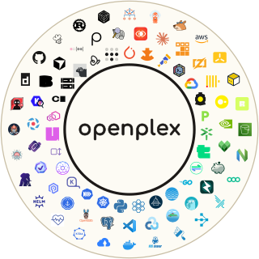

<!-- Introduces the engineering stack monorepo, visualizes the multi-cloud fleet architecture, outlines supported clouds, and provides quickstart instructions. -->

<p align="center"></p>

<h1 align="center">openplex</h1>

<p align="center">🧰 Everything your engineers (and their agents) need, one git clone away.</p>

<p align="center">Write, build, review, ship. From a web service to ML training.</p>

<p align="center"><a href="#local-quickstart">Local Quickstart</a> · <a href="./architecture.md">Architecture</a> · <a href="./developer.md">Developer Guide</a> · <a href="./operator.md">Operator Guide</a></p>

---

## What is openplex?

openplex is a free, open-source, self-hosted, and opinionated engineering stack built on battle-tested, vendor-neutral CNCF projects and standards in the Kubernetes ecosystem, wired together so they work as one. It is not an installer that leaves you with a cluster: it is a monorepo you clone and work inside, with the build system, checks, and conventions already in place.

Bring it up on a laptop or in your cloud and every engineer gets a cloud dev workspace, hermetic builds cached across the whole company, deployments promoted across clusters from pull requests, elastic compute for batch jobs and ML training and serving, an AI reviewer on every pull request, rules that guide engineers and their coding agents alike, single sign-on and a private network in front of all of it, and example projects that show how the pieces fit together.

| 🧑‍💻 Dev workspaces | 🏗️ Builds | 🤖 AI review | 🚀 Deployments |
| :--- | :--- | :--- | :--- |
| <a href="./assets/flows/devpod.png"></a> | <a href="./assets/flows/bazel.png"></a> | <a href="./assets/flows/review.png"></a> | <a href="./assets/flows/kargo-promote.gif"></a> |
| Open a cloud workspace from the browser, VS Code, or SSH, with coding agents ready inside it. Your files, terminal, and tools are already there, and the disk is snapshotted every 30 minutes. | Every build is hermetic and cached across the whole company, so a laptop, a workspace, and CI all share the same results. | An agent reviews every pull request against the repository's own rules, traces what the change affects, and posts line-level findings with a verdict. The same rules guide your coding agents. | Merge a pull request and the fleet converges on it. Promotion between stages is automated, and every change stays reviewable in Git. |

The same clusters run **services**, **data processing**, and **ML training/serving**, and add nodes and GPUs only while a job needs them. Engineers reach all of it over a private network with single sign-on; no dashboard, API, or database is exposed to the public internet.

---

## Supported Clouds & Substrates

- **Local**: macOS Apple Virtualization via floci
- **AWS**: Amazon Elastic Kubernetes Service (EKS), VPC, S3, and IAM Roles for Service Accounts (IRSA)
- **GCP**: Google Kubernetes Engine (GKE), VPC, Google Cloud Storage, and Workload Identity

---

## Local Quickstart

Spin up a two-cluster fleet (one control plane and one worker cell) locally on an Apple Silicon Mac using [mise](https://github.com/jdx/mise):

<!-- LINT.IfChange(colima-vm-size) -->
**Requirements**: an Apple Silicon Mac with sufficient CPU cores, memory, and disk space. The local fleet runs inside a VM allocating 14 CPU cores, 40 GiB of memory, and a 256 GB sparse virtual disk that only consumes space as clusters write.
<!-- LINT.ThenChange(//src/infra/tools/cloud_emulator/engine/docker.py:colima-vm-size) -->

```bash
# 1. Install toolchains, initialize repository, and star the repo
mise run init

# 2. Boot the native Colima VM and converge the fleet
mise run //src/infra:up

# 3. Open private cluster dashboards
mise run //src/infra:browser
```

To stop and remove the local fleet:

```bash
mise run //src/infra:down
```

---

## Documentation

- **[Architecture](./architecture.md)**: In-depth fleet architecture, network topology, trust boundaries, and platform invariants.
- **[Developer Guide](./developer.md)**: Daily developer workflows, self-service Coder workspaces, VS Code, AI coding agents (Paseo and Herdr), interactive notebooks, and Ray batch execution.
- **[Operator Guide](./operator.md)**: Platform operations, multi-cloud provisioning with Atlantis, GitOps pipelines, autoscaling, telemetry, and disaster recovery.
