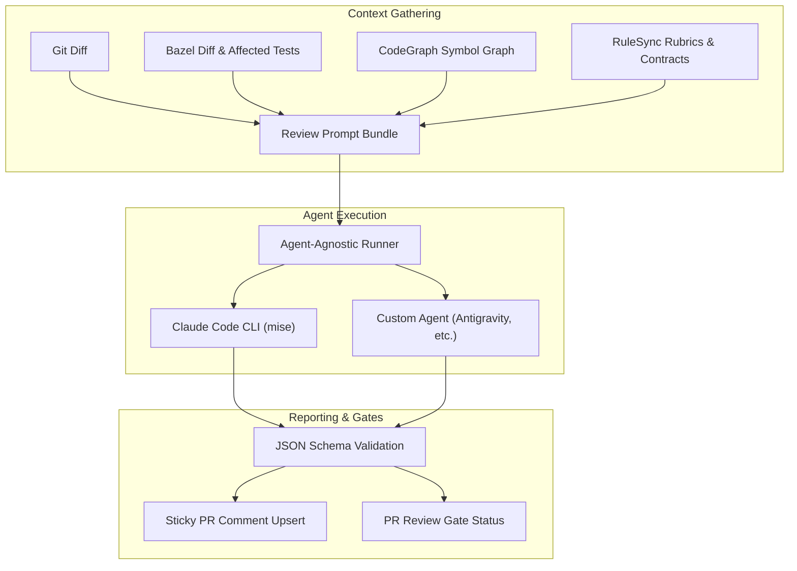

<!-- Explains the architecture, lifecycle, and integration contracts for the autonomous agentic code review engine. -->

# Autonomous PR Review Engine

The autonomous PR review engine provides automated, context-rich code reviews on pull requests. It extracts git change diffs, computes Bazel dependency impact graphs, evaluates CodeGraph symbol references, and verifies adherence to repository rulesync rubrics before dispatching to an agent-agnostic CLI runner.

---

## Architecture Overview



---

## Core Philosophy: Agent Agnostic

The review harness is strictly separated from the agent runtime:

1. **The Review Harness** (`src/infra/tools/review/`): Collects all codebase intelligence into `.review/review-bundle.md` and provides the structural review schema via [`report.py:review_schema()`](engine/report.py).
2. **First-Class Agent Support**: The harness natively drives three major agent CLIs (all provisioned via `[mise](https://github.com/jdx/mise)`):
   - **`claude` (Anthropic Claude Code)**: Driven non-interactively via `-p --output-format json --json-schema '<schema>' --dangerously-skip-permissions`. Requires `ANTHROPIC_API_KEY`.
   - **`codex` (OpenAI Codex CLI)**: Driven non-interactively via `codex exec --output-schema <schema_file> --dangerously-bypass-approvals-and-sandbox -o <out_file>`. Requires `OPENAI_API_KEY`.
   - **`agy` (Google Antigravity CLI)**: Driven non-interactively via `-p --output-format json --json-schema '<schema>' --dangerously-skip-permissions`. Requires `GEMINI_API_KEY`.
   - **`auto` (Default)**: Automatically selects `claude`, `codex`, or `agy` based on which API key environment variable is available.
   - **Custom CLI agents**: Any arbitrary CLI agent command can be supplied via `--agent "<command>"`.
3. **Structured Outputs**: The agent produces structured findings conforming to the required schema:
   - `verdict`: `LGTM`, `CHANGES REQUESTED`, or `DO NOT MERGE`.
   - `size`: `XS`, `S`, `M`, `L`, `XL`, or `XXL`.
   - `findings`: Array of line-level issues (`severity`, `location`, `body`).
   - `summary`: High-level summary markdown.

---

## Configuring the Reviewer Agent

### Environment Variables & Credentials

Set any of the following credentials or rely on ambient CLI login sessions:

| Reviewer | CLI Binary | Priority 1 (Subscription / OAuth) | Priority 2 (API Keys / Token Pool) | Ambient Local Session | CLI Flag |
|---|---|---|---|---|---|
| **Claude Code** | `claude` | `CLAUDE_CODE_OAUTH_TOKEN` / `CLAUDE_CODE_OAUTH_TOKENS` / `CLAUDE_REVIEW_OAUTH_TOKENS` | `ANTHROPIC_API_KEY` / `ANTHROPIC_API_KEYS` | `~/.claude.json` | `--agent claude` |
| **OpenAI Codex** | `codex` | `CODEX_API_KEY` / `CODEX_API_KEYS` | `OPENAI_API_KEY` / `OPENAI_API_KEYS` | `~/.codex/auth.json` | `--agent codex` |
| **Antigravity** | `agy` | — | `GEMINI_API_KEY` / `GEMINI_API_KEYS` | `~/.gemini/` | `--agent agy` |
| **Auto (Default)** | Auto-detected | Available OAuth tokens checked first | Available API keys or active ambient sessions | Auto-detected | `--agent auto` |

Plural environment variables accept comma-separated values (CSV) or JSON string arrays (e.g. `CLAUDE_CODE_OAUTH_TOKENS="tok1, tok2"` or `'["tok1", "tok2"]'`). When multiple keys are provided, the review engine automatically inspects rate limits and selects the optimal key.

### Setting the Reviewer in CI

In GitHub Actions, configure the repository variable `vars.REVIEW_AGENT` to `claude`, `codex`, or `agy` (or leave it unset / set to `auto` to automatically detect from configured secrets).

---

## Running Reviews

### Local Execution

To run the review agent locally on your current working tree diff:

```bash
# Auto-detects based on available API key
mise run review --base origin/main

# Explicitly choose your preferred reviewer
mise run review --agent claude --base origin/main
mise run review --agent codex --base origin/main
mise run review --agent agy --base origin/main
```

To only compile the context bundle without invoking an agent:

```bash
python3 -m src.infra.tools.review.cli --base origin/main --output .review/review-bundle.md
```

### Continuous Integration

In GitHub Actions ([`.github/workflows/review.yml`](../../../../.github/workflows/review.yml)), the review runs on `pull_request` events:

1. Initializes a sticky comment with a spinner and runtime progress.
2. Invokes `mise run review --base "origin/$BASE_REF" --target "HEAD"`.
3. Parses structured results from `.review/review-result.json` and execution metrics (tokens, latency, cost) from `.review/review-meta.json`.
4. Updates the sticky comment with line-level findings and sets the `Review Gate` check.
